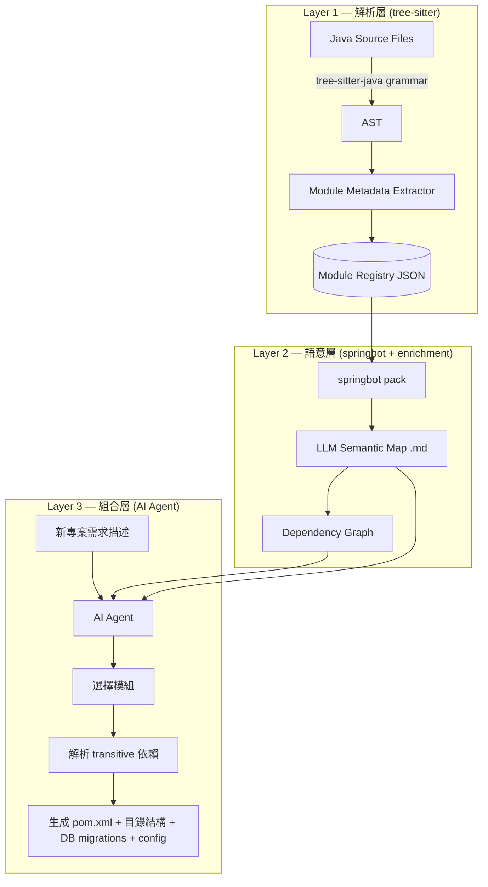

> 有個想法，我常常需要開立新專案，專案之間的需求其實很雷同，都是IOT類型的，目前我已經把功能模組化，遇到新的專案，我只需要組合模組，並稍許修改就好

> 有沒有可能利用tree-sitter的技術，backend當作模板，利用ai agent讀取 tree-sitter 的資訊，完成專案

# AI SAY

這個想法非常可行！而且你已經有了關鍵工具 — `springbot` 正是在做這件事的基礎層。讓我說明完整架構：

---

## 構想：AI-driven Module Composition System

### 目前你有的優勢

`springbot pack backend` 已經在把你的 Spring Boot 專案轉換成 **LLM-optimized Semantic Map**。這是 tree-sitter 驅動流程的第一步。

### 完整架構（三層）



### tree-sitter 在這裡具體做什麼

比 springbot 更細粒度的分析，針對每個模組自動提取：

| 提取項目 | 用途 |
|---|---|
| `@RestController` + `@RequestMapping` | 知道模組暴露哪些 API |
| `@Entity` class + field types | 知道模組的資料模型 |
| `import com.taipei.iot.*` | 知道模組間的依賴關係 |
| `@Service` / `@Component` interfaces | 知道模組提供哪些 Spring Bean |
| `@ConfigurationProperties` | 知道模組需要哪些 config key |

### Module Registry 範例輸出

```json
{
  "modules": {
    "auth": {
      "provides": ["JwtTokenProvider", "SecurityConfig", "AuthController"],
      "api_paths": ["/api/auth/login", "/api/auth/refresh"],
      "entities": ["User", "UserSession"],
      "depends_on": ["common", "rbac", "user"],
      "migrations": ["V1__auth__create_tables.sql", "V1_1__auth__seed_data.sql"],
      "config_keys": ["jwt.secret", "jwt.expiration"]
    },
    "rbac": {
      "provides": ["RoleService", "PermissionEvaluator"],
      "depends_on": ["common"],
      ...
    }
  }
}
```

### 實作路線

**Step 1** — 建立 tree-sitter 分析腳本（Python，約 200 行）
```
npx springbot pack backend          # 現有 → Semantic Map
python analyze_modules.py backend/  # 新增 → Module Registry JSON
```

**Step 2** — 定義 Module manifest（每個模組一個 `module.yml`）
- 哪些模組是「必選」（common, config）
- 哪些是「可選」（announcement, workflow, audit）

**Step 3** — AI Agent workflow（MCP Server 或 VS Code Agent）
```
用戶輸入: "新專案需要：auth + user + notification，專案名稱 SmartParking"

Agent:
1. 讀 Module Registry → 選模組
2. 解析 transitive 依賴 (auth → rbac → common)
3. 複製相關模組程式碼，重命名 package
4. 合併 pom.xml dependencies
5. 挑選對應的 DB migration files
6. 生成 application.yml skeleton
```

---

### 我的建議

你已有 `springbot` 做 LLM 語意層，最高價值的 **next step** 是：

1. **先寫 tree-sitter 模組依賴分析腳本** — 產生 Module Registry JSON，這是最缺的一塊
2. **把分析結果 + 模組列表做成 MCP Server** — 讓 GitHub Copilot Agent 可以直接查詢 "我需要 auth 模組，它還需要哪些？"
3. **Agent 負責 code transformation** — 重命名 package、調整 pom.xml、合併 migrations

要我先從哪一步開始實作？我建議先做 **tree-sitter 模組分析腳本**，把 Module Registry 建起來。