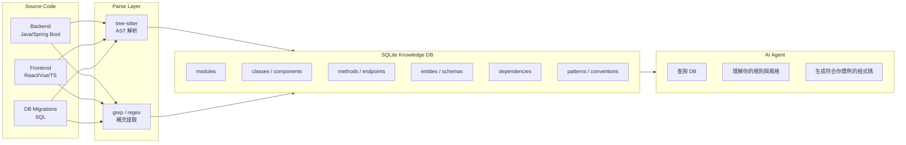

你的理解**完全正確**，而且這正是目前 AI-assisted development 最前沿的方向。讓我把這個架構說清楚：

---

## 核心概念：Personal Code Knowledge Graph



---

## SQLite 存什麼？

| Table | 內容 | 價值 |
|---|---|---|
| `modules` | auth, rbac, user, workflow... | Agent 知道有哪些模組可選 |
| `classes` | 類名、annotations、所屬模組 | Agent 知道你的命名慣例 |
| `endpoints` | HTTP method + path + controller | Agent 知道 API 設計風格 |
| `entities` | 欄位、關聯、JPA 映射 | Agent 能推斷 DB schema |
| `frontend_components` | 組件名、props、呼叫的 API | **全端關聯** |
| `module_deps` | `auth → rbac → common` | Agent 能解 transitive 依賴 |
| `patterns` | 例如「分頁統一用 PageRequest」 | Agent 學習你的規則 |
| `migrations` | 哪個 migration 屬於哪個模組 | 新專案自動挑選 |

---

## 關鍵能力：Agent 能做什麼

**場景：新專案需要「資產轉移 + 通知 + 使用者管理」**

```
Agent 查詢 DB:
  SELECT * FROM module_deps WHERE module IN ('assettransfer', 'notification', 'user')
  → 解析出還需要: workflow, rbac, common, auth, dept

  SELECT * FROM migrations WHERE module IN (上面所有模組) ORDER BY domain
  → 知道要複製哪些 SQL files

  SELECT * FROM patterns WHERE type = 'naming'
  → 知道你的 Controller/Service/Repository 命名規則

  SELECT * FROM frontend_components WHERE backend_endpoint LIKE '/api/asset%'
  → 知道前端哪些組件要一起複製

結果：生成完整的新專案骨架，100% 符合你的現有慣例
```

---

## 與直接給 AI 看原始碼的差異

| 方式 | 問題 |
|---|---|
| 直接貼程式碼 | Context window 有限，幾十個模組貼不完 |
| semantic_search | 找相似文字，不理解結構關係 |
| **SQLite Knowledge DB** | 結構化查詢，精確、可推理、永久累積 |

SQLite 的本質是把「隱含在程式碼裡的知識」**顯式化**成可查詢的結構。

---

## 建議實作順序

```
Phase 1  tree-sitter 解析腳本 (Python)
         → 產生 SQLite schema + 填入後端資料

Phase 2  前端解析 (TypeScript/React component graph)
         → 補充 frontend_components + API binding

Phase 3  MCP Server 包裝 SQLite
         → GitHub Copilot / Claude 可以直接 call tool 查詢

Phase 4  Agent workflow
         → 輸入需求 → 查 DB → 生成新專案
```

---

要從 Phase 1 開始嗎？我可以幫你寫 tree-sitter Python 解析腳本，針對你的 Spring Boot 模組結構，把 backend 的資訊全部存入 SQLite。