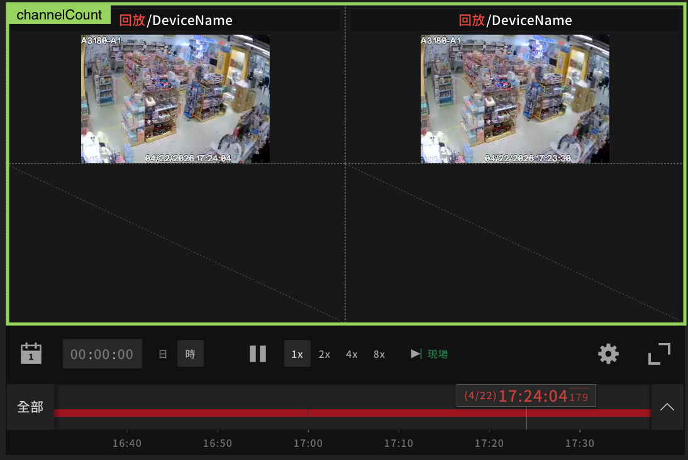
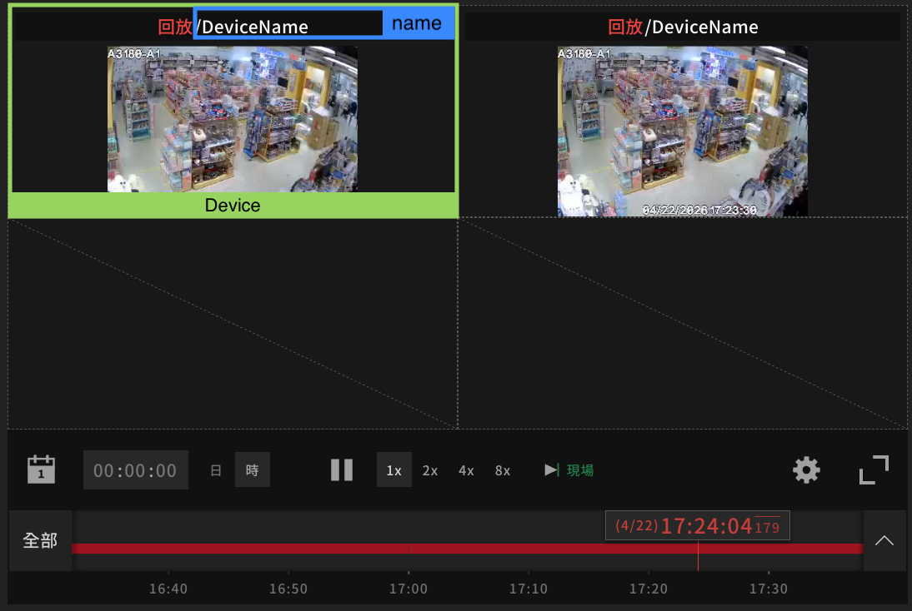
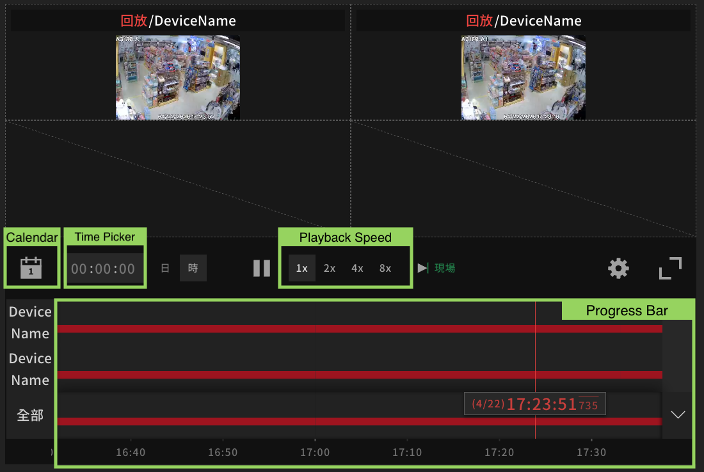

## Table of Contents
- [I. Importing Player to Your Vue Project](#i-importing-player-to-your-vue-project)
  - [1. Add to Project Root](#1-add-to-project-root)
  - [2. Import the Player](#2-import-the-player)
- [II. Add the Player to Your Page](#ii-add-the-player-to-your-page)
  - [1. Add a Container Element and Configure Its Size](#1-add-a-container-element-and-configure-its-size)
  - [2. Initialize the Player](#2-initialize-the-player)
  - [3. Destroy the Player](#3-destroy-the-player)
- [III. Frontend Integration Capabilities](#iii-frontend-integration-capabilities)
  - [1. Live Streaming](#1-live-streaming)
  - [2. Playback](#2-playback)
  - [3. Seekbar](#3-seekbar)
- [IV. Backend API Requirements](#iv-backend-api-requirements)
  - [1. Integration Prerequisites](#1-integration-prerequisites)
  - [2. Videos — Used for both live streaming and playback](#2-videos--used-for-both-live-streaming-and-playback)
    - [a. Live streaming](#a-live-streaming)
    - [b. Playback](#b-playback)
    - [c. Recorded Segments](#c-recorded-segments)
---
# I. Importing Player to Your Vue Project

### 1. Add to Project Root
After unzipping `arisan-video-player-v2-r${version}.zip`, a `arisan-video-player-v2` directory will be available containing the ESM build and related assets.

Place the `arisan-video-player-v2` folder in the root directory of the project:
```
project-root/
├── arisan-video-player-v2/
├── src/
├── package.json
```

### 2. Import the Player
Import the player functions in the component where the player will be used:
```
import { initializePlayer, destroyPlayer } from '.../arisan-video-player-v2/arisan-video-player-v2.esm'
```

# II. Add the Player to Your Page

### 1. Add a Container Element and Configure Its Size
Define a container element in the template for initializing the player:
```
<template>
  <div ref="playerContainer" class="player-container" />
</template>

<style>
.player-container {
  height: ...;
  width: ...;
}
</style>
```
### 2. Initialize the Player
Invoke `initializePlayer` after the component is mounted. Provide the container element and required props:
```
initializePlayer(
  playerContainer.value,
  {
    cancelHoveredResource: () => null,
    channelCount: 1,
    currentChannelPage: 1,
    devices: [],
    projectName: 'ProjectName',
  },
)
```

#### a. Configurable Fields (Player Config)
- `channelCount`: Number of video channels displayed on the player.
  - Supported range: 1 to 36. Must be a perfect square (e.g., 1, 4, 9, 16, 25, 36).



- `devices`: List of devices used to provide video streams for playback or live streaming.
  - Must follow the required device schema (see below)

#### b. Device schema
All fields are required.
```ts
type Device = {
  id: string;
  name: string;
  type: string;
  sources: {
    streams: {
      enabled: boolean;
      services: {
        cvr: { enabled: boolean };
        evr: { enabled: boolean };
        live: boolean;
      };
    }[];
  }[];
};
```

####  Configurable Fields (Device Config)

| Field | Type | Description |
|------|------|-------------|
| `id` | string | Unique identifier of the device. Choose your own ID strings but ensure not to have duplicates. |
| `name` | string | Display name of the device. This value will be shown on the top of each video channel in the player UI. |



#### Constrained Fields (Device Config)

| Field | Type | Description |
|------|------|-------------|
| `type` | string | Please set to `RTSP`. |
| `sources` | array | List of sources for the device. |
| `sources[].streams` | array | List of streams under each source. |
| `sources[].streams[].enabled` | boolean | Set to `true` to enable the stream. Disabled streams will not be shown in any channel. |
| `sources[].streams[].services` | object | Capabilities of the stream. |
| `sources[].streams[].services.live` | boolean | Set to `true` to enable live streaming. |
| `sources[].streams[].services.cvr.enabled` | boolean | Set to `true` to enable playback. |
| `sources[].streams[].services.evr.enabled` | boolean | Set to `true` to enable playback. |

Example:
```ts
devices = [
  {
    id: 'eeeeeeee-eeee-eeee-eeee-111111111111',
    name: 'Name',
    type: 'RTSP',
    sources: [
      {
        streams: [
          {
            enabled: true,
            services: {
              cvr: { enabled: true },
              evr: { enabled: true },
              live: true,
            },
          },
        ],
      },
    ],
  },
];
```

### 3. Destroy the Player
Invoke `destroyPlayer` in the `onBeforeUnmount` lifecycle hook:
```
destroyPlayer(playerContainer.value)
```
---

# III. Frontend Integration Capabilities
The V2 Player supports the following features:



- Multi-stream Playback
- Multi-stream Live
- Calendar
- Seekbar
- Playback Speed

Multiple streams can be displayed by:
- Supplying multiple devices, or
- Supplying multiple sources or streams within a single device,

in combination with an appropriate `channelCount`.

### 1. Live Streaming

By default, the player starts in **live streaming** mode upon initialization. 

#### Backend requirement:
To support this, the following endpoint should be implemented to retrieve the live stream source: [Live streaming endpoint](#a-live-streaming)

### 2. Playback

#### How to enter playback mode:

To enter playback mode, you can:
- Select a specific time via the calendar
- Enter a past time using the time picker
- Drag or click on the Seekbar

Once switched to playback mode, playback speed can be adjusted.

#### Backend requirement:
To support playback, the following endpoint should be implemented to retrieve playback data: [Playback endpoint](#b-playback)

### 3. Seekbar

The red segments on the Seekbar indicate recorded playback intervals (recorded segments) where video data is available.

#### Backend requirement:
To support rendering recorded segments on the Seekbar, the following endpoint should be implemented to retrieve recorded segments: [Recorded segments endpoint](#c-recorded-segments)

---

# IV. Backend API Requirements

### 1. Integration Prerequisites

**Required cookies:** `access_token`

Before loading the player, ensure that a valid `access_token` cookie is available. When the client sends a request to the Videos API, the client will automatically include the access token in the request header:

```http
Authorization: Bearer <access_token>
```

### 2. Videos API

`GET /videos`

This endpoint supports live streaming, playback and recorded segments. The required parameters differ depending on the use case.

Query params:
- `deviceId`: string - Unique identifier of the device.
- `sourceIndex`: integer - The target source index to get videos.
- `streamIndex`: integer - The target stream index to get videos.
- `interval`: string - A time interval is the intervening ISO 8601 time between two time points.
  - Examples: `2023-08-10T10:50:00Z/2023-08-10T10:55:00Z`, `2023-08-10T10:55:01Z/P1D`.
- `merged`: boolean - A boolean to combine videos.

#### a. Live Streaming
```http
GET /videos?deviceId={deviceId}&sourceIndex={sourceIndex}&streamIndex={streamIndex}
```
Required query params:
- `deviceId`
- `sourceIndex`
- `streamIndex`

The API returns the following response for live streaming:

```ts
{
  /// URL in m3u8 format.
  "hlsUrl": "https://hostname.windows.net/hls/74e97853-222d-402d-b774-4889427b71df-0-0/realtime.m3u8", 
}
```

#### b. Playback

```http
GET /videos?deviceId={deviceId}&sourceIndex={sourceIndex}&streamIndex={streamIndex}&interval={interval}
```

Required query params:
- `deviceId`
- `sourceIndex`
- `streamIndex`
- `interval`

The API returns the following response for playback:

```ts
{
  "hosts": [
    "https://hostname.windows.net/74e97853-222d-402d-b774-4889427b71df-0-0/"
  ],
  /// The video path is a string contains device ID, source index, stream index, start time of video and end time of video
  "videos": [   
    "cvrs/74e97853-222d-402d-b774-4889427b71df-0-0-1691722500-1691722501.mp4",
    "cvrs/74e97853-222d-402d-b774-4889427b71df-0-0-1691722501-1691722502.mp4"
  ]
}
```

#### c. Recorded Segments

```http
GET /videos?deviceId={deviceId}&sourceIndex={sourceIndex}&streamIndex={streamIndex}&interval={interval}&merged=true
```

Required query params:
- `deviceId`
- `sourceIndex`
- `streamIndex`
- `interval`
- `merged=true`

The API returns the following response for recorded segments:

```ts
/// The array of video paths. The video path is a string contains ISO 8601 start time and end time of video.
[
  "2023-08-11T02:55:00.000Z/2023-08-11T02:55:02.000Z",
  "2023-08-12T09:01:00.000Z/2023-08-12T09:15:02.000Z"
]
```
