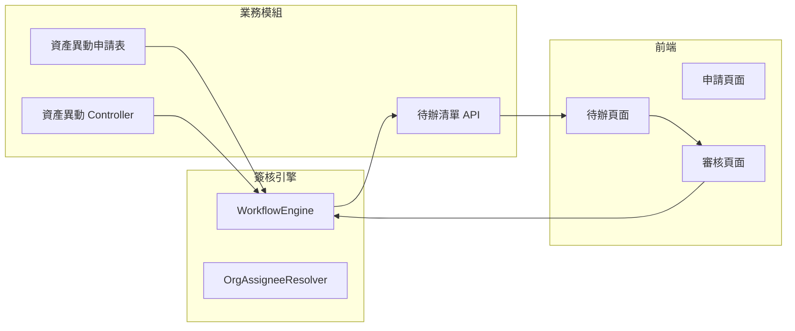

---

## 一、Option B 目標

將「資產異動」作為第一個真實業務，驗證簽核引擎與業務模組的完整整合。



---

## 二、Option B 任務清單

| 順序 | 任務 | 說明 | 預估工時 |
|------|------|------|---------|
| 1 | 資產異動申請表設計 | 存放申請資料（申請人、部門、金額、原因等） | 0.5 天 |
| 2 | 資產異動 Entity + Repository | JPA 實體與資料操作 | 0.5 天 |
| 3 | 資產異動 Service | 業務邏輯 + 觸發流程啟動 | 0.5 天 |
| 4 | 資產異動 Controller | 申請、查詢、審核等 API | 0.5 天 |
| 5 | 待辦清單 API | 查詢某用戶的待審案件 | 0.5 天 |
| 6 | 前端頁面（可選） | 申請表單、待辦列表、審核按鈕 | 1 天 |

---

## 三、資產異動申請表設計（建議）

> **版本說明**：V75 為最新 migration，故本 migration 編號為 V76。

```sql
-- V76__create_asset_transfer_application.sql
CREATE TABLE iot_workflowdb.asset_transfer_applications (
    id                   BIGSERIAL PRIMARY KEY,
    tenant_id            VARCHAR(50) NOT NULL,         -- 多租戶隔離（與 dept_info.tenant_id 對齊）
    application_no       VARCHAR(64) NOT NULL,         -- 申請單號（tenant 內唯一）
    applicant_id         VARCHAR(64) NOT NULL,         -- 申請人 ID
    applicant_name       VARCHAR(128),                 -- 申請人姓名（冗餘顯示用）
    department_id        BIGINT NOT NULL,              -- 申請部門 ID（對應 dept_info.dept_id，BIGINT）
    department_name      VARCHAR(128),                 -- 申請部門名稱（冗餘顯示用）

    -- 資產資訊
    asset_code           VARCHAR(64) NOT NULL,         -- 資產編號
    asset_name           VARCHAR(256) NOT NULL,        -- 資產名稱
    transfer_type        VARCHAR(32) NOT NULL,         -- 異動類型：TRANSFER / DISPOSAL / SCRAP
    target_department_id BIGINT,                       -- 目標部門（移轉時，對應 dept_info.dept_id）
    reason               TEXT,                         -- 異動原因

    -- 金額資訊
    asset_value          DECIMAL(20,2),                -- 資產價值

    -- 流程關聯
    workflow_instance_id BIGINT,                       -- 關聯 workflow_instances.id

    -- 狀態：與 workflow 狀態同步（由 Service 層主動更新，非 event listener）
    status               VARCHAR(32) DEFAULT 'DRAFT',  -- DRAFT / PROCESSING / COMPLETED / REJECTED
    current_assignee     VARCHAR(64),                  -- 當前審核人（冗餘，方便待辦查詢）

    -- 時間戳
    created_at           TIMESTAMP DEFAULT NOW(),
    created_by           VARCHAR(64),
    updated_at           TIMESTAMP DEFAULT NOW(),
    updated_by           VARCHAR(64),

    -- 審核結果
    approved_at          TIMESTAMP,
    approved_by          VARCHAR(64),
    reject_reason        TEXT,

    UNIQUE (tenant_id, application_no)
);

CREATE INDEX idx_asset_transfer_tenant_applicant ON iot_workflowdb.asset_transfer_applications(tenant_id, applicant_id);
CREATE INDEX idx_asset_transfer_tenant_status ON iot_workflowdb.asset_transfer_applications(tenant_id, status);
CREATE INDEX idx_asset_transfer_workflow ON iot_workflowdb.asset_transfer_applications(workflow_instance_id);
```

---

## 四、資產異動 Service 核心邏輯

```java
// AssetTransferService.java
@Service
public class AssetTransferService {
    
    @Autowired
    private AssetTransferRepository repository;
    
    @Autowired
    private WorkflowEngine workflowEngine;
    
    @Transactional
    public AssetTransferApplication createApplication(CreateRequest request, String applicantId) {
        // 1. 儲存申請資料
        AssetTransferApplication app = AssetTransferApplication.builder()
            .applicationNo(generateApplicationNo())
            .applicantId(applicantId)
            .departmentId(request.getDepartmentId())
            .assetCode(request.getAssetCode())
            .assetName(request.getAssetName())
            .transferType(request.getTransferType())
            .reason(request.getReason())
            .assetValue(request.getAssetValue())
            .status("DRAFT")
            .build();
        
        app = repository.save(app);
        
        return app;
    }
    
    @Transactional
    public void submitApplication(Long applicationId, String applicantId) {
        AssetTransferApplication app = repository.findById(applicationId)
            .orElseThrow(() -> new RuntimeException("Application not found"));
        
        // 驗證申請人權限
        if (!app.getApplicantId().equals(applicantId)) {
            throw new RuntimeException("Only applicant can submit");
        }
        
        // 啟動簽核流程
        // departmentId 以字串形式傳入（String.valueOf），OrgAssigneeResolver 內部轉 Long
        WorkflowContext context = WorkflowContext.builder()
            .businessId(app.getApplicationNo())
            .businessType("ASSET_TRANSFER")
            .applicantId(applicantId)
            .departmentId(String.valueOf(app.getDepartmentId()))
            .build();
        
        WorkflowInstanceEntity instance = workflowEngine.start(
            "asset_transfer",
            app.getApplicationNo(),
            "ASSET_TRANSFER",
            context
        );
        
        // 更新申請表
        app.setWorkflowInstanceId(instance.getId());
        app.setStatus("PROCESSING");
        app.setCurrentAssignee(getCurrentAssignee(instance));
        repository.save(app);
    }
    
    public List<AssetTransferApplication> getPendingTasks(String userId) {
        // 透過 stepLog 查詢該用戶的待審案件
        // 需在 WorkflowStepLogRepository 補充此查詢方法
        List<WorkflowStepLogEntity> pendingLogs = stepLogRepository
            .findByAssigneeUserIdAndCompletedAtIsNull(userId);
        
        List<Long> instanceIds = pendingLogs.stream()
            .map(WorkflowStepLogEntity::getWorkflowInstanceId)
            .collect(Collectors.toList());
        
        return repository.findByWorkflowInstanceIdIn(instanceIds);
    }
}
```

---

## 五、API 設計

| Method | Endpoint | 說明 |
|--------|----------|------|
| POST | `/api/asset-transfer/create` | 建立申請（草稿） |
| POST | `/api/asset-transfer/submit/{id}` | 送出申請（啟動流程） |
| GET | `/api/asset-transfer/pending` | 查詢我的待審案件 |
| GET | `/api/asset-transfer/{id}` | 查詢申請明細 |
| POST | `/api/asset-transfer/approve/{id}` | 審核通過（呼叫 engine.approve） |
| POST | `/api/asset-transfer/reject/{id}` | 審核退回（呼叫 engine.reject） |

---

## 六、狀態同步機制說明

申請表 `status` 與 workflow `status` 採 **Service 層主動同步**，不使用 event listener：

| 操作 | workflow 狀態 | 申請表狀態 | 更新時機 |
|------|-------------|-----------|--------|
| submit | → IN_PROGRESS | DRAFT → PROCESSING | submitApplication() |
| approve（非末關） | IN_PROGRESS | PROCESSING（更新 current_assignee） | approveApplication() |
| approve（末關） | → COMPLETED | PROCESSING → COMPLETED | approveApplication() |
| reject | IN_PROGRESS | PROCESSING → REJECTED | rejectApplication() |

---

## 七、執行順序確認

| 順序 | 任務 | 說明 |
|------|------|------|
| 1 | 建立 V76 migration | 資產異動申請表（含 tenant_id，department_id 為 BIGINT） |
| 2 | 建立 Entity + Repository | 實作 TenantAware；補 findByWorkflowInstanceIdIn |
| 3 | 補 WorkflowStepLogRepository | 新增 findByAssigneeUserIdAndCompletedAtIsNull |
| 4 | 建立 Service + Controller | 業務邏輯 + API；移除 assetValue context |
| 5 | 建立待辦清單查詢 | 整合 stepLog 查詢 |
| 5 | 執行端到端測試 | 完整流程驗證 |

---

