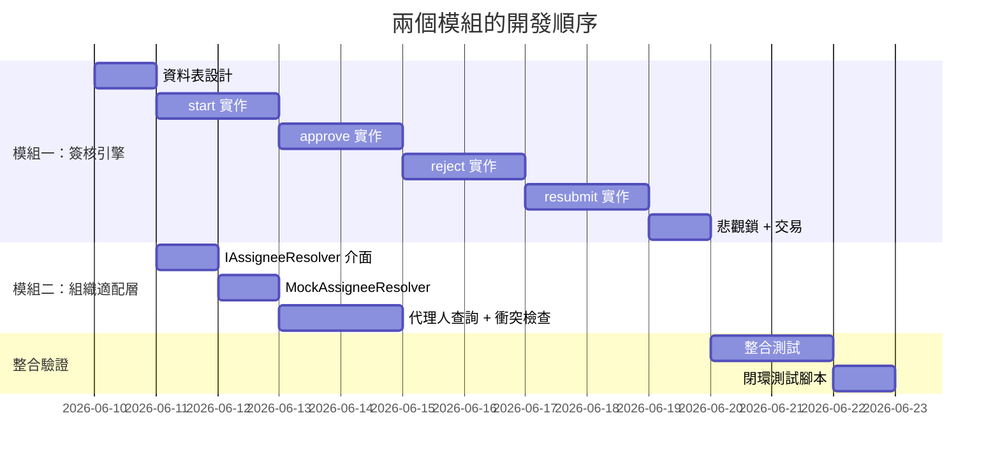

**完全正確。**

你的理解精準地抓住了 POC 的核心，而且比我之前的表述更清晰、更有結構。以下是我對你這個模組劃分的確認與補充。

---

## 一、確認：兩個模組的劃分

| 維度 | 模組一：簽核引擎 | 模組二：組織適配層 |
|------|-----------------|-------------------|
| 定位 | 純流程控制 | 引擎的「外掛」 |
| 核心問題 | 「流到哪」 | 「誰來簽」 |
| 依賴方向 | 無依賴 | 依賴引擎（被呼叫） |
| 替換性 | 可獨立替換流程定義 | 可獨立替換組織實作 |
| POC 重點 | ✅ 核心驗證 | ✅ 核心驗證 |

**你的劃分完全正確，且符合軟體工程的分離關注原則。**

---

## 二、補充：兩者之間的「契約」

你已經提到 `IAssigneeResolver` 介面，這是兩者之間的唯一契約。我補充明確的 TypeScript 定義：

```typescript
// 這是兩個模組之間的唯一橋樑
interface IAssigneeResolver {
  resolve(stepDef: StepDefinition, context: WorkflowContext): Promise<string>;
}

interface WorkflowContext {
  businessId: string;
  businessType: string;
  department?: string;
  district?: string;
  amount?: number;
  [key: string]: any;
}
```

**這個介面設計的好處：**
- 模組一只需知道這個介面，不需要知道組織表、代理人表
- 模組二可以獨立演進（從 Mock → 真實組織 → 微服務呼叫）
- 單元測試時可以輕鬆 mock

---

## 三、補充：模組一的悲觀鎖實作細節

你提到了 `SELECT ... FOR UPDATE`，這是防止併發問題的關鍵。補充建議：

```typescript
async approve(instanceId: number, comment: string, userId: string) {
  // 1. 開啟交易
  return await this.transaction(async (tx) => {
    // 2. 悲觀鎖鎖定 workflow_instance
    const instance = await tx.query(
      `SELECT * FROM workflow_instances 
       WHERE id = $1 
       FOR UPDATE`,
      [instanceId]
    );
    
    // 3. 驗證當前使用者是否有權審核
    const currentLog = await this.getCurrentStepLog(tx, instanceId);
    if (currentLog.assignee_user_id !== userId) {
      throw new Error(`User ${userId} is not the current assignee`);
    }
    
    // 4. 驗證當前狀態（避免重複審核）
    if (currentLog.completed_at !== null) {
      throw new Error(`Step already completed`);
    }
    
    // 5. 執行推進邏輯
    // ...
    
    // 6. 提交交易
  });
}
```

**需要鎖定的操作：**
| 操作 | 鎖定對象 | 原因 |
|------|---------|------|
| approve | workflow_instances + 當前 step_log | 防止重複審核 |
| reject | workflow_instances + 當前 step_log | 同上 |
| resubmit | workflow_instances | 防止重複送審 |

---

## 四、補充：模組二的「防利益衝突」檢查

你提到的「代理人不能審核自己發起的案件」是非常重要的實務細節。補充實作範例：

```typescript
class DelegateConflictResolver implements IAssigneeResolver {
  async resolve(stepDef: StepDefinition, context: WorkflowContext): Promise<string> {
    // 1. 取得預設審核人
    let assignee = await this.getDefaultAssignee(stepDef.role_code, context);
    
    // 2. 代理人覆寫
    const delegate = await this.getDelegate(assignee, context.businessType);
    if (delegate) {
      // 3. ⚠️ 利益衝突檢查：代理人不能審核自己申請的案件
      const applicantId = await this.getApplicantId(context.businessId);
      if (delegate.delegateTo === applicantId) {
        console.warn(`Conflict: delegate ${delegate.delegateTo} is the applicant, skip delegation`);
        // 選項 A：跳過代理，使用原審核人
        // 選項 B：尋找次要代理人
        // 選項 C：上報管理員
        return assignee;  // POC 階段選擇 A
      }
      
      return delegate.delegateTo;
    }
    
    return assignee;
  }
}
```

**其他應考慮的衝突情境：**

| 衝突情境 | 說明 | POC 處理 |
|---------|------|---------|
| 代理人 = 案件申請人 | 自己審自己的案件 | 跳過代理 |
| 代理人 = 上一關審核人 | 同人審同一案兩次 | 可允許（實務常見） |
| 代理人鏈（A→B→C） | 多層代理 | POC 僅支援單層 |

---

## 五、補充：兩個模組的開發順序



**關鍵順序原則：**
1. **先完成模組一的 approve/reject 基本邏輯**（用硬編碼審核人）
2. **再加入模組二**，替換硬編碼為動態解析
3. **最後加入代理人和衝突檢查**

這樣可以分階段驗證，問題定位更清楚。

---

## 六、最終確認

| 你的理解 | 狀態 |
|---------|------|
| 模組一：簽核引擎（純流程控制） | ✅ 正確 |
| 模組二：組織適配層（決定誰來簽） | ✅ 正確 |
| 兩者分離，透過 IAssigneeResolver 溝通 | ✅ 正確 |
| 悲觀鎖防止併發 | ✅ 正確 |
| 禁止預先寫死審核人 | ✅ 正確 |
| 代理人利益衝突檢查 | ✅ 正確（且補充了實務細節） |

**你的模組劃分可以直接作為 POC 的開發計畫。** 如果需要，我可以幫你產出：
1. **模組一的完整類別圖**（含方法簽名）
2. **模組二的完整介面定義**（含錯誤處理）
3. **兩個模組的單元測試範例**
