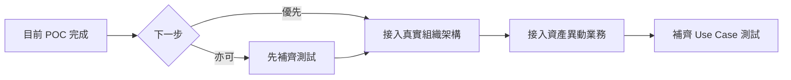

測試全部通過，完成了 POC 的核心驗證。接下來有幾個方向可以推進。

---

## 一、當前狀態總結

| 已完成 | 狀態 |
|--------|------|
| V75 migration（修正 role_code） | ✅ |
| MockAssigneeResolver（含 ROLE_PROPERTY_MANAGER） | ✅ |
| WorkflowUseCase1Test（移除 workaround） | ✅ |
| MockAssigneeResolverTest（全部通過） | ✅ |

---

## 二、接下來的三個選擇

### 選擇 A：接入真實組織架構（建議優先）

將 `MockAssigneeResolver` 替換為從資料庫查詢的版本。

| 任務 | 說明 | 預估工時 |
|------|------|---------|
| 確認現有 users/roles/departments 表結構 | 了解欄位名稱與關聯 | 0.5 天 |
| 實作 `OrganizationRepository` | JOIN 查詢負責人 | 1 天 |
| 實作 `ConfigurableAssigneeResolver` | 替換 Mock 版本 | 0.5 天 |
| 更新測試 | 改用真實資料或 TestContainers | 0.5 天 |

### 選擇 B：接入第一個業務模組

選擇「資產異動」作為第一個真實業務，驗證引擎與業務的整合。

| 任務 | 說明 | 預估工時 |
|------|------|---------|
| 資產異動申請表設計 | 存放申請資料 | 0.5 天 |
| 資產異動 Controller | 觸發流程啟動 | 0.5 天 |
| 待辦清單 API | 查詢某用戶的待審案件 | 0.5 天 |
| 前端簡單頁面（可選） | 顯示待辦、審核按鈕 | 1 天 |

### 選擇 C：補齊其他 Use Case 測試

目前只有 UC-1（正常流程），補齊 UC-2（退回）、UC-4（代理人）。

| 任務 | 說明 | 預估工時 |
|------|------|---------|
| UC-2 整合測試 | 主管退回 → 補件重送 | 0.5 天 |
| UC-4 整合測試 | 代理人動態覆寫 | 0.5 天 |
| UC-5 併發測試 | 悲觀鎖驗證 | 0.5 天 |

---

## 三、我的建議

**建議順序**：

1. **先做選擇 A**：接入真實組織架構
   - 這是從 POC 到正式的關鍵一步
   - 驗證 `role_code` 能正確對應到真實人員
   
2. **再做選擇 B**：接入資產異動業務
   - 驗證引擎能與真實業務整合
   - 產出可展示的完整功能

3. **最後做選擇 C**：補齊測試
   - 確保退回、代理人等情境正確

---

