以下為完整的技術設計文件，包含類別圖、介面定義與單元測試範例。

---

# 簽核引擎 POC 技術設計文件

> 版本：1.0 | 最後更新：2026-01-27

---

## 一、模組一：簽核引擎完整類別圖

### 1.1 類別圖（UML）

```mermaid
classDiagram
    class WorkflowEngine {
        - WorkflowDefinitionRepository definitionRepo
        - WorkflowInstanceRepository instanceRepo
        - WorkflowStepLogRepository stepLogRepo
        - IAssigneeResolver assigneeResolver
        - ITransactionManager transactionManager
        - ICacheManager cacheManager
        + start(StartParams): Promise~WorkflowInstance~
        + approve(ApproveParams): Promise~WorkflowInstance~
        + reject(RejectParams): Promise~WorkflowInstance~
        + resubmit(ResubmitParams): Promise~WorkflowInstance~
        + getInstance(id): Promise~WorkflowInstance~
        + getHistory(id): Promise~StepLog[]~
        - advanceToNextStep(instanceId, stepId, comment): Promise~void~
        - rollbackToStep(instanceId, targetStepId, comment): Promise~void~
        - completeCurrentStep(instanceId, action, comment, targetStepId): Promise~void~
        - createNextStep(instanceId, stepDef, context): Promise~void~
        - validateStepTransition(currentStep, targetStep): Promise~boolean~
    }

    class WorkflowDefinitionRepository {
        + findById(id): Promise~WorkflowDefinition~
        + findByCode(code, version): Promise~WorkflowDefinition~
        + getSteps(definitionId): Promise~StepDefinition[]~
        + getStep(definitionId, stepId): Promise~StepDefinition~
        + cacheDefinition(code, version): Promise~void~
    }

    class WorkflowInstanceRepository {
        + save(instance): Promise~WorkflowInstance~
        + update(instance): Promise~WorkflowInstance~
        + findById(id, lock): Promise~WorkflowInstance~
        + findByBusiness(businessType, businessId): Promise~WorkflowInstance~
        + updateCurrentStep(instanceId, stepId): Promise~void~
        + updateStatus(instanceId, status): Promise~void~
    }

    class WorkflowStepLogRepository {
        + save(log): Promise~StepLog~
        + findByInstance(instanceId): Promise~StepLog[]~
        + findCurrentByInstance(instanceId): Promise~StepLog~
        + complete(logId, action, comment, targetStepId): Promise~void~
        + findByAssignee(userId, status): Promise~StepLog[]~
    }

    class WorkflowInstance {
        + Long id
        + Long workflowDefId
        + String businessId
        + String businessType
        + String currentStepId
        + String status
        + JsonNode context
        + LocalDateTime createdAt
        + LocalDateTime updatedAt
        + Long version
    }

    class StepDefinition {
        + String id
        + String name
        + String type
        + String roleCode
        + String next
        + String rejectTarget
        + String gatewayType
        + List~Condition~ conditions
        + String timeCalculationRule
    }

    class StepLog {
        + Long id
        + Long workflowInstanceId
        + String stepId
        + String stepName
        + String assigneeUserId
        + String action
        + String comment
        + LocalDateTime enteredAt
        + LocalDateTime completedAt
        + String targetStepId
    }

    class StartParams {
        + String workflowCode
        + String businessId
        + String businessType
        + Map~String,Object~ context
    }

    class ApproveParams {
        + Long workflowInstanceId
        + String comment
        + String userId
    }

    class RejectParams {
        + Long workflowInstanceId
        + String targetStepId
        + String comment
        + String userId
    }

    class ResubmitParams {
        + Long workflowInstanceId
        + String comment
        + String userId
    }

    class ITransactionManager {
        <<interface>>
        + execute~T~(callback): Promise~T~
    }

    class ICacheManager {
        <<interface>>
        + get(key): Promise~any~
        + set(key, value, ttl): Promise~void~
        + evict(key): Promise~void~
    }

    WorkflowEngine --> WorkflowDefinitionRepository
    WorkflowEngine --> WorkflowInstanceRepository
    WorkflowEngine --> WorkflowStepLogRepository
    WorkflowEngine --> IAssigneeResolver
    WorkflowEngine --> ITransactionManager
    WorkflowEngine --> ICacheManager
    
    WorkflowInstanceRepository --> WorkflowInstance
    WorkflowDefinitionRepository --> StepDefinition
    WorkflowStepLogRepository --> StepLog
    
    WorkflowEngine ..> StartParams : uses
    WorkflowEngine ..> ApproveParams : uses
    WorkflowEngine ..> RejectParams : uses
    WorkflowEngine ..> ResubmitParams : uses
```



### 1.2 方法簽名詳細說明

#### WorkflowEngine 類別

```typescript
class WorkflowEngine {
  /**
   * 啟動新流程
   * @param params - 啟動參數
   * @returns 流程實例（含當前步驟與審核人）
   * @throws WorkflowNotFoundException 流程定義不存在
   * @throws WorkflowValidationException 流程定義無效
   */
  async start(params: StartParams): Promise<WorkflowInstance>
  
  /**
   * 審核通過，推進到下一步
   * @param params - 審核參數（含 instanceId, comment, userId）
   * @returns 更新後的流程實例
   * @throws WorkflowInstanceNotFoundException 流程不存在
   * @throws WorkflowStepNotCompletedException 當前步驟尚未完成
   * @throws WorkflowPermissionException 用戶無權審核
   * @throws WorkflowConcurrentModificationException 併發衝突
   */
  async approve(params: ApproveParams): Promise<WorkflowInstance>
  
  /**
   * 審核退回，跳到指定步驟
   * @param params - 退回參數（含 instanceId, targetStepId, comment, userId）
   * @returns 更新後的流程實例
   * @throws WorkflowInstanceNotFoundException 流程不存在
   * @throws WorkflowInvalidTransitionException 不允許退回該步驟
   * @throws WorkflowPermissionException 用戶無權審核
   */
  async reject(params: RejectParams): Promise<WorkflowInstance>
  
  /**
   * 補件重送，返回退回前步驟
   * @param params - 重送參數（含 instanceId, comment, userId）
   * @returns 更新後的流程實例
   * @throws WorkflowInstanceNotFoundException 流程不存在
   * @throws WorkflowPermissionException 用戶無權重送
   * @throws WorkflowNoRejectHistoryException 無退回歷史
   */
  async resubmit(params: ResubmitParams): Promise<WorkflowInstance>
  
  /**
   * 查詢流程狀態
   * @param id - 流程實例 ID
   * @returns 流程實例
   */
  async getInstance(id: number): Promise<WorkflowInstance>
  
  /**
   * 查詢歷程紀錄
   * @param id - 流程實例 ID
   * @returns 步驟紀錄清單
   */
  async getHistory(id: number): Promise<StepLog[]>
  
  // ========== 私有方法 ==========
  
  /**
   * 推進到下一步驟
   * @param instanceId - 流程實例 ID
   * @param stepId - 當前步驟 ID
   * @param comment - 意見
   */
  private async advanceToNextStep(
    instanceId: number, 
    stepId: string, 
    comment: string
  ): Promise<void>
  
  /**
   * 退回到指定步驟
   * @param instanceId - 流程實例 ID
   * @param targetStepId - 目標步驟 ID
   * @param comment - 退回原因
   */
  private async rollbackToStep(
    instanceId: number, 
    targetStepId: string, 
    comment: string
  ): Promise<void>
  
  /**
   * 完成當前步驟
   * @param instanceId - 流程實例 ID
   * @param action - 動作（approve/reject/resubmit）
   * @param comment - 意見
   * @param targetStepId - 退回目標（僅 reject 時有值）
   */
  private async completeCurrentStep(
    instanceId: number,
    action: string,
    comment: string,
    targetStepId?: string
  ): Promise<void>
  
  /**
   * 建立下一步驟的待辦
   * @param instanceId - 流程實例 ID
   * @param stepDef - 步驟定義
   * @param context - 業務上下文
   */
  private async createNextStep(
    instanceId: number,
    stepDef: StepDefinition,
    context: WorkflowContext
  ): Promise<void>
  
  /**
   * 驗證步驟轉換是否合法
   * @param currentStep - 當前步驟定義
   * @param targetStep - 目標步驟定義
   * @returns 是否合法
   */
  private async validateStepTransition(
    currentStep: StepDefinition,
    targetStep: StepDefinition
  ): Promise<boolean>
}
```

### 1.3 錯誤類型定義

```typescript
// 基礎錯誤類別
abstract class WorkflowError extends Error {
  constructor(message: string, public code: string) {
    super(message);
    this.name = this.constructor.name;
  }
}

class WorkflowNotFoundException extends WorkflowError {
  constructor(workflowCode: string) {
    super(`Workflow definition not found: ${workflowCode}`, 'WF_NOT_FOUND');
  }
}

class WorkflowInstanceNotFoundException extends WorkflowError {
  constructor(instanceId: number) {
    super(`Workflow instance not found: ${instanceId}`, 'WF_INSTANCE_NOT_FOUND');
  }
}

class WorkflowStepNotFoundException extends WorkflowError {
  constructor(stepId: string) {
    super(`Step definition not found: ${stepId}`, 'WF_STEP_NOT_FOUND');
  }
}

class WorkflowPermissionException extends WorkflowError {
  constructor(userId: string, stepName: string) {
    super(`User ${userId} is not authorized to approve step: ${stepName}`, 'WF_PERMISSION_DENIED');
  }
}

class WorkflowStepNotCompletedException extends WorkflowError {
  constructor(stepName: string) {
    super(`Step ${stepName} is already completed`, 'WF_STEP_ALREADY_COMPLETED');
  }
}

class WorkflowInvalidTransitionException extends WorkflowError {
  constructor(fromStep: string, toStep: string) {
    super(`Invalid transition: ${fromStep} -> ${toStep}`, 'WF_INVALID_TRANSITION');
  }
}

class WorkflowConcurrentModificationException extends WorkflowError {
  constructor(instanceId: number) {
    super(`Concurrent modification detected on instance: ${instanceId}`, 'WF_CONCURRENT_MODIFICATION');
  }
}

class WorkflowNoRejectHistoryException extends WorkflowError {
  constructor(instanceId: number) {
    super(`No reject history found for resubmit on instance: ${instanceId}`, 'WF_NO_REJECT_HISTORY');
  }
}

class WorkflowValidationException extends WorkflowError {
  constructor(message: string) {
    super(`Workflow definition validation failed: ${message}`, 'WF_VALIDATION_ERROR');
  }
}
```

---

## 二、模組二：組織適配層完整介面定義

### 2.1 核心介面

```typescript
// ========== 核心解析器介面 ==========

/**
 * 審核人解析器（模組二的核心介面）
 * 簽核引擎透過此介面獲取實際審核人，實現流程與組織解耦
 */
interface IAssigneeResolver {
  /**
   * 解析步驟的實際審核人
   * @param stepDef - 步驟定義（含 role_code）
   * @param context - 業務上下文
   * @returns 審核人 User ID
   * @throws RoleNotFoundException 角色不存在
   * @throws AssigneeNotFoundException 找不到符合條件的人員
   * @throws DelegateConflictException 代理人衝突（如自己審自己）
   */
  resolve(stepDef: StepDefinition, context: WorkflowContext): Promise<string>;
}

/**
 * 業務上下文（引擎傳遞給組織適配層的資訊）
 */
interface WorkflowContext {
  businessId: string;           // 業務案件 ID
  businessType: string;         // 業務類型（REPAIR/REPLACEMENT/ASSET_TRANSFER）
  department?: string;          // 部門
  district?: string;            // 行政區
  contractId?: string;          // 契約 ID
  amount?: number;              // 金額
  applicantId?: string;         // 申請人 ID（用於衝突檢查）
  [key: string]: any;           // 其他業務欄位
}
```

### 2.2 輔助介面

```typescript
// ========== 組織查詢介面 ==========

/**
 * 組織結構查詢（模組二內部使用）
 */
interface IOrganizationRepository {
  /**
   * 根據角色代碼和業務上下文查詢負責人
   * @param roleCode - 角色代碼（如 MANAGER, PROPERTY_MANAGER）
   * @param context - 業務上下文
   * @returns 負責人 ID
   */
  findAssigneeByRole(roleCode: string, context: WorkflowContext): Promise<string | null>;
  
  /**
   * 查詢案件的申請人
   * @param businessType - 業務類型
   * @param businessId - 業務案件 ID
   * @returns 申請人 ID
   */
  findApplicant(businessType: string, businessId: string): Promise<string | null>;
  
  /**
   * 驗證用戶是否具有特定角色
   * @param userId - 用戶 ID
   * @param roleCode - 角色代碼
   * @param context - 業務上下文
   * @returns 是否具有該角色
   */
  hasRole(userId: string, roleCode: string, context: WorkflowContext): Promise<boolean>;
}

// ========== 代理人管理介面 ==========

/**
 * 代理人設定查詢（模組二內部使用）
 */
interface IDelegateRepository {
  /**
   * 查詢有效的代理人設定
   * @param delegateFor - 被代理人 ID
   * @param businessType - 業務類型（可選，null 表示適用全部）
   * @param date - 查詢日期
   * @returns 代理人設定（如有）
   */
  findActiveDelegate(
    delegateFor: string, 
    businessType: string | null, 
    date: Date
  ): Promise<DelegateSetting | null>;
  
  /**
   * 查詢指定日期範圍內的所有有效代理設定
   * @param delegateFor - 被代理人 ID
   * @param startDate - 開始日期
   * @param endDate - 結束日期
   * @returns 代理人設定清單
   */
  findDelegatesByPeriod(
    delegateFor: string,
    startDate: Date,
    endDate: Date
  ): Promise<DelegateSetting[]>;
}

/**
 * 代理人設定實體
 */
interface DelegateSetting {
  id: number;
  delegateFor: string;      // 被代理人
  delegateTo: string;       // 代理人
  businessType: string | null;  // 可限定業務類型
  effectiveFrom: Date;      // 生效起始日
  effectiveTo: Date;        // 生效截止日
  createdAt: Date;
}

// ========== 衝突檢查介面 ==========

/**
 * 代理人衝突檢查器
 */
interface IDelegateConflictChecker {
  /**
   * 檢查代理人是否存在衝突
   * @param delegateTo - 代理人 ID
   * @param context - 業務上下文
   * @returns 衝突檢查結果
   */
  check(delegateTo: string, context: WorkflowContext): Promise<ConflictCheckResult>;
}

/**
 * 衝突檢查結果
 */
interface ConflictCheckResult {
  hasConflict: boolean;           // 是否有衝突
  conflictType?: ConflictType;    // 衝突類型
  message?: string;               // 衝突描述
  suggestedAction?: ConflictAction; // 建議處理方式
}

enum ConflictType {
  SELF_REVIEW = 'SELF_REVIEW',           // 代理人審核自己的案件
  CIRCULAR_DELEGATION = 'CIRCULAR_DELEGATION', // 循環代理
  SAME_AS_PREVIOUS = 'SAME_AS_PREVIOUS'  // 與上一關審核人相同
}

enum ConflictAction {
  SKIP_DELEGATION = 'SKIP_DELEGATION',   // 跳過代理，使用原審核人
  FIND_ALTERNATE = 'FIND_ALTERNATE',     // 尋找次要代理人
  ESCALATE = 'ESCALATE'                  // 上報管理員
}
```

### 2.3 模組二實作類別（POC 版）

```typescript
// ========== POC Mock 實作 ==========

/**
 * POC 階段使用的 Mock 實作
 * 角色對應固定人員，支援簡單代理人查詢
 */
class MockAssigneeResolver implements IAssigneeResolver {
  private roleMapping: Record<string, string> = {
    'APPLICANT': 'user_employee_001',
    'MANAGER': 'user_manager_001',
    'PROPERTY_MANAGER': 'user_property_001',
    'DIRECTOR': 'user_director_001'
  };
  
  constructor(
    private delegateRepo: IDelegateRepository,
    private conflictChecker: IDelegateConflictChecker
  ) {}
  
  async resolve(stepDef: StepDefinition, context: WorkflowContext): Promise<string> {
    const roleCode = stepDef.role_code;
    if (!roleCode) {
      throw new WorkflowValidationException(`Step ${stepDef.id} has no role_code`);
    }
    
    // 1. 取得預設審核人
    let assignee = this.roleMapping[roleCode];
    if (!assignee) {
      throw new RoleNotFoundException(roleCode);
    }
    
    // 2. 查詢代理人（即時查詢）
    const delegate = await this.delegateRepo.findActiveDelegate(
      assignee, 
      context.businessType, 
      new Date()
    );
    
    if (delegate) {
      // 3. 衝突檢查
      const conflict = await this.conflictChecker.check(delegate.delegateTo, context);
      
      if (conflict.hasConflict) {
        console.warn(`[DelegateConflict] ${conflict.message}, skip delegation`);
        return assignee;  // 跳過代理，使用原審核人
      }
      
      console.log(`[Delegate] ${assignee} → ${delegate.delegateTo}`);
      return delegate.delegateTo;
    }
    
    return assignee;
  }
}

/**
 * 簡單的代理人衝突檢查器（POC 版）
 */
class SimpleDelegateConflictChecker implements IDelegateConflictChecker {
  constructor(
    private orgRepo: IOrganizationRepository
  ) {}
  
  async check(delegateTo: string, context: WorkflowContext): Promise<ConflictCheckResult> {
    // 1. 檢查是否為案件申請人
    if (context.applicantId && delegateTo === context.applicantId) {
      return {
        hasConflict: true,
        conflictType: ConflictType.SELF_REVIEW,
        message: `代理人 ${delegateTo} 是案件申請人，不可代理審核`,
        suggestedAction: ConflictAction.SKIP_DELEGATION
      };
    }
    
    // 2. 檢查是否與上一關審核人相同（可選）
    // 此處省略，POC 階段不實作
    
    return { hasConflict: false };
  }
}
```

### 2.4 模組二錯誤類型

```typescript
/**
 * 角色不存在
 */
class RoleNotFoundException extends WorkflowError {
  constructor(roleCode: string) {
    super(`Role not found: ${roleCode}`, 'ORG_ROLE_NOT_FOUND');
  }
}

/**
 * 找不到符合條件的人員
 */
class AssigneeNotFoundException extends WorkflowError {
  constructor(roleCode: string, context: WorkflowContext) {
    super(`No assignee found for role ${roleCode} with context: ${JSON.stringify(context)}`, 'ORG_ASSIGNEE_NOT_FOUND');
  }
}

/**
 * 代理人衝突
 */
class DelegateConflictException extends WorkflowError {
  constructor(delegateTo: string, conflictType: ConflictType) {
    super(`Delegate conflict: ${delegateTo} - ${conflictType}`, 'ORG_DELEGATE_CONFLICT');
  }
}
```

---

## 三、兩個模組的單元測試範例

### 3.1 模組一：簽核引擎測試

```typescript
// workflow-engine.spec.ts

import { describe, it, expect, beforeEach, vi } from 'vitest';

describe('WorkflowEngine', () => {
  let engine: WorkflowEngine;
  let mockAssigneeResolver: IAssigneeResolver;
  let mockDefinitionRepo: WorkflowDefinitionRepository;
  let mockInstanceRepo: WorkflowInstanceRepository;
  let mockStepLogRepo: WorkflowStepLogRepository;
  let mockTransactionManager: ITransactionManager;
  
  // 測試用的流程定義
  const testDefinition = {
    id: 1,
    code: 'test_workflow',
    steps_json: {
      initial_step: 'step_a',
      steps: [
        { id: 'step_a', name: '步驟A', type: 'normal', role_code: 'ROLE_A', next: 'step_b', reject_target: null },
        { id: 'step_b', name: '步驟B', type: 'normal', role_code: 'ROLE_B', next: 'step_c', reject_target: 'step_a' },
        { id: 'step_c', name: '步驟C', type: 'normal', role_code: 'ROLE_C', next: 'step_end', reject_target: 'step_b' },
        { id: 'step_end', name: '結案', type: 'end', role_code: null, next: null }
      ]
    }
  };
  
  beforeEach(() => {
    // Mock 設定
    mockAssigneeResolver = {
      resolve: vi.fn().mockImplementation((stepDef, context) => {
        const mapping = { ROLE_A: 'user_a', ROLE_B: 'user_b', ROLE_C: 'user_c' };
        return Promise.resolve(mapping[stepDef.role_code] || 'unknown');
      })
    };
    
    mockDefinitionRepo = {
      findByCode: vi.fn().mockResolvedValue(testDefinition),
      getStep: vi.fn().mockImplementation((defId, stepId) => {
        const step = testDefinition.steps_json.steps.find(s => s.id === stepId);
        return Promise.resolve(step);
      })
    } as any;
    
    mockInstanceRepo = {
      save: vi.fn().mockImplementation(instance => Promise.resolve({ ...instance, id: 1 })),
      update: vi.fn().mockImplementation(instance => Promise.resolve(instance)),
      findById: vi.fn().mockResolvedValue(null),
      updateCurrentStep: vi.fn().mockResolvedValue(undefined),
      updateStatus: vi.fn().mockResolvedValue(undefined)
    } as any;
    
    mockStepLogRepo = {
      save: vi.fn().mockResolvedValue({ id: 1 }),
      findCurrentByInstance: vi.fn().mockResolvedValue(null),
      complete: vi.fn().mockResolvedValue(undefined)
    } as any;
    
    mockTransactionManager = {
      execute: vi.fn().mockImplementation(callback => callback())
    } as any;
    
    engine = new WorkflowEngine(
      mockDefinitionRepo,
      mockInstanceRepo,
      mockStepLogRepo,
      mockAssigneeResolver,
      mockTransactionManager,
      {} as any
    );
  });
  
  // ========== 測試案例 ==========
  
  describe('start()', () => {
    it('應該成功啟動流程並建立第一步驟', async () => {
      // Arrange
      const params: StartParams = {
        workflowCode: 'test_workflow',
        businessId: 'BIZ-001',
        businessType: 'TEST',
        context: { amount: 1000 }
      };
      
      // Act
      const result = await engine.start(params);
      
      // Assert
      expect(result.currentStepId).toBe('step_a');
      expect(mockStepLogRepo.save).toHaveBeenCalledTimes(1);
      const savedLog = mockStepLogRepo.save.mock.calls[0][0];
      expect(savedLog.stepId).toBe('step_a');
      expect(savedLog.assigneeUserId).toBe('user_a');
    });
  });
  
  describe('approve()', () => {
    it('應該推進到下一步驟', async () => {
      // Arrange
      const instance: WorkflowInstance = {
        id: 1,
        workflowDefId: 1,
        businessId: 'BIZ-001',
        businessType: 'TEST',
        currentStepId: 'step_a',
        status: 'IN_PROGRESS',
        context: {},
        version: 1,
        createdAt: new Date(),
        updatedAt: new Date()
      };
      
      const currentLog: StepLog = {
        id: 1,
        workflowInstanceId: 1,
        stepId: 'step_a',
        stepName: '步驟A',
        assigneeUserId: 'user_a',
        action: null,
        comment: null,
        enteredAt: new Date(),
        completedAt: null,
        targetStepId: null
      };
      
      mockInstanceRepo.findById = vi.fn().mockResolvedValue(instance);
      mockStepLogRepo.findCurrentByInstance = vi.fn().mockResolvedValue(currentLog);
      
      const params: ApproveParams = {
        workflowInstanceId: 1,
        comment: '同意',
        userId: 'user_a'
      };
      
      // Act
      const result = await engine.approve(params);
      
      // Assert
      expect(result.currentStepId).toBe('step_b');
      expect(mockStepLogRepo.complete).toHaveBeenCalledWith(1, 'approve', '同意', null);
      expect(mockStepLogRepo.save).toHaveBeenCalledTimes(2); // 第二步驟的 log
    });
    
    it('當用戶不是當前審核人時應該拋出權限錯誤', async () => {
      // Arrange
      const instance: WorkflowInstance = {
        id: 1,
        workflowDefId: 1,
        businessId: 'BIZ-001',
        businessType: 'TEST',
        currentStepId: 'step_a',
        status: 'IN_PROGRESS',
        context: {},
        version: 1,
        createdAt: new Date(),
        updatedAt: new Date()
      };
      
      const currentLog: StepLog = {
        id: 1,
        workflowInstanceId: 1,
        stepId: 'step_a',
        stepName: '步驟A',
        assigneeUserId: 'user_a',  // 正確審核人是 user_a
        action: null,
        comment: null,
        enteredAt: new Date(),
        completedAt: null,
        targetStepId: null
      };
      
      mockInstanceRepo.findById = vi.fn().mockResolvedValue(instance);
      mockStepLogRepo.findCurrentByInstance = vi.fn().mockResolvedValue(currentLog);
      
      const params: ApproveParams = {
        workflowInstanceId: 1,
        comment: '同意',
        userId: 'user_wrong'  // 錯誤的用戶
      };
      
      // Act & Assert
      await expect(engine.approve(params)).rejects.toThrow(WorkflowPermissionException);
    });
    
    it('當步驟已完成時應該拋出錯誤', async () => {
      // Arrange
      const instance: WorkflowInstance = {
        id: 1,
        workflowDefId: 1,
        businessId: 'BIZ-001',
        businessType: 'TEST',
        currentStepId: 'step_a',
        status: 'IN_PROGRESS',
        context: {},
        version: 1,
        createdAt: new Date(),
        updatedAt: new Date()
      };
      
      const currentLog: StepLog = {
        id: 1,
        workflowInstanceId: 1,
        stepId: 'step_a',
        stepName: '步驟A',
        assigneeUserId: 'user_a',
        action: 'approve',
        comment: '已完成',
        enteredAt: new Date(),
        completedAt: new Date(),  // 已完成
        targetStepId: null
      };
      
      mockInstanceRepo.findById = vi.fn().mockResolvedValue(instance);
      mockStepLogRepo.findCurrentByInstance = vi.fn().mockResolvedValue(currentLog);
      
      const params: ApproveParams = {
        workflowInstanceId: 1,
        comment: '同意',
        userId: 'user_a'
      };
      
      // Act & Assert
      await expect(engine.approve(params)).rejects.toThrow(WorkflowStepNotCompletedException);
    });
  });
  
  describe('reject()', () => {
    it('應該退回至指定步驟', async () => {
      // Arrange
      const instance: WorkflowInstance = {
        id: 1,
        workflowDefId: 1,
        businessId: 'BIZ-001',
        businessType: 'TEST',
        currentStepId: 'step_b',
        status: 'IN_PROGRESS',
        context: {},
        version: 1,
        createdAt: new Date(),
        updatedAt: new Date()
      };
      
      const currentLog: StepLog = {
        id: 1,
        workflowInstanceId: 1,
        stepId: 'step_b',
        stepName: '步驟B',
        assigneeUserId: 'user_b',
        action: null,
        comment: null,
        enteredAt: new Date(),
        completedAt: null,
        targetStepId: null
      };
      
      mockInstanceRepo.findById = vi.fn().mockResolvedValue(instance);
      mockStepLogRepo.findCurrentByInstance = vi.fn().mockResolvedValue(currentLog);
      
      const params: RejectParams = {
        workflowInstanceId: 1,
        targetStepId: 'step_a',
        comment: '退回補件',
        userId: 'user_b'
      };
      
      // Act
      const result = await engine.reject(params);
      
      // Assert
      expect(result.currentStepId).toBe('step_a');
      expect(mockStepLogRepo.complete).toHaveBeenCalledWith(1, 'reject', '退回補件', 'step_a');
      expect(mockStepLogRepo.save).toHaveBeenCalledTimes(2); // 退回步驟的 log
    });
    
    it('退回不允許的步驟時應該拋出錯誤', async () => {
      // Arrange: step_b 的 reject_target 是 step_a，不能退回 step_c
      const instance: WorkflowInstance = {
        id: 1,
        workflowDefId: 1,
        businessId: 'BIZ-001',
        businessType: 'TEST',
        currentStepId: 'step_b',
        status: 'IN_PROGRESS',
        context: {},
        version: 1,
        createdAt: new Date(),
        updatedAt: new Date()
      };
      
      const currentLog: StepLog = {
        id: 1,
        workflowInstanceId: 1,
        stepId: 'step_b',
        stepName: '步驟B',
        assigneeUserId: 'user_b',
        action: null,
        comment: null,
        enteredAt: new Date(),
        completedAt: null,
        targetStepId: null
      };
      
      mockInstanceRepo.findById = vi.fn().mockResolvedValue(instance);
      mockStepLogRepo.findCurrentByInstance = vi.fn().mockResolvedValue(currentLog);
      
      const params: RejectParams = {
        workflowInstanceId: 1,
        targetStepId: 'step_c',  // 不允許退回 step_c
        comment: '退回',
        userId: 'user_b'
      };
      
      // Act & Assert
      await expect(engine.reject(params)).rejects.toThrow(WorkflowInvalidTransitionException);
    });
  });
  
  describe('resubmit()', () => {
    it('補件重送後應該回到退回前的步驟', async () => {
      // Arrange
      const instance: WorkflowInstance = {
        id: 1,
        workflowDefId: 1,
        businessId: 'BIZ-001',
        businessType: 'TEST',
        currentStepId: 'step_a',  // 當前在申請人步驟
        status: 'IN_PROGRESS',
        context: {},
        version: 1,
        createdAt: new Date(),
        updatedAt: new Date()
      };
      
      const currentLog: StepLog = {
        id: 3,
        workflowInstanceId: 1,
        stepId: 'step_a',
        stepName: '步驟A',
        assigneeUserId: 'user_a',
        action: null,
        comment: null,
        enteredAt: new Date(),
        completedAt: null,
        targetStepId: null
      };
      
      // 歷程記錄：顯示曾被退回
      const history: StepLog[] = [
        { id: 1, workflowInstanceId: 1, stepId: 'step_a', stepName: '步驟A', assigneeUserId: 'user_a', action: 'approve', comment: null, enteredAt: new Date(), completedAt: new Date(), targetStepId: null },
        { id: 2, workflowInstanceId: 1, stepId: 'step_b', stepName: '步驟B', assigneeUserId: 'user_b', action: 'reject', comment: '退回', enteredAt: new Date(), completedAt: new Date(), targetStepId: 'step_a' }
      ];
      
      mockInstanceRepo.findById = vi.fn().mockResolvedValue(instance);
      mockStepLogRepo.findCurrentByInstance = vi.fn().mockResolvedValue(currentLog);
      mockStepLogRepo.findByInstance = vi.fn().mockResolvedValue(history);
      
      const params: ResubmitParams = {
        workflowInstanceId: 1,
        comment: '已補件',
        userId: 'user_a'
      };
      
      // Act
      const result = await engine.resubmit(params);
      
      // Assert
      // 應該回到退回前的步驟 step_b
      expect(result.currentStepId).toBe('step_b');
      expect(mockStepLogRepo.complete).toHaveBeenCalledWith(3, 'resubmit', '已補件', null);
    });
    
    it('沒有退回歷史時應該拋出錯誤', async () => {
      // Arrange
      const instance: WorkflowInstance = {
        id: 1,
        workflowDefId: 1,
        businessId: 'BIZ-001',
        businessType: 'TEST',
        currentStepId: 'step_a',
        status: 'IN_PROGRESS',
        context: {},
        version: 1,
        createdAt: new Date(),
        updatedAt: new Date()
      };
      
      const currentLog: StepLog = {
        id: 1,
        workflowInstanceId: 1,
        stepId: 'step_a',
        stepName: '步驟A',
        assigneeUserId: 'user_a',
        action: null,
        comment: null,
        enteredAt: new Date(),
        completedAt: null,
        targetStepId: null
      };
      
      // 歷程記錄：沒有退回歷史
      const history: StepLog[] = [
        { id: 1, workflowInstanceId: 1, stepId: 'step_a', stepName: '步驟A', assigneeUserId: 'user_a', action: 'approve', comment: null, enteredAt: new Date(), completedAt: new Date(), targetStepId: null }
      ];
      
      mockInstanceRepo.findById = vi.fn().mockResolvedValue(instance);
      mockStepLogRepo.findCurrentByInstance = vi.fn().mockResolvedValue(currentLog);
      mockStepLogRepo.findByInstance = vi.fn().mockResolvedValue(history);
      
      const params: ResubmitParams = {
        workflowInstanceId: 1,
        comment: '重送',
        userId: 'user_a'
      };
      
      // Act & Assert
      await expect(engine.resubmit(params)).rejects.toThrow(WorkflowNoRejectHistoryException);
    });
  });
});
```

### 3.2 模組二：組織適配層測試

```typescript
// organization-adapter.spec.ts

import { describe, it, expect, beforeEach, vi } from 'vitest';

describe('MockAssigneeResolver', () => {
  let resolver: MockAssigneeResolver;
  let mockDelegateRepo: IDelegateRepository;
  let mockConflictChecker: IDelegateConflictChecker;
  
  const stepDef: StepDefinition = {
    id: 'step_manager',
    name: '主管審核',
    type: 'normal',
    role_code: 'MANAGER',
    next: 'step_next',
    reject_target: null,
    time_calculation_rule: 'INCLUDE'
  };
  
  const context: WorkflowContext = {
    businessId: 'BIZ-001',
    businessType: 'ASSET_TRANSFER',
    department: '工務局',
    amount: 500000,
    applicantId: 'user_applicant'
  };
  
  beforeEach(() => {
    mockDelegateRepo = {
      findActiveDelegate: vi.fn().mockResolvedValue(null),
      findDelegatesByPeriod: vi.fn().mockResolvedValue([])
    } as any;
    
    mockConflictChecker = {
      check: vi.fn().mockResolvedValue({ hasConflict: false })
    } as any;
    
    resolver = new MockAssigneeResolver(mockDelegateRepo, mockConflictChecker);
  });
  
  // ========== 測試案例 ==========
  
  describe('resolve() - 基本角色解析', () => {
    it('應該回傳角色對應的預設人員', async () => {
      // Act
      const assignee = await resolver.resolve(stepDef, context);
      
      // Assert
      expect(assignee).toBe('user_manager_001');
    });
    
    it('未知角色應該拋出錯誤', async () => {
      // Arrange
      const unknownRoleStep: StepDefinition = {
        ...stepDef,
        role_code: 'UNKNOWN_ROLE'
      };
      
      // Act & Assert
      await expect(resolver.resolve(unknownRoleStep, context)).rejects.toThrow(RoleNotFoundException);
    });
    
    it('步驟無 role_code 應該拋出錯誤', async () => {
      // Arrange
      const noRoleStep: StepDefinition = {
        ...stepDef,
        role_code: null
      };
      
      // Act & Assert
      await expect(resolver.resolve(noRoleStep, context)).rejects.toThrow(WorkflowValidationException);
    });
  });
  
  describe('resolve() - 代理人覆寫', () => {
    it('有生效中的代理人時，應該回傳代理人 ID', async () => {
      // Arrange
      const delegate: DelegateSetting = {
        id: 1,
        delegateFor: 'user_manager_001',
        delegateTo: 'user_deputy_manager_001',
        businessType: 'ASSET_TRANSFER',
        effectiveFrom: new Date('2026-01-01'),
        effectiveTo: new Date('2026-12-31'),
        createdAt: new Date()
      };
      
      mockDelegateRepo.findActiveDelegate = vi.fn().mockResolvedValue(delegate);
      
      // Act
      const assignee = await resolver.resolve(stepDef, context);
      
      // Assert
      expect(assignee).toBe('user_deputy_manager_001');
      expect(mockConflictChecker.check).toHaveBeenCalledWith('user_deputy_manager_001', context);
    });
    
    it('代理人與申請人衝突時，應該跳過代理，回傳原審核人', async () => {
      // Arrange
      const delegate: DelegateSetting = {
        id: 1,
        delegateFor: 'user_manager_001',
        delegateTo: 'user_applicant',  // 代理人正是申請人
        businessType: 'ASSET_TRANSFER',
        effectiveFrom: new Date('2026-01-01'),
        effectiveTo: new Date('2026-12-31'),
        createdAt: new Date()
      };
      
      const conflictResult: ConflictCheckResult = {
        hasConflict: true,
        conflictType: ConflictType.SELF_REVIEW,
        message: '代理人是案件申請人',
        suggestedAction: ConflictAction.SKIP_DELEGATION
      };
      
      mockDelegateRepo.findActiveDelegate = vi.fn().mockResolvedValue(delegate);
      mockConflictChecker.check = vi.fn().mockResolvedValue(conflictResult);
      
      // Act
      const assignee = await resolver.resolve(stepDef, context);
      
      // Assert
      expect(assignee).toBe('user_manager_001');  // 跳過代理，回傳原審核人
    });
    
    it('代理已過期時，不應套用代理人', async () => {
      // Arrange
      mockDelegateRepo.findActiveDelegate = vi.fn().mockResolvedValue(null);  // 查不到有效代理
      
      // Act
      const assignee = await resolver.resolve(stepDef, context);
      
      // Assert
      expect(assignee).toBe('user_manager_001');
      expect(mockConflictChecker.check).not.toHaveBeenCalled();
    });
  });
});

// ========== 衝突檢查器測試 ==========

describe('SimpleDelegateConflictChecker', () => {
  let checker: SimpleDelegateConflictChecker;
  let mockOrgRepo: IOrganizationRepository;
  
  beforeEach(() => {
    mockOrgRepo = {
      findApplicant: vi.fn(),
      findAssigneeByRole: vi.fn(),
      hasRole: vi.fn()
    } as any;
    
    checker = new SimpleDelegateConflictChecker(mockOrgRepo);
  });
  
  describe('check()', () => {
    it('代理人與申請人相同時，應該回傳衝突', async () => {
      // Arrange
      const context: WorkflowContext = {
        businessId: 'BIZ-001',
        businessType: 'TEST',
        applicantId: 'user_same'
      };
      
      // Act
      const result = await checker.check('user_same', context);
      
      // Assert
      expect(result.hasConflict).toBe(true);
      expect(result.conflictType).toBe(ConflictType.SELF_REVIEW);
    });
    
    it('代理人與申請人不同時，不應回傳衝突', async () => {
      // Arrange
      const context: WorkflowContext = {
        businessId: 'BIZ-001',
        businessType: 'TEST',
        applicantId: 'user_applicant'
      };
      
      // Act
      const result = await checker.check('user_different', context);
      
      // Assert
      expect(result.hasConflict).toBe(false);
    });
    
    it('無申請人資訊時，不應回傳衝突', async () => {
      // Arrange
      const context: WorkflowContext = {
        businessId: 'BIZ-001',
        businessType: 'TEST',
        applicantId: undefined
      };
      
      // Act
      const result = await checker.check('any_user', context);
      
      // Assert
      expect(result.hasConflict).toBe(false);
    });
  });
});
```

### 3.3 整合測試：兩個模組協作

```typescript
// integration.spec.ts

import { describe, it, expect, beforeEach } from 'vitest';

describe('簽核引擎 + 組織適配層 整合測試', () => {
  let engine: WorkflowEngine;
  let resolver: MockAssigneeResolver;
  let delegateRepo: InMemoryDelegateRepository;  // 測試用記憶體實作
  
  beforeEach(() => {
    // 使用真實的記憶體實作，而非 Mock
    delegateRepo = new InMemoryDelegateRepository();
    const conflictChecker = new SimpleDelegateConflictChecker(mockOrgRepo);
    resolver = new MockAssigneeResolver(delegateRepo, conflictChecker);
    
    engine = new WorkflowEngine(
      definitionRepo,
      instanceRepo,
      stepLogRepo,
      resolver,
      transactionManager,
      cacheManager
    );
  });
  
  it('完整流程：啟動 → 審核 → 退回 → 設代理人 → 重送 → 審核 → 結案', async () => {
    // 1. 啟動流程
    const startResult = await engine.start({
      workflowCode: 'asset_transfer',
      businessId: 'INT-TEST-001',
      businessType: 'ASSET_TRANSFER',
      context: { applicantId: 'user_employee' }
    });
    expect(startResult.currentStepId).toBe('step_applicant');
    
    // 2. 申請人送審
    const approve1 = await engine.approve({
      workflowInstanceId: startResult.id,
      comment: '申請',
      userId: 'user_employee'
    });
    expect(approve1.currentStepId).toBe('step_manager');
    expect(approve1.status).not.toBe('COMPLETED');
    
    // 3. 主管退回
    const reject = await engine.reject({
      workflowInstanceId: startResult.id,
      targetStepId: 'step_applicant',
      comment: '補件',
      userId: 'user_manager'
    });
    expect(reject.currentStepId).toBe('step_applicant');
    
    // 4. 設定代理人（主管請假）
    await delegateRepo.create({
      delegateFor: 'user_manager',
      delegateTo: 'user_deputy',
      businessType: 'ASSET_TRANSFER',
      effectiveFrom: new Date('2026-01-01'),
      effectiveTo: new Date('2026-12-31')
    });
    
    // 5. 申請人補件重送
    const resubmit = await engine.resubmit({
      workflowInstanceId: startResult.id,
      comment: '已補件',
      userId: 'user_employee'
    });
    // ⚠️ 關鍵驗證：此時審核人應該是代理人，不是原主管
    const currentLog = await stepLogRepo.findCurrentByInstance(startResult.id);
    expect(currentLog.assigneeUserId).toBe('user_deputy');
    expect(resubmit.currentStepId).toBe('step_manager');
    
    // 6. 代理人審核通過
    const approve2 = await engine.approve({
      workflowInstanceId: startResult.id,
      comment: '同意',
      userId: 'user_deputy'
    });
    expect(approve2.currentStepId).toBe('step_property');
    
    // 7. 後續審核至結案...
    // ... 省略其餘步驟
    
    // 8. 最終驗證：歷程完整性
    const history = await engine.getHistory(startResult.id);
    expect(history.length).toBeGreaterThan(0);
    
    // 驗證代理人正確記錄在歷程中
    const managerStepLog = history.find(log => log.stepId === 'step_manager' && log.action === 'approve');
    expect(managerStepLog?.assigneeUserId).toBe('user_deputy');
  });
});
```

---

## 四、檔案結構建議

```
src/
├── workflow/
│   ├── engine/
│   │   ├── WorkflowEngine.ts           # 簽核引擎主類別
│   │   ├── WorkflowEngine.spec.ts      # 單元測試
│   │   └── errors.ts                   # 錯誤類型定義
│   ├── repositories/
│   │   ├── WorkflowDefinitionRepository.ts
│   │   ├── WorkflowInstanceRepository.ts
│   │   └── WorkflowStepLogRepository.ts
│   └── models/
│       ├── WorkflowInstance.ts
│       ├── StepDefinition.ts
│       └── StepLog.ts
│
├── organization/
│   ├── adapter/
│   │   ├── IAssigneeResolver.ts        # 核心介面
│   │   ├── MockAssigneeResolver.ts     # POC 實作
│   │   └── MockAssigneeResolver.spec.ts
│   ├── delegate/
│   │   ├── IDelegateRepository.ts
│   │   ├── IDelegateConflictChecker.ts
│   │   └── SimpleDelegateConflictChecker.ts
│   └── errors.ts
│
└── integration/
    └── workflow-organization.test.ts   # 整合測試
```

---

**文件結束**