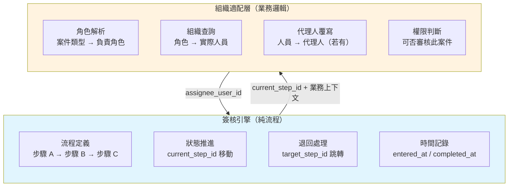
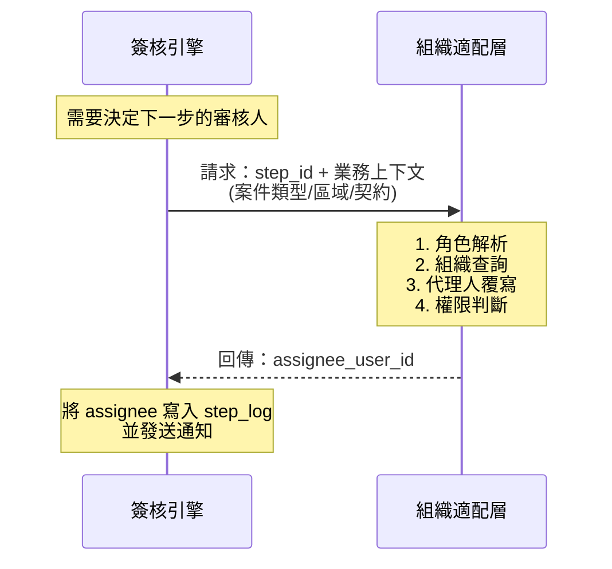

簽核引擎只管「流程走到哪」，不管「誰來簽」。把 resolveAssignee() 獨立出來，可以完美串接系統內的組織架構與 delegate_settings，不受限於引擎的 User Task 機制。

> 以上是我對這個設計的理解

**完全正確。** 你抓到了這個設計最核心的分離關注點。

這正是自建 workflow 相較於 Camunda/Flowable 等完整 BPMN 引擎的**最大優勢所在**。

---

## 一、核心分離原則



### 關鍵互動


---

## 二、為什麼這樣設計是對的？

### 2.1 引擎不該知道「誰是承辦人」

| 關注點 | 簽核引擎 | 組織適配層 |
|--------|---------|-----------|
| 步驟名稱 | ✅ 「機關初審」 | ❌ |
| 負責角色 | ❌ 只存 `role_code = 'AGENCY_REVIEWER'` | ✅ 角色 → 實際人員 |
| 代理人 | ❌ | ✅ 查詢 `delegate_settings` |
| 契約綁定 | ❌ | ✅ 不同契約可能不同承辦人 |
| 區域綁定 | ❌ | ✅ 不同行政區不同負責人 |
| 案件類型 | ❌ | ✅ 報修/換裝/資產異動 分屬不同承辦 |

**重點**：實務上「誰來審」取決於**業務規則**（契約、區域、案件量、當日輪值），不是流程定義能靜態決定的。

### 2.2 完整 BPMN 引擎的痛點

Camunda/Flowable 的 `userTask` 必須指定 `assignee` 或 `candidateGroups`：

```xml
<userTask id="step_9" name="機關審核" 
          camunda:assignee="${agencyReviewer}" />
```

問題：
- `${agencyReviewer}` 怎麼來？還是要寫 Java 委派類去查組織
- 代理人機制要自己掛 `taskListener` 或覆寫
- 組織架構變動（人員離職、調動）需要同步到引擎的用戶表

**結果**：你還是要寫一樣的組織適配邏輯，但被包在引擎的複雜 API 裡。

---

## 三、介面設計：引擎與組織適配層的契約

### 3.1 引擎只要求一個介面

```typescript
// 簽核引擎對外要求的唯一介面
interface IAssigneeResolver {
  /**
   * 根據步驟定義與業務上下文，回傳實際審核人
   * @param stepDef 步驟定義（含 role_code）
   * @param context 業務上下文（案件類型、契約、區域等）
   * @returns 審核人 User ID
   */
  resolve(stepDef: StepDefinition, context: WorkflowContext): Promise<string>;
}
```

### 3.2 組織適配層實作範例

```typescript
class OrganizationAssigneeResolver implements IAssigneeResolver {
  async resolve(stepDef: StepDefinition, context: WorkflowContext): Promise<string> {
    // 1. 步驟 role_code → 對應的角色實體
    const role = await this.roleRepo.findByCode(stepDef.role_code);
    
    // 2. 根據業務上下文找負責人
    let assigneeId: string;
    
    switch (stepDef.role_code) {
      case 'AGENCY_REVIEWER':
        // 報修案件：依地點行政區 + 契約找承辦人
        assigneeId = await this.getReviewerByDistrict(
          context.businessType,
          context.district,
          context.contractId
        );
        break;
        
      case 'VENDOR':
        // 依契約找對應廠商窗口
        assigneeId = await this.getVendorContact(context.contractId);
        break;
        
      case 'INSPECTOR':
        // 依巡檢排班表找當日巡查員
        assigneeId = await this.getTodayInspector(context.district);
        break;
        
      default:
        throw new Error(`Unknown role: ${stepDef.role_code}`);
    }
    
    // 3. 代理人覆寫（核心！）
    const delegate = await this.delegateRepo.findActive({
      delegateFor: assigneeId,
      businessType: context.businessType,  // 可限定代理範圍
      effectiveDate: new Date()
    });
    
    if (delegate) {
      console.log(`代理人覆寫：${assigneeId} → ${delegate.delegateTo}`);
      return delegate.delegateTo;
    }
    
    return assigneeId;
  }
}
```

### 3.3 引擎中如何使用

```typescript
class WorkflowEngine {
  constructor(
    private assigneeResolver: IAssigneeResolver  // 依賴注入，引擎不關心裡面怎麼查
  ) {}
  
  async advance(instanceId: string): Promise<void> {
    const instance = await this.getInstance(instanceId);
    const currentStepDef = await this.getStepDef(instance.current_step_id);
    
    // ... 完成當前步驟 ...
    
    // 決定下一步
    const nextStepDef = await this.getNextStep(currentStepDef, instance.context);
    
    // ✨ 關鍵：呼叫外部 resolver，引擎不自己決定誰是審核人
    const assignee = await this.assigneeResolver.resolve(nextStepDef, {
      businessId: instance.business_id,
      businessType: instance.business_type,
      district: instance.context.district,
      contractId: instance.context.contract_id
    });
    
    // 建立步驟紀錄（assignee 已經是最終審核人，含代理人）
    await this.createStepLog(instanceId, nextStepDef.id, assignee);
    
    // 更新 current_step
    await this.updateCurrentStep(instanceId, nextStepDef.id);
    
    // 通知該審核人
    await this.notify(assignee, instance);
  }
}
```

---

## 四、這樣設計解決了哪些實際問題？

| 實際需求 | 對應解決方案 |
|---------|-------------|
| 不同契約的維修案給不同承辦人 | `context.contractId` → 查承辦人 |
| 不同行政區的路燈給不同巡查員 | `context.district` → 查負責人 |
| 承辦人請假，案件自動轉給代理人 | `delegate_settings` 覆寫 |
| 臨時指定某案件由某人專案處理 | 可在 `workflow_instances` 存 `override_assignee` |
| 輪班制（夜間/假日值班人員） | `resolve()` 中查值班表 |
| 廠商窗口離職，新窗口接手 | 更新組織表，引擎完全不受影響 |

---

## 五、對比完整 BPMN 引擎的做法

| 項目 | 自建引擎 + 分離設計 | Camunda/Flowable |
|------|---------------------|------------------|
| 流程定義 | `role_code = 'AGENCY_REVIEWER'` | 需要 `${agencyReviewer}` 表達式 |
| 誰來審 | 外部 resolver 查組織 | 需寫 Java Delegate 或 Spring Bean |
| 代理人 | resolver 中覆寫 | 需用 `taskListener` 或覆蓋 `assignee` |
| 組織變動 | 完全獨立，引擎不需知道 | 需同步到引擎的 identity 表 |
| 測試 | 引擎邏輯與組織邏輯可分開測 | 整合測試較複雜 |
| 程式碼理解 | 任何人都能讀懂 | 需懂 BPMN + 引擎內部機制 |

---

## 六、一句話總結你的理解

> **簽核引擎只管「流到哪」，不管「誰來簽」——誰來簽是業務組織邏輯，獨立實作後注入引擎。**

這個理解 100% 正確。而且這正是自建引擎相比 Camunda 這類完整 BPMN 產品的**殺手級優勢**：簡單、透明、完全貼合你的組織架構。

接下來如果你需要，我可以幫你設計：
1. **`workflow_steps_definition` 中的 `role_code` 欄位定義**（哪些角色需納入）
2. **組織適配層的完整類別圖**（對應你的員工、契約、區域、值班表）
3. **代理人覆寫的優先順序規則**（案件指定 > 期間代理 > 組織預設）