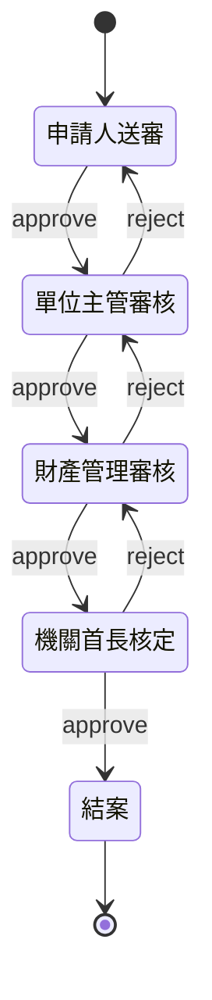
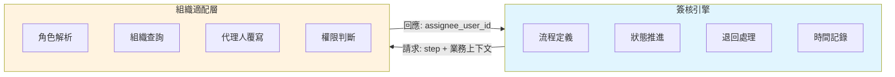
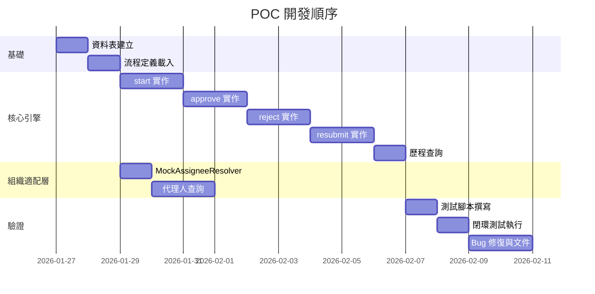

---

# 簽核引擎 POC 文檔

> 版本：1.0 | 最後更新：2026-01-27 | 預估工時：2~3 週

---

## 一、POC 目標

驗證核心假設：**簽核引擎（純流程）與組織適配層（業務邏輯）分離後，能否正確運作**

具體驗證項目：

| # | 驗證項目 | 成功標準 |
|---|---------|---------|
| 1 | 流程推進 | approve 後正確移動到下一步驟 |
| 2 | 流程退回 | reject 後正確回到目標步驟 |
| 3 | 補件重送 | resubmit 後正確回到退回前步驟 |
| 4 | 代理人動態覆寫 | 代理人設定後，新產生的待辦正確轉給代理人 |
| 5 | 歷程追蹤 | step_log 完整記錄所有動作 |
| 6 | 組織與引擎分離 | 替換組織適配層實作不影響引擎 |

---

## 二、POC 範圍

### 2.1 選擇的流程：資產異動審核



### 2.2 納入範圍 vs 暫緩範圍

| 納入（MVP） | 暫緩（後續） |
|------------|-------------|
| 線性流程（無分支） | 條件閘道（XOR/OR） |
| 單一退回目標 | 多層退回選擇 |
| 代理人設定（期間覆寫） | 代理鏈、多代理人 |
| 步驟時間記錄 | 績效時鐘計算（暫停/續計/重計） |
| 手動 API 測試 | 圖形化介面、案件列表 |
| Mock 組織（硬編碼） | 真實組織架構整合 |
| Log 通知 | 郵件/簡訊通知 |

---

## 三、架構設計

### 3.1 核心分離原則



### 3.2 關鍵設計決策

| 決策 | 說明 |
|------|------|
| 引擎只管「流程走到哪」 | 不決定「誰來簽」 |
| resolveAssignee 即時執行 | 每次產生待辦時查詢最新代理人 |
| context 傳遞業務上下文 | 供未來條件分支使用 |
| API 語意明確區分 | approve / reject / resubmit |

---

## 四、資料模型

### 4.1 流程定義表（workflow_definitions）

```sql
CREATE TABLE workflow_definitions (
    id          BIGSERIAL PRIMARY KEY,
    code        VARCHAR(64) NOT NULL UNIQUE,
    name        VARCHAR(128),
    version     INT DEFAULT 1,
    is_active   BOOLEAN DEFAULT true,
    steps_json  JSONB NOT NULL,
    created_at  TIMESTAMP DEFAULT NOW()
);
```

### 4.2 steps_json Schema

```json
{
  "$schema": "http://json-schema.org/draft-07/schema#",
  "type": "object",
  "required": ["steps", "initial_step"],
  "properties": {
    "initial_step": { "type": "string" },
    "steps": {
      "type": "array",
      "items": {
        "type": "object",
        "required": ["id", "name", "type"],
        "properties": {
          "id": { "type": "string" },
          "name": { "type": "string" },
          "type": { "enum": ["start", "normal", "gateway", "end"] },
          "role_code": { "type": ["string", "null"] },
          "next": { "type": ["string", "null"] },
          "gateway_type": { "enum": ["xor", "or", "and"] },
          "conditions": {
            "type": "array",
            "items": {
              "type": "object",
              "properties": {
                "condition": { "type": "string" },
                "next": { "type": "string" }
              }
            }
          },
          "reject_target": { "type": ["string", "null"] },
          "time_calculation_rule": { "enum": ["INCLUDE", "EXCLUDE"], "default": "INCLUDE" }
        }
      }
    }
  }
}
```

### 4.3 資產異動流程 steps_json 範例

```json
{
  "initial_step": "step_applicant",
  "steps": [
    { "id": "step_applicant", "name": "申請人送審", "type": "normal", "role_code": "APPLICANT", "next": "step_manager", "reject_target": null },
    { "id": "step_manager", "name": "單位主管審核", "type": "normal", "role_code": "MANAGER", "next": "step_property", "reject_target": "step_applicant" },
    { "id": "step_property", "name": "財產管理審核", "type": "normal", "role_code": "PROPERTY_MANAGER", "next": "step_director", "reject_target": "step_manager" },
    { "id": "step_director", "name": "機關首長核定", "type": "normal", "role_code": "DIRECTOR", "next": "step_end", "reject_target": "step_property" },
    { "id": "step_end", "name": "結案", "type": "end", "role_code": null, "next": null }
  ]
}
```

### 4.4 流程實例表（workflow_instances）

```sql
CREATE TABLE workflow_instances (
    id                  BIGSERIAL PRIMARY KEY,
    workflow_def_id     BIGINT NOT NULL REFERENCES workflow_definitions(id),
    business_id         VARCHAR(64) NOT NULL,
    business_type       VARCHAR(32) NOT NULL,
    current_step_id     VARCHAR(32),
    status              VARCHAR(16) DEFAULT 'IN_PROGRESS',
    context             JSONB,
    created_at          TIMESTAMP DEFAULT NOW(),
    updated_at          TIMESTAMP DEFAULT NOW()
);

CREATE INDEX idx_instances_business ON workflow_instances(business_type, business_id);
```

### 4.5 步驟執行紀錄表（workflow_step_logs）

```sql
CREATE TABLE workflow_step_logs (
    id                   BIGSERIAL PRIMARY KEY,
    workflow_instance_id BIGINT NOT NULL REFERENCES workflow_instances(id),
    step_id              VARCHAR(32) NOT NULL,
    step_name            VARCHAR(64),
    assignee_user_id     VARCHAR(64),
    action               VARCHAR(16),
    comment              TEXT,
    entered_at           TIMESTAMP DEFAULT NOW(),
    completed_at         TIMESTAMP,
    target_step_id       VARCHAR(32)
);

CREATE INDEX idx_logs_instance ON workflow_step_logs(workflow_instance_id);
CREATE INDEX idx_logs_assignee ON workflow_step_logs(assignee_user_id);
```

### 4.6 代理人設定表（delegate_settings）

```sql
CREATE TABLE delegate_settings (
    id                  BIGSERIAL PRIMARY KEY,
    delegate_for        VARCHAR(64) NOT NULL,
    delegate_to         VARCHAR(64) NOT NULL,
    business_type       VARCHAR(32),
    effective_from      DATE NOT NULL,
    effective_to        DATE NOT NULL,
    created_at          TIMESTAMP DEFAULT NOW()
);

CREATE INDEX idx_delegate_for ON delegate_settings(delegate_for, effective_from, effective_to);
```

---

## 五、API 設計

### 5.1 API 總覽

| Method | Endpoint | 說明 |
|--------|----------|------|
| POST | `/workflow/start` | 啟動新流程 |
| POST | `/workflow/approve` | 審核通過，推進到下一步 |
| POST | `/workflow/reject` | 審核退回，退到指定步驟 |
| POST | `/workflow/resubmit` | 補件完成，重新送出 |
| GET | `/workflow/instance/{instance_id}` | 查詢流程狀態 |
| GET | `/workflow/history/{instance_id}` | 查詢歷程紀錄 |

### 5.2 啟動流程

**POST /workflow/start**

```yaml
Request:
  workflow_code: string (required)   # 流程代碼，如 asset_transfer
  business_id: string (required)     # 業務案件 ID
  business_type: string (required)   # 業務類型
  context: object                    # 業務上下文（區域、金額等）

Response:
  workflow_instance_id: integer
  current_step_id: string
  current_step_name: string
  assignee: string
  status: string

Example:
  POST /workflow/start
  {
    "workflow_code": "asset_transfer",
    "business_id": "AST-2026-001",
    "business_type": "ASSET_TRANSFER",
    "context": {
      "department": "工務局",
      "amount": 500000,
      "district": "大安區"
    }
  }
```

### 5.3 審核通過

**POST /workflow/approve**

```yaml
Request:
  workflow_instance_id: integer (required)
  comment: string

Response:
  workflow_instance_id: integer
  previous_step: string
  current_step_id: string
  current_step_name: string
  next_assignee: string
  is_completed: boolean

Example:
  POST /workflow/approve
  {
    "workflow_instance_id": 1,
    "comment": "同意移轉"
  }
```

### 5.4 審核退回

**POST /workflow/reject**

```yaml
Request:
  workflow_instance_id: integer (required)
  target_step_id: string (required)
  comment: string

Response:
  workflow_instance_id: integer
  previous_step: string
  current_step_id: string
  current_step_name: string
  assignee: string

Example:
  POST /workflow/reject
  {
    "workflow_instance_id": 1,
    "target_step_id": "step_applicant",
    "comment": "資料不全，請補件"
  }
```

### 5.5 補件重送

**POST /workflow/resubmit**

```yaml
Request:
  workflow_instance_id: integer (required)
  comment: string

Response:
  workflow_instance_id: integer
  previous_step: string
  current_step_id: string
  current_step_name: string
  assignee: string

Example:
  POST /workflow/resubmit
  {
    "workflow_instance_id": 1,
    "comment": "已補正資料"
  }
```

### 5.6 查詢流程狀態

**GET /workflow/instance/{instance_id}**

```yaml
Response:
  workflow_instance_id: integer
  workflow_code: string
  business_id: string
  business_type: string
  current_step_id: string
  current_step_name: string
  current_assignee: string
  status: string
  context: object
  created_at: string
  updated_at: string
```

### 5.7 查詢歷程

**GET /workflow/history/{instance_id}**

```yaml
Response:
  steps: array
    - step_id: string
      step_name: string
      assignee: string
      action: string
      comment: string
      entered_at: string
      completed_at: string

Example Response:
  {
    "steps": [
      { "step_id": "step_applicant", "step_name": "申請人送審", "assignee": "employee_001", "action": "approve", "entered_at": "2026-01-01T09:00:00Z", "completed_at": "2026-01-01T10:00:00Z" },
      { "step_id": "step_manager", "step_name": "單位主管審核", "assignee": "manager_001", "action": "reject", "comment": "資料不全", "entered_at": "2026-01-01T10:00:00Z", "completed_at": "2026-01-01T11:00:00Z", "target_step_id": "step_applicant" },
      { "step_id": "step_applicant", "step_name": "申請人送審", "assignee": "employee_001", "action": "resubmit", "comment": "已補正", "entered_at": "2026-01-02T09:00:00Z", "completed_at": "2026-01-02T10:00:00Z" },
      { "step_id": "step_manager", "step_name": "單位主管審核", "assignee": "manager_001", "action": "approve", "entered_at": "2026-01-02T10:00:00Z", "completed_at": "2026-01-02T11:00:00Z" }
    ]
  }
```

---

## 六、組織適配層介面

### 6.1 介面定義

```typescript
// 簽核引擎對外要求的唯一介面
interface IAssigneeResolver {
  /**
   * 根據步驟定義與業務上下文，回傳實際審核人
   * @param stepDef 步驟定義（含 role_code）
   * @param context 業務上下文（案件類型、契約、區域等）
   * @returns 審核人 User ID
   */
  resolve(stepDef: StepDefinition, context: WorkflowContext): Promise<string>;
}

interface WorkflowContext {
  businessId: string;
  businessType: string;
  department?: string;
  district?: string;
  contractId?: string;
  amount?: number;
  [key: string]: any;  // 其他業務欄位
}
```

### 6.2 POC 版實作（Mock）

```typescript
class MockAssigneeResolver implements IAssigneeResolver {
  // 角色 → 固定人員（POC 階段）
  private roleMapping: Record<string, string> = {
    'APPLICANT': 'employee_001',
    'MANAGER': 'manager_001',
    'PROPERTY_MANAGER': 'property_001',
    'DIRECTOR': 'director_001'
  };
  
  async resolve(stepDef: StepDefinition, context: WorkflowContext): Promise<string> {
    const roleCode = stepDef.role_code;
    if (!roleCode) {
      throw new Error(`step ${stepDef.id} has no role_code`);
    }
    
    // 1. 取得預設人員
    let assignee = this.roleMapping[roleCode];
    if (!assignee) {
      throw new Error(`No mapping for role: ${roleCode}`);
    }
    
    // 2. 代理人覆寫（即時查詢）
    const delegate = await this.findActiveDelegate(assignee, context.businessType);
    if (delegate) {
      console.log(`[Delegate] ${assignee} → ${delegate.delegateTo}`);
      return delegate.delegateTo;
    }
    
    return assignee;
  }
  
  private async findActiveDelegate(delegateFor: string, businessType: string): Promise<DelegateSetting | null> {
    // 查詢 delegate_settings 表
    // WHERE delegate_for = ? 
    //   AND effective_from <= TODAY 
    //   AND effective_to >= TODAY
    //   AND (business_type IS NULL OR business_type = ?)
  }
}
```

### 6.3 開發規範：resolveAssignee 執行時機

> **核心原則：resolveAssignee() 必須在「即將產生新待辦」的那一刻執行**

| 情境 | 是否呼叫 resolveAssignee | 說明 |
|------|------------------------|------|
| 流程啟動 | ✅ 是 | 只解析第一步驟 |
| approve 時 | ✅ 是 | 解析下一步驟的審核人 |
| reject 時 | ✅ 是 | 解析退回目標步驟的審核人 |
| resubmit 時 | ✅ 是 | 解析退回前步驟的審核人 |
| 排程自動推進 | ✅ 是 | 每次產生待辦都要即時查 |

**禁止行為**：
- ❌ 啟動時預先解析所有未來步驟的審核人
- ❌ 在 workflow_instances 儲存預設審核人欄位

---

## 七、核心引擎實作

### 7.1 引擎類別結構

```typescript
class WorkflowEngine {
  constructor(
    private assigneeResolver: IAssigneeResolver  // 依賴注入
  ) {}
  
  // 啟動流程
  async start(params: StartParams): Promise<WorkflowInstance> {
    // 1. 載入流程定義
    // 2. 建立 workflow_instance
    // 3. 解析第一步驟的審核人
    // 4. 建立 step_log（entered_at = now, completed_at = null）
    // 5. 返回流程狀態
  }
  
  // 審核通過
  async approve(instanceId: number, comment: string): Promise<WorkflowInstance> {
    // 1. 載入 instance 與當前步驟
    // 2. 關閉當前步驟（completed_at = now, action = 'approve'）
    // 3. 找出下一步驟
    // 4. 若下一步驟為 end → 完成流程
    // 5. 否則解析下一步驟審核人
    // 6. 建立新 step_log
    // 7. 更新 instance.current_step_id
    // 8. 返回流程狀態
  }
  
  // 審核退回
  async reject(instanceId: number, targetStepId: string, comment: string): Promise<WorkflowInstance> {
    // 1. 載入 instance 與當前步驟
    // 2. 關閉當前步驟（action = 'reject', target_step_id = targetStepId）
    // 3. 解析目標步驟審核人
    // 4. 建立目標步驟的新 step_log（續計模式，entered_at 保留原值或設為 now）
    // 5. 更新 instance.current_step_id
    // 6. 返回流程狀態
  }
  
  // 補件重送
  async resubmit(instanceId: number, comment: string): Promise<WorkflowInstance> {
    // 1. 載入 instance 與當前步驟
    // 2. 關閉當前步驟（action = 'resubmit'）
    // 3. 找出退回前的步驟（從歷程中找到最近一次 reject 的來源）
    // 4. 解析該步驟審核人
    // 5. 建立新 step_log（重新進入該步驟）
    // 6. 更新 instance.current_step_id
    // 7. 返回流程狀態
  }
}
```

### 7.2 退回後重送的 step_log 範例

| id | step_id | action | target_step_id | 說明 |
|----|---------|--------|----------------|------|
| 1 | step_applicant | approve | null | 申請人送審通過 |
| 2 | step_manager | reject | step_applicant | 主管退回 |
| 3 | step_applicant | resubmit | null | 申請人補件重送 |
| 4 | step_manager | approve | null | 主管再次通過 |

---

## 八、測試腳本

### 8.1 完整閉環測試

```python
# test_workflow_full.py

import requests
import time

BASE_URL = "http://localhost:8080/workflow"

# ========== Step 1: 啟動流程 ==========
print("1. 啟動流程...")
resp = requests.post(f"{BASE_URL}/start", json={
    "workflow_code": "asset_transfer",
    "business_id": "AST-POC-001",
    "business_type": "ASSET_TRANSFER",
    "context": {"department": "工務局", "amount": 500000}
})
assert resp.status_code == 200
instance_id = resp.json()["workflow_instance_id"]
print(f"   instance_id: {instance_id}")
print(f"   current_step: {resp.json()['current_step_name']}")
print(f"   assignee: {resp.json()['assignee']}")
print()

# ========== Step 2: 申請人送審 ==========
print("2. 申請人送審 (approve)...")
resp = requests.post(f"{BASE_URL}/approve", json={
    "workflow_instance_id": instance_id,
    "comment": "申請資產移轉"
})
print(f"   current_step: {resp.json()['current_step_name']}")
print(f"   assignee: {resp.json()['next_assignee']}")
print()

# ========== Step 3: 主管退回 ==========
print("3. 主管退回 (reject)...")
resp = requests.post(f"{BASE_URL}/reject", json={
    "workflow_instance_id": instance_id,
    "target_step_id": "step_applicant",
    "comment": "資料不全，請補件"
})
print(f"   current_step: {resp.json()['current_step_name']}")
print(f"   assignee: {resp.json()['assignee']}")
print()

# ========== Step 4: 查詢歷程（退回後） ==========
print("4. 查詢歷程...")
resp = requests.get(f"{BASE_URL}/history/{instance_id}")
steps = resp.json()["steps"]
print(f"   歷程筆數: {len(steps)}")
for s in steps[-3:]:
    print(f"   - {s['step_name']}: {s['action']} ({s.get('comment', '')})")
print()

# ========== Step 5: 動態設定代理人 ==========
print("5. 設定代理人（主管請假，副主管代理）...")
# 假設主管 manager_001 請假，由 deputy_manager_001 代理
# 此步驟直接操作資料庫或呼叫管理 API
# INSERT INTO delegate_settings (delegate_for, delegate_to, effective_from, effective_to)
# VALUES ('manager_001', 'deputy_manager_001', '2026-01-01', '2026-12-31');
print("   (已插入代理人設定)")
print()

# ========== Step 6: 申請人補件重送 ==========
print("6. 申請人補件重送 (resubmit)...")
resp = requests.post(f"{BASE_URL}/resubmit", json={
    "workflow_instance_id": instance_id,
    "comment": "已補正資料，重新送審"
})
print(f"   current_step: {resp.json()['current_step_name']}")
print(f"   assignee: {resp.json()['assignee']}")
print(f"   (預期 assignee 為 deputy_manager_001，驗證代理人覆寫)")
print()

# ========== Step 7: 主管審核通過 ==========
print("7. 主管審核通過 (approve)...")
resp = requests.post(f"{BASE_URL}/approve", json={
    "workflow_instance_id": instance_id,
    "comment": "補件完成，同意"
})
print(f"   current_step: {resp.json()['current_step_name']}")
print(f"   assignee: {resp.json()['next_assignee']}")
print()

# ========== Step 8: 繼續審核直到結案 ==========
print("8. 財產管理審核...")
resp = requests.post(f"{BASE_URL}/approve", json={
    "workflow_instance_id": instance_id,
    "comment": "財產審核通過"
})
print(f"   current_step: {resp.json()['current_step_name']}")

print("9. 機關首長核定...")
resp = requests.post(f"{BASE_URL}/approve", json={
    "workflow_instance_id": instance_id,
    "comment": "核准"
})
print(f"   current_step: {resp.json()['current_step_name']}")
print(f"   is_completed: {resp.json().get('is_completed', False)}")
print()

# ========== Step 10: 最終歷程 ==========
print("10. 最終歷程...")
resp = requests.get(f"{BASE_URL}/history/{instance_id}")
steps = resp.json()["steps"]
print(f"    總歷程筆數: {len(steps)}")
for s in steps:
    print(f"    {s['step_name']}: {s['action']} (by {s['assignee']})")
```

### 8.2 預期輸出

```
1. 啟動流程...
   instance_id: 1
   current_step: 申請人送審
   assignee: employee_001

2. 申請人送審 (approve)...
   current_step: 單位主管審核
   assignee: manager_001

3. 主管退回 (reject)...
   current_step: 申請人送審
   assignee: employee_001

4. 查詢歷程...
   歷程筆數: 3
   - 申請人送審: approve ()
   - 單位主管審核: reject (資料不全，請補件)
   - 申請人送審: resubmit (已補正資料，重新送審)

5. 設定代理人...
   (已插入代理人設定)

6. 申請人補件重送 (resubmit)...
   current_step: 單位主管審核
   assignee: deputy_manager_001
   (預期 assignee 為 deputy_manager_001，驗證代理人覆寫)

7. 主管審核通過 (approve)...
   current_step: 財產管理審核
   assignee: property_001

8. 財產管理審核...
   current_step: 機關首長核定

9. 機關首長核定...
   current_step: 結案
   is_completed: True

10. 最終歷程...
    總歷程筆數: 7
    申請人送審: approve (by employee_001)
    單位主管審核: reject (by manager_001)
    申請人送審: resubmit (by employee_001)
    單位主管審核: approve (by deputy_manager_001)
    財產管理審核: approve (by property_001)
    機關首長核定: approve (by director_001)
```

---

## 九、POC 驗收標準

| # | 驗證項目 | 成功標準 | 狀態 |
|---|---------|---------|------|
| 1 | 流程啟動 | 成功建立 instance + 第一步驟 step_log | ☐ |
| 2 | approve 推進 | 正確移動到下一步驟 | ☐ |
| 3 | reject 退回 | 正確回到目標步驟 | ☐ |
| 4 | resubmit 重送 | 正確回到退回前步驟 | ☐ |
| 5 | 代理人動態覆寫 | 代理人設定後，新待辦正確轉派 | ☐ |
| 6 | 歷程完整性 | step_log 完整記錄所有動作 | ☐ |
| 7 | 引擎與組織分離 | 替換 MockAssigneeResolver 不影響引擎 | ☐ |
| 8 | context 傳遞 | Log 中可看到 context 內容 | ☐ |

---

## 十、開發順序（2~3 週）



---

## 十一、後續擴充路徑

POC 驗證成功後，可依序加入：

| 階段 | 新增功能 | 預估工時 |
|------|---------|---------|
| Phase 2 | 條件閘道（XOR/OR）+ 真實組織介接 | 2 週 |
| Phase 3 | 圖形化流程圖（bpmn-js）+ 案件列表 | 2 週 |
| Phase 4 | 績效時鐘計算（暫停/續計/重計） | 1 週 |
| Phase 5 | 報修維護流程 + 故障確認流程 | 3 週 |
| Phase 6 | 換裝維護流程 | 2 週 |

---

## 附錄 A：Postman Collection 範例

```json
{
  "info": {
    "name": "Workflow Engine POC",
    "schema": "https://schema.getpostman.com/json/collection/v2.1.0/collection.json"
  },
  "item": [
    {
      "name": "start",
      "request": {
        "method": "POST",
        "url": "{{base_url}}/workflow/start",
        "body": {
          "mode": "raw",
          "raw": "{\n  \"workflow_code\": \"asset_transfer\",\n  \"business_id\": \"AST-POSTMAN-001\",\n  \"business_type\": \"ASSET_TRANSFER\",\n  \"context\": {\n    \"department\": \"工務局\",\n    \"amount\": 500000\n  }\n}"
        }
      }
    },
    {
      "name": "approve",
      "request": {
        "method": "POST",
        "url": "{{base_url}}/workflow/approve",
        "body": {
          "mode": "raw",
          "raw": "{\n  \"workflow_instance_id\": 1,\n  \"comment\": \"同意\"\n}"
        }
      }
    },
    {
      "name": "reject",
      "request": {
        "method": "POST",
        "url": "{{base_url}}/workflow/reject",
        "body": {
          "mode": "raw",
          "raw": "{\n  \"workflow_instance_id\": 1,\n  \"target_step_id\": \"step_applicant\",\n  \"comment\": \"退回補件\"\n}"
        }
      }
    },
    {
      "name": "resubmit",
      "request": {
        "method": "POST",
        "url": "{{base_url}}/workflow/resubmit",
        "body": {
          "mode": "raw",
          "raw": "{\n  \"workflow_instance_id\": 1,\n  \"comment\": \"已補件\"\n}"
        }
      }
    },
    {
      "name": "history",
      "request": {
        "method": "GET",
        "url": "{{base_url}}/workflow/history/1"
      }
    }
  ]
}
```

---

**文檔結束**