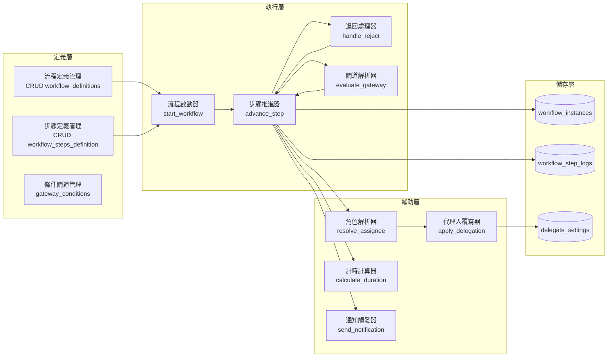

以 BPMN 2.0 為「語義參考」和「視覺化標準」，但**自建 workflow 引擎**。

這是最適合這個專案的路徑。以下是為什麼這樣建議、以及「自建」到底要建哪些東西。

---

## 一、為什麼不是直接用 BPMN 引擎？

| 評估維度 | 直接用 Camunda/Flowable | 自建輕量引擎 |
|---------|------------------------|-------------|
| **學習成本** | 團隊需學 BPMN、DMN、CMMN | 只需懂狀態機 + 你的業務邏輯 |
| **整合難度** | 需獨立服務或嵌入（Java 為主） | 與你的 Spring Boot / .NET 完全貼合 |
| **退回補件邏輯** | 需用 Boundary Event + 迴圈，較迂迴 | 直接用 `reject_target_step_id` 直覺實作 |
| **績效時鐘（暫停/續計/重計）** | 無內建，仍需外掛 | 完全自控 |
| **代理人** | 無內建 | 完全自控 |
| **流程版本與進行中案件凍結** | 複雜（需同時跑多版本） | 簡單（workflow_instance 綁 version） |
| **部署與維運成本** | 中高（需維護引擎 DB schema、Job Executor） | 低（只有你自己的表與邏輯） |
| **未來擴充到複雜流程** | 強 | 中（但你的需求已大致固定） |

**結論**：用完整 BPMN 引擎是「為了 20% 進階需求（子流程、事件網、多租戶複雜路由）付出 80% 成本」，而你沒有那 20% 的需求。

---

## 二、自建 workflow 要實作的核心模組



### 2.1 必須自寫的核心邏輯（約 1000~1500 行）

| 模組 | 功能 | 複雜度 |
|------|------|--------|
| `WorkflowEngine.advance()` | 給定 `workflow_instance_id`，找出下一步驟、建立 step log、更新 current_step | 中 |
| `WorkflowEngine.reject()` | 給定 `target_step_id`，建立退回紀錄，跳回目標步驟，處理時間暫停 | 中高 |
| `GatewayEvaluator.evaluate()` | 讀取 JSON conditions，用 SpEL/JSONPath 判斷走向 | 中 |
| `TimeoutScheduler` | 掃描停留超過 SLA 的步驟，觸發通知或自動轉派 | 中 |
| `DurationCalculator` | 根據 `workflow_step_logs` 的 entered_at / completed_at，加總 INCLUDE 步驟的時間 | 低中 |

### 2.2 你不需要自己寫的（可套件輔助）

| 功能 | 建議套件 |
|------|---------|
| BPMN 視覺化編輯 | bpmn-js (僅前端繪製 + 匯出 JSON) |
| JSON 條件判斷 | JSONPath + SpEL / JavaScript eval（沙箱） |
| 排程掃描 | Quartz / Hangfire / 排程框架 |
| 通知 | 既有通知模組（2-10） |

---

## 三、自建 vs 引擎的程式碼量對比

| 項目 | 自建 | Camunda/Flowable |
|------|------|------------------|
| 核心引擎程式碼 | ~1500 行 | 數萬行（你還是只用到 subset） |
| 資料表數量 | 5 張 | 40+ 張 |
| 啟動時間 | 即時 | 需載入引擎上下文 |
| 除錯難度 | 低（你寫的你懂） | 高（需懂引擎內部行為） |
| 面試/交接成本 | 中（需說明設計） | 中（需有人懂 BPMN） |

---

## 四、自建 workflow 的範例核心程式（TypeScript 風格）

```typescript
class WorkflowEngine {
  async advance(instanceId: string): Promise<void> {
    const instance = await this.getInstance(instanceId);
    const currentStepDef = await this.getStepDef(instance.current_step_id);
    
    // 1. 關閉當前步驟（寫完成時間）
    await this.completeCurrentStep(instanceId, currentStepDef);
    
    // 2. 決定下一步
    let nextStepId = currentStepDef.next;
    
    // 2.1 如果是 Gateway，進行條件判斷
    if (currentStepDef.type === 'gateway') {
      nextStepId = await this.evaluateGateway(currentStepDef, instance.context);
    }
    
    // 2.2 檢查是否為終點
    const nextStepDef = await this.getStepDef(nextStepId);
    if (nextStepDef.type === 'end') {
      await this.completeWorkflow(instanceId);
      return;
    }
    
    // 3. 解析實際審核人（含代理）
    const assignee = await this.resolveAssignee(nextStepDef, instance);
    
    // 4. 建立新步驟紀錄
    await this.createStepLog(instanceId, nextStepId, assignee);
    
    // 5. 更新 workflow_instances.current_step_id
    await this.updateCurrentStep(instanceId, nextStepId);
    
    // 6. 觸發通知
    await this.notify(assignee, instance, nextStepDef);
  }
  
  async reject(instanceId: string, targetStepId: string, reason: string): Promise<void> {
    const instance = await this.getInstance(instanceId);
    const currentStepId = instance.current_step_id;
    
    // 1. 關閉當前步驟（標記為 REJECT，不列入績效時間）
    await this.completeCurrentStep(instanceId, currentStepId, {
      action: 'REJECT',
      comment: reason
    });
    
    // 2. 退回目標步驟：重置 entered_at（或保留續計，視規則）
    await this.resetStepEntry(instanceId, targetStepId, {
      resetTimer: false  // 續計模式
    });
    
    // 3. 更新 current_step_id 到目標步驟
    await this.updateCurrentStep(instanceId, targetStepId);
    
    // 4. 通知目標步驟審核人
    const targetStepDef = await this.getStepDef(targetStepId);
    const assignee = await this.resolveAssignee(targetStepDef, instance);
    await this.notify(assignee, instance, targetStepDef, { rejectReason: reason });
  }
}
```

---

## 五、自建的最大風險與對策

| 風險 | 對策 |
|------|------|
| 流程邏輯 Bug 導致卡死 | 提供管理後台「強制跳轉步驟」功能 |
| 無法滿足未來複雜需求（如多執行緒會簽） | 保留擴充點：`step_type` 可新增 `PARALLEL_GATEWAY` |
| 退回補件的時間計算爭議 | 所有時間變更寫入 `workflow_time_adjustments` 表（稽核用） |
| 多人同時操作狀態衝突 | 樂觀鎖（`workflow_instances.version` 欄位） |

---

## 六、最終建議總結

| 決策 | 建議 |
|------|------|
| 流程設計符號 | BPMN 2.0（可視化 + 溝通） |
| 流程儲存格式 | 自訂 JSON（相容 BPMN subset） |
| 流程引擎 | **自建**（1000~1500 行核心） |
| 視覺化編輯 | bpmn-js（僅用於設計，匯出 JSON） |
| 退回/補件/績效時鐘 | 完全自控 |
| 代理人 | 獨立模組，引擎中呼叫覆寫 |
| 不採用的部分 | 完整 BPMN 引擎、XML、事件子流程、交易 |

---

## 七、一句話結論

> **用 BPMN 畫流程圖給人看，用自建狀態機跑流程給機器跑。**

兩者各司其職，互不衝突。你拿到 BPMN 的好處（標準化、可視化），同時保有自建引擎的靈活性與低複雜度。

如果決定走這條路，我可以幫你進一步：
1. 設計 **workflow_definitions 與 workflow_steps_definition 的完整 DDL**
2. 寫出 **Gateway 條件表達式的設計方案**（JSONPath / SpEL / 自訂 DSL）
3. 提供 **bpmn-js 匯出到你 JSON 格式的轉換器範例**