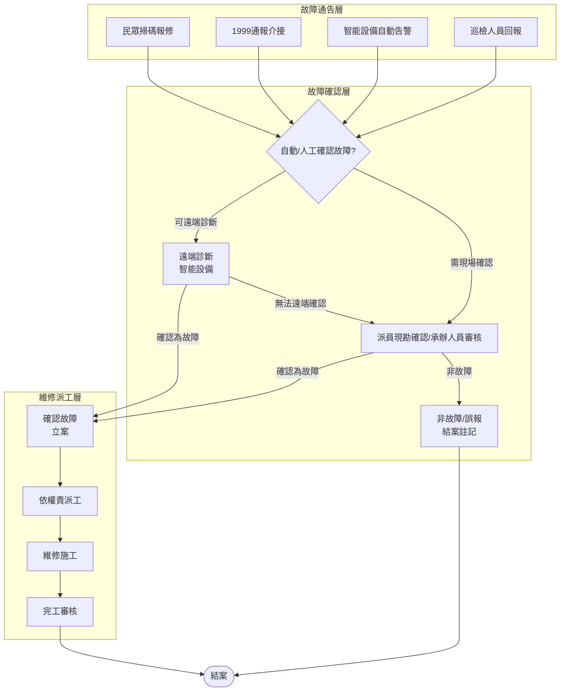

```mermaid
flowchart TD
    subgraph 故障通告層
        A1[民眾掃碼報修]
        A2[1999通報介接]
        A3[智能設備自動告警]
        A4[巡檢人員回報]
    end
    
    subgraph 故障確認層
        B1{自動/人工確認故障?}
        B2[遠端診斷<br/>智能設備]
        B3[派員現勘確認/承辦人員審核]
        B4[非故障/誤報<br/>結案註記]
    end
    
    subgraph 維修派工層
        C1[確認故障<br/>立案]
        C2[依權責派工]
        C3[維修施工]
        C4[完工審核]
    end
    
    A1 --> B1
    A2 --> B1
    A3 --> B1
    A4 --> B1
    
    B1 -->|可遠端診斷| B2
    B1 -->|需現場確認| B3
    B2 -->|確認為故障| C1
    B2 -->|無法遠端確認| B3
    B3 -->|確認為故障| C1
    B3 -->|非故障| B4
    
    C1 --> C2 --> C3 --> C4
    
    B4 --> END([結案])
    C4 --> END
```