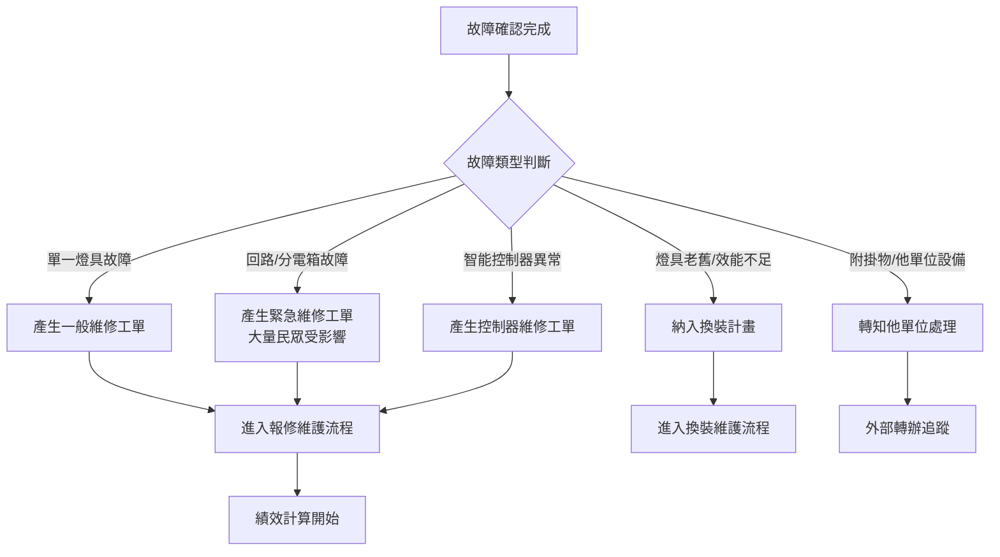

```mermaid
flowchart TD
    A[故障確認完成] --> B{故障類型判斷}
    
    B -->|單一燈具故障| C[產生一般維修工單]
    B -->|回路/分電箱故障| D[產生緊急維修工單<br/>大量民眾受影響]
    B -->|燈具老舊/效能不足| E[納入換裝計畫]
    B -->|附掛物/他單位設備| F[轉知他單位處理]
    B -->|智能控制器異常| G[產生控制器維修工單]
    
    C --> H[進入報修維護流程]
    D --> H
    G --> H
    
    E --> I[進入換裝維護流程]
    
    F --> J[外部轉辦追蹤]
    
    H --> K[績效計算開始]
```