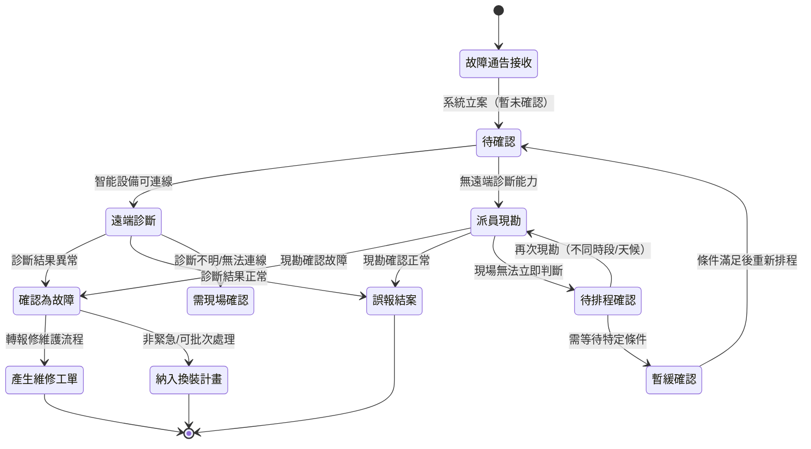

```mermaid
stateDiagram-v2
    [*] --> 故障通告接收
    
    故障通告接收 --> 待確認: 系統立案（暫未確認）
    
    待確認 --> 遠端診斷: 智能設備可連線
    待確認 --> 派員現勘: 無遠端診斷能力
    
    遠端診斷 --> 確認為故障: 診斷結果異常
    遠端診斷 --> 誤報結案: 診斷結果正常
    遠端診斷 --> 需現場確認: 診斷不明/無法連線
    
    派員現勘 --> 確認為故障: 現勘確認故障
    派員現勘 --> 誤報結案: 現勘確認正常
    派員現勘 --> 待排程確認: 現場無法立即判斷
    
    待排程確認 --> 派員現勘: 再次現勘（不同時段/天候）
    待排程確認 --> 暫緩確認: 需等待特定條件
    
    暫緩確認 --> 待確認: 條件滿足後重新排程
    
    確認為故障 --> 產生維修工單: 轉報修維護流程
    確認為故障 --> 納入換裝計畫: 非緊急/可批次處理
    
    誤報結案 --> [*]
    產生維修工單 --> [*]
    納入換裝計畫 --> [*]
```