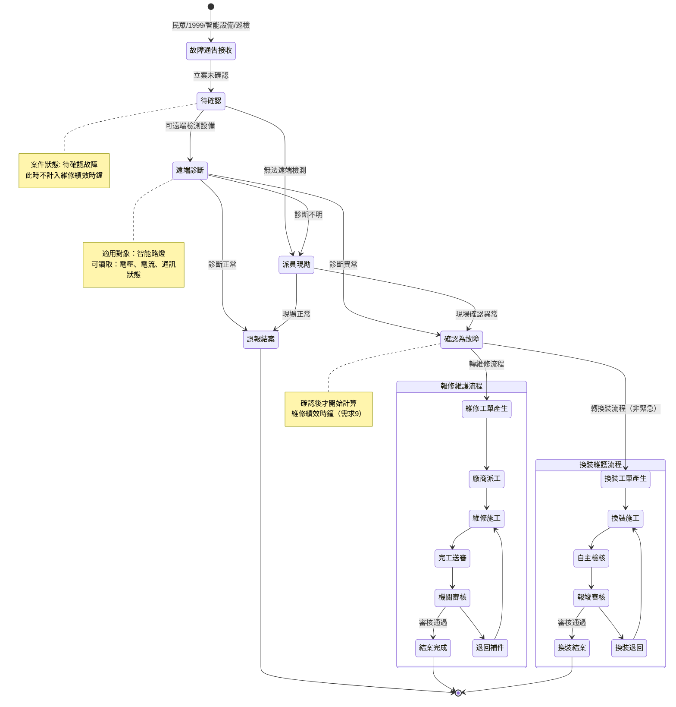

```mermaid
stateDiagram-v2
    [*] --> 故障通告接收: 民眾/1999/智能設備/巡檢
    
    故障通告接收 --> 待確認: 立案未確認
    
    待確認 --> 遠端診斷: 可遠端檢測設備
    待確認 --> 派員現勘: 無法遠端檢測
    
    遠端診斷 --> 確認為故障: 診斷異常
    遠端診斷 --> 誤報結案: 診斷正常
    遠端診斷 --> 派員現勘: 診斷不明
    
    派員現勘 --> 確認為故障: 現場確認異常
    派員現勘 --> 誤報結案: 現場正常
    
    確認為故障 --> 維修工單產生: 轉維修流程
    確認為故障 --> 換裝工單產生: 轉換裝流程（非緊急）
    
    state 報修維護流程 {
        維修工單產生 --> 廠商派工
        廠商派工 --> 維修施工
        維修施工 --> 完工送審
        完工送審 --> 機關審核
        機關審核 --> 結案完成: 審核通過
        機關審核 --> 退回補件
        退回補件 --> 維修施工
    }
    
    state 換裝維護流程 {
        換裝工單產生 --> 換裝施工
        換裝施工 --> 自主檢核
        自主檢核 --> 報竣審核
        報竣審核 --> 換裝結案: 審核通過
        報竣審核 --> 換裝退回
        換裝退回 --> 換裝施工
    }
    
    誤報結案 --> [*]
    結案完成 --> [*]
    換裝結案 --> [*]
    
    note right of 待確認
        案件狀態: 待確認故障
        此時不計入維修績效時鐘
    end note
    
    note right of 遠端診斷
        適用對象：智能路燈
        可讀取：電壓、電流、通訊狀態
    end note
    
    note right of 確認為故障
        確認後才開始計算
        維修績效時鐘（需求9）
    end note

```