# 資產異動申請 — 流程與整合 UML

> 以下所有圖表均以 **Mermaid** 語法撰寫，可在 GitHub / VS Code Markdown Preview 直接渲染。

---

## 1. 整體狀態機（AssetTransferStatus）

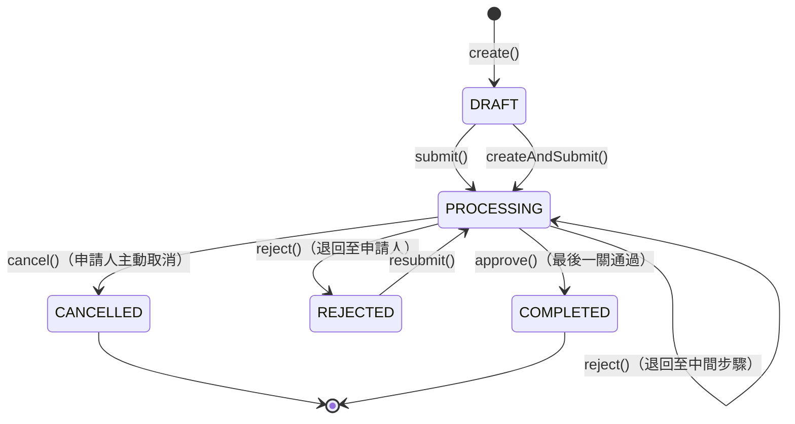

---

## 2. 申請流程（Sequence Diagram）

### 2-1 建立草稿並送出

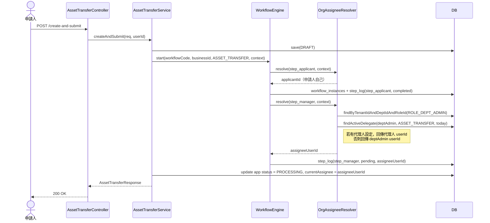

### 2-2 審核通過（中間步驟）

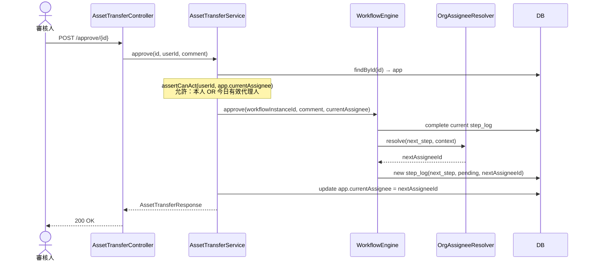

### 2-3 審核通過（最終步驟 → 結案）

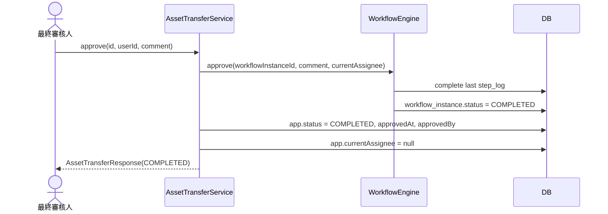

### 2-4 退回申請

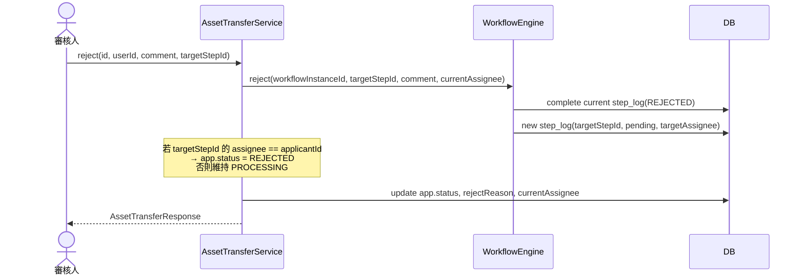

### 2-5 補件重送

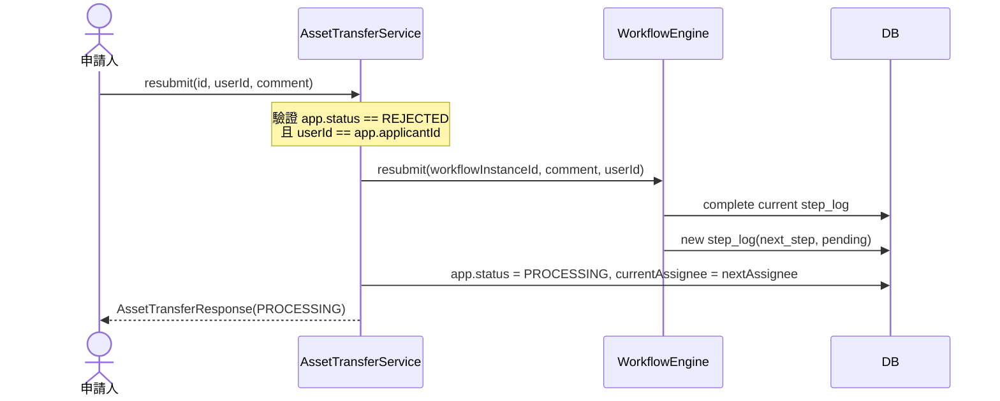

---

## 3. 代理人機制（Delegate）

### 3-1 代理人設定流程

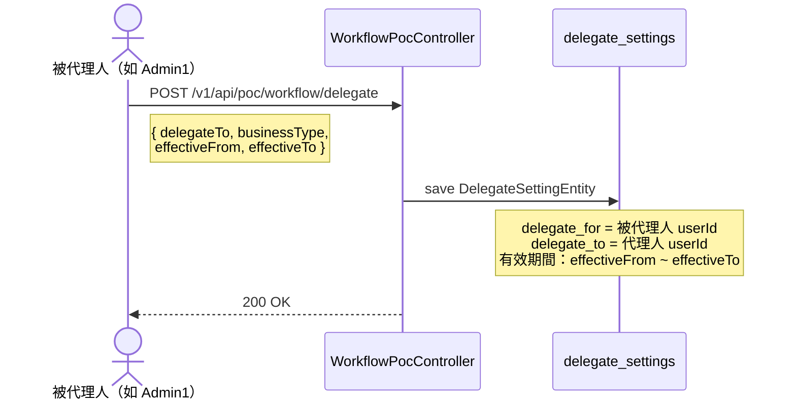

### 3-2 代理人指派解析（OrgAssigneeResolver）

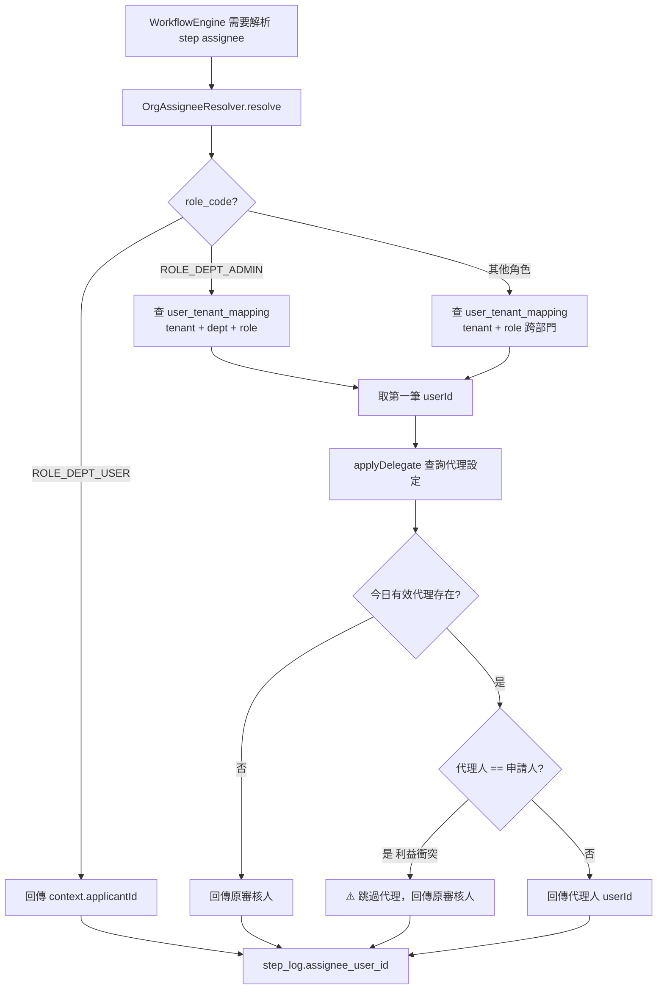

### 3-3 代理人執行審核（assertCanAct）

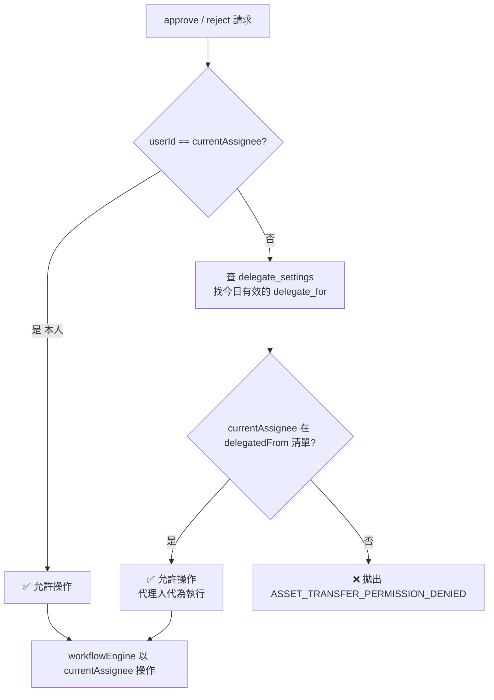

---

## 4. 待審案件查詢（getPendingTasks）

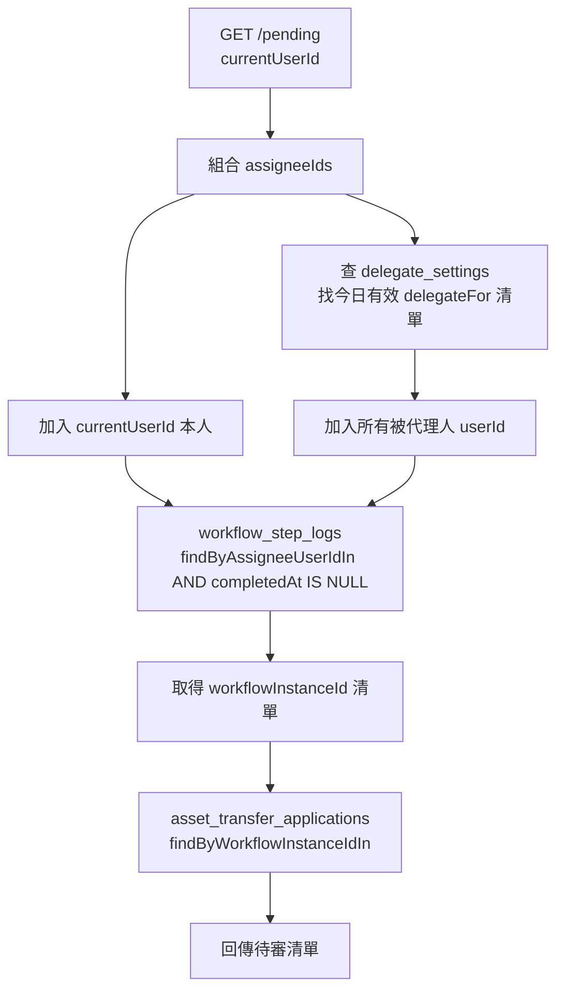

---

## 5. 資料模型關係圖（ERD）

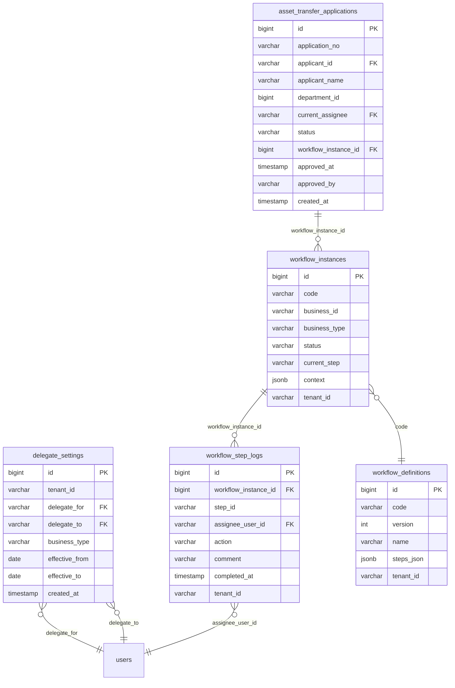

---

## 6. 元件架構圖

```mermaid
graph TB
    subgraph Frontend["Frontend (Vue 3)"]
        AT[AssetTransferDetailView]
        PD[AssetTransferPendingView]
        DL[WorkflowDelegateView]
    end

    subgraph Controller["Controller Layer"]
        ATC[AssetTransferController\n/v1/auth/asset-transfer/*]
        WPC[WorkflowPocController\n/v1/api/poc/workflow/*]
    end

    subgraph Service["Service Layer"]
        ATS[AssetTransferService]
        WE[WorkflowEngine]
        OAR[OrgAssigneeResolver\n@Primary]
    end

    subgraph Repository["Repository Layer"]
        ATAR[AssetTransferApplicationRepository]
        WSLR[WorkflowStepLogRepository]
        WIR[WorkflowInstanceRepository]
        DSR[DelegateSettingRepository]
        WDR[WorkflowDefinitionRepository]
    end

    AT --> ATC
    PD --> ATC
    DL --> WPC

    ATC --> ATS
    WPC --> WE
    WPC --> DSR

    ATS --> WE
    ATS --> ATAR
    ATS --> DSR
    WE --> OAR
    WE --> WSLR
    WE --> WIR
    WE --> WDR
    OAR --> DSR
```

---

## 7. 流程步驟定義（workflow_definitions.steps_json）

```
asset_transfer 流程定義：

step_applicant  →  step_manager  →  step_property  →  step_end
(ROLE_DEPT_USER)   (ROLE_DEPT_ADMIN)  (ROLE_PROPERTY_MANAGER)  (END)

退回路徑：
  step_manager  ──reject──▶  step_applicant
  step_property ──reject──▶  step_manager
```

---

## 8. 權限對照

| 操作 | 所需 Permission | 說明 |
|---|---|---|
| 建立草稿 | `ASSET_TRANSFER_CREATE` | 申請人 |
| 送出申請 | `ASSET_TRANSFER_CREATE` | 申請人 |
| 建立並送出 | `ASSET_TRANSFER_CREATE` | 申請人（原子操作）|
| 審核通過 | `ASSET_TRANSFER_APPROVE` | 指派審核人或代理人 |
| 退回申請 | `ASSET_TRANSFER_APPROVE` | 指派審核人或代理人 |
| 補件重送 | `ASSET_TRANSFER_CREATE` | 申請人 |
| 取消申請 | `ASSET_TRANSFER_CREATE` | 申請人 |
| 查詢明細 | `ASSET_TRANSFER_VIEW` | 任何相關人員 |
| 查詢待審 | `ASSET_TRANSFER_APPROVE` | 指派審核人或代理人 |
| 設定代理 | `WORKFLOW_DELEGATE_MANAGE` | 任何有審核權的使用者 |

---

## 9. 通知整合

### 9-1 事件架構

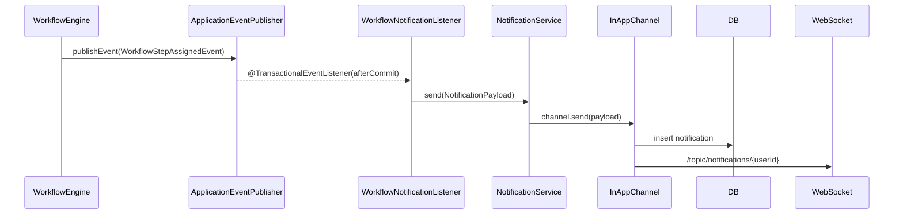

### 9-2 事件類型

| 事件 | 發布時機 | payload 內容 |
|---|---|---|
| `WorkflowStepAssignedEvent` | `createStepLog()` 後 | 通知新任審核人有新的待辦 |
| `WorkflowStepCompletedEvent` | `completeLog()` 後 | 記錄步驟完成（供 audit / 擴充） |

### 9-3 通知內容

| 情境 | 標題 | 內容 |
|---|---|---|
| 步驟指派 | 你有新的審核待辦 | 「{步驟名稱}」步驟已指派給你，請前往處理。 |
