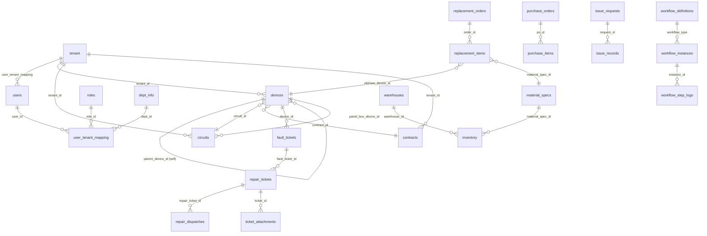
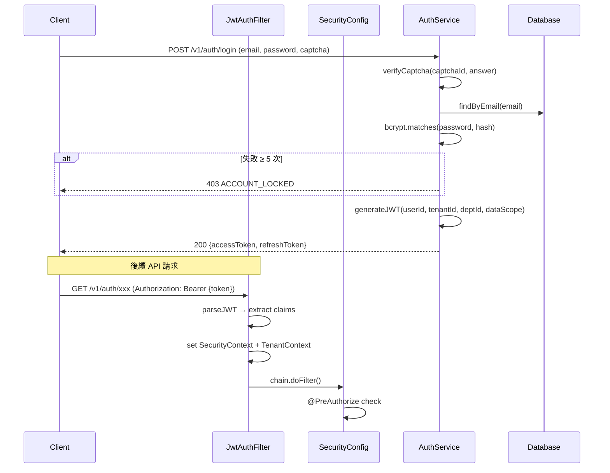

# SD-00 系統設計總覽

> **專案**：臺北市路燈智慧管理平台  
> **版本**：1.0  
> **日期**：2026-04-24  
> **對應**：SA (`/05-sa/`)、SRS (`/03-srs/`)

---

## 1. 技術架構

```
┌─────────────────────────────────────────────────────────────────┐
│                      Client Layer                               │
├────────────┬────────────┬──────────────┬────────────────────────┤
│  Vue 3 SPA │ Mobile APP │ 民眾報修網頁  │ IoT Gateway            │
│  (Vite)    │ (PWA/RN)   │ (Public)     │ (MQTT/CoAP/REST)       │
└─────┬──────┴─────┬──────┴──────┬───────┴──────┬─────────────────┘
      │ HTTPS      │ HTTPS       │ HTTPS        │ MQTT/REST
      ▼            ▼             ▼              ▼
┌─────────────────────────────────────────────────────────────────┐
│              Spring Boot 3.4 (Java 21)                          │
│  ┌──────────────────────────────────────────────────────────┐   │
│  │ Filter Chain: CORS → RateLimit → JwtAuth → TenantFilter  │   │
│  └──────────────────────────────────────────────────────────┘   │
│  ┌───────────┬───────────┬───────────┬──────────┬───────────┐   │
│  │ Controller│ Service   │ Repository│ Entity   │ DTO       │   │
│  │ (@Rest)   │ (@Service)│ (JPA)     │ (@Entity)│ (Req/Res) │   │
│  └───────────┴───────────┴───────────┴──────────┴───────────┘   │
│  ┌──────────────────────────────────────────────────────────┐   │
│  │ Cross-cutting: AuditAspect · TenantAspect · EventBus     │   │
│  └──────────────────────────────────────────────────────────┘   │
└─────────────────────────────┬───────────────────────────────────┘
                              │ JPA/Hibernate + Flyway
                              ▼
┌─────────────────────────────────────────────────────────────────┐
│  PostgreSQL 15+ │ Schema: taipei_streetlight │ 39 active tables │
└─────────────────────────────────────────────────────────────────┘
┌─────────────────────────────────────────────────────────────────┐
│  Redis (optional) │ Rate Limiting · Token Blacklist · Cache     │
└─────────────────────────────────────────────────────────────────┘
```

---

## 2. 技術棧

| 層級 | 技術 | 版本 |
|------|------|------|
| Language | Java | 21 (LTS) |
| Framework | Spring Boot | 3.4 |
| Security | Spring Security + JWT | — |
| ORM | JPA / Hibernate 6 | — |
| DB Migration | Flyway | — |
| Database | PostgreSQL | 15+ |
| Cache | Redis (optional) | 7+ |
| Frontend | Vue 3 + TypeScript + Element Plus + Pinia | — |
| Build | Maven (backend) / Vite (frontend) | — |
| API Doc | SpringDoc OpenAPI 3 | — |
| i18n | vue-i18n (zh-TW / zh-CN / en) | — |

---

## 3. 分層架構慣例

### 3.1 後端分層

```
com.taipei.iot.{module}/
├── controller/          # REST Controller (@PreAuthorize)
│   └── XxxController.java
├── dto/                 # Request/Response DTO
│   ├── XxxRequest.java
│   ├── XxxResponse.java
│   └── XxxQueryParams.java
├── entity/              # JPA Entity (implements TenantAware)
│   └── Xxx.java
├── enums/               # 狀態/類型枚舉
├── repository/          # JpaRepository (extends TenantScopedRepository)
├── service/             # Business logic
│   └── XxxService.java
├── listener/            # @EventListener (跨模組事件)
└── event/               # Event class (ApplicationEvent)
```

### 3.2 命名慣例

| 項目 | 慣例 | 範例 |
|------|------|------|
| Entity | 業務名稱 (無 Entity 後綴) | `Device`, `RepairTicket` |
| Repository | `{Entity}Repository` | `DeviceRepository` |
| Service | `{Entity}Service` | `DeviceService` |
| Controller | `{Entity}Controller` | `DeviceController` |
| Request DTO | `{Entity}Request` | `DeviceRequest` |
| Response DTO | `{Entity}Response` | `DeviceResponse` |
| QueryParams | `{Entity}QueryParams` | `RepairTicketQueryParams` |
| API Path | `/v1/auth/{module}/{resource}` | `/v1/auth/devices` |
| Flyway | `V{N}__{module}__{desc}.sql` | `V30__device__create_tables.sql` |
| Error Code | `{module_range}xxx` | `60xxx` = Device, `70xxx` = Repair |

### 3.3 通用模式

**API 回應封裝**：
```json
{
  "errorCode": "00000",
  "errorMsg": "成功",
  "errorDetail": null,
  "timestamp": 1714000000000,
  "body": { ... }
}
```

**分頁回應**：
```json
{
  "errorCode": "00000",
  "body": {
    "content": [...],
    "totalElements": 100,
    "totalPages": 10,
    "number": 0,
    "size": 10
  }
}
```

**多租戶 Entity**：
```java
@Entity
@Table(name = "xxx")
@FilterDef(name = "tenantFilter", parameters = @ParamDef(name = "tenantId", type = String.class))
@Filter(name = "tenantFilter", condition = "tenant_id = :tenantId")
@EntityListeners(TenantEntityListener.class)
public class Xxx extends BaseEntity implements TenantAware { ... }
```

---

## 4. 資料庫 ER 總覽

### 4.1 Table 清單 (39 active tables)

| 領域 | Table 數 | Tables |
|------|---------|--------|
| Tenant | 1 | `tenant` |
| Auth/User | 9 | `users`, `roles`, `permissions`, `role_permissions`, `user_tenant_mapping`, `user_reset_password_token`, `change_password_log`, `password_history`, `user_info_log` |
| RBAC | 1 | `menus` |
| Audit | 2 | `user_event_log`, `rev_info` |
| Department | 1 | `dept_info` |
| Settings | 1 | `system_settings` |
| Announcement | 3 | `announcements`, `announcement_depts`, `announcement_reads` |
| Asset | 5 | `devices`, `circuits`, `contracts`, `device_events`, `device_managers` |
| Fault | 2 | `fault_tickets`, `fault_correlations` |
| Workflow | 5 | `workflow_definitions`, `workflow_steps_template`, `workflow_instances`, `workflow_step_logs`, `delegate_settings` |
| Inspection | 2 | `inspection_tasks`, `inspection_records` |
| Repair | 3 | `repair_tickets`, `repair_dispatches`, `ticket_attachments` |
| Material | 12 | `warehouses`, `material_specs`, `suppliers`, `inventory`, `approved_materials`, `purchase_orders`, `purchase_items`, `receiving_records`, `issue_requests`, `issue_records`, `inventory_adjustments`, `disposal_records` |
| Replacement | 3 | `replacement_orders`, `replacement_items`, `light_pole_numbers` |

### 4.2 核心 ER 關係圖 (Mermaid)



---

## 5. 安全架構

### 5.1 認證流程



### 5.2 授權模型

| 層級 | 機制 | 說明 |
|------|------|------|
| URL | SecurityConfig | 路徑級別白名單/角色 |
| Method | @PreAuthorize("hasAuthority('xxx')") | 方法級權限碼 |
| Data | TenantFilter (Hibernate @Filter) | 租戶資料隔離 |
| Data | DataScope (ALL/DEPT/SELF) | 部門層級資料範圍 |
| Row | TenantEntityListener (@PrePersist/@PreUpdate) | 寫入時驗證 tenant |

### 5.3 密碼策略

| 項目 | 規則 |
|------|------|
| 最低長度 | 8 字元 |
| 複雜度 | 大寫 + 小寫 + 數字 |
| 密碼過期 | 90 天 |
| 歷史紀錄 | 不可重複最近 5 組 |
| 鎖定 | 連續錯誤 5 次 → 鎖定 10 分鐘 |
| 加密 | BCrypt |

---

## 6. 多租戶架構

```
模式：Discriminator Column (共享 Schema)
欄位：tenant_id VARCHAR(50)

Filter 機制：
  TenantInterceptor → TenantContext.set(tenantId)
  TenantFilterAspect → @Filter(name="tenantFilter") on SELECT
  TenantEntityListener → @PrePersist auto-fill / @PreUpdate verify

全域 Table (不套 tenant filter)：
  tenant, users, roles, permissions, menus, rev_info

模式切換：
  tenant.mode=single → 強制 DEFAULT tenant
  tenant.mode=multi  → JWT 中取得 tenantId
```

---

## 7. Error Code 範圍

| 範圍 | 模組 | 說明 |
|------|------|------|
| 00xxx | 通用 | SUCCESS, VALIDATION_ERROR |
| 10xxx | 認證/租戶 | Token/Lock/Captcha/Permission/RateLimit |
| 20xxx | 使用者 | 密碼規則/CRUD |
| 30xxx | RBAC | 角色/選單 |
| 40xxx | 部門 | 樹狀結構 |
| 50xxx | 公告 | CRUD |
| 60xxx | 資產 | 設備/迴路/契約 |
| 70xxx | 報修 | 工單/派工/附件/巡查 |
| 80xxx | 換裝 | 換裝工單 |
| 85xxx | 材料 | 庫存/倉庫/採購/領用 |
| 90xxx | 簽核 | 流程/步驟/代理 |
| 99xxx | 系統 | 未知錯誤 |

---

## 8. Flyway 遷移版本

| 版本 | 領域 | 說明 |
|------|------|------|
| V0 | Tenant | tenant table |
| V1~V1_1 | Auth | users, roles, user_tenant_mapping + seed |
| V2 | User | user tables |
| V3~V3_1 | RBAC | permissions, menus, role_permissions + seed |
| V4~V4_1 | Audit | user_event_log, rev_info |
| V5~V5_1 | Dept | dept_info + seed |
| V12~V12_3 | Log | audit fulltext, permissions seed |
| V13 | Asset | streetlight seed data |
| V14~V18 | Misc | dept admin, password fix, soft delete |
| V19~V27 | Cleanup | schema refinements, drop legacy tables |
| V28 | Settings | system_settings |
| V29~V29_1 | Announcement | announcements + seed |
| V30~V34 | Device | devices, circuits, contracts, device_events |
| V36 | Inspection | inspection_tasks, inspection_records |
| V37~V39 | Repair | repair_tickets, dispatches, attachments |
| V40~V44 | Material | 12 material tables + seed + menu |
| V45~V47 | Replacement | replacement_orders, items, pole_numbers |

---

## 9. SD 文件索引

| SD 文件 | 模組 | 實作狀態 | Tables |
|---------|------|---------|--------|
| [SD-01-system-mgmt.md](SD-01-system-mgmt.md) | 系統管理 | ✅ Phase 1 | 16 |
| [SD-02-approval.md](SD-02-approval.md) | 簽核引擎 | ✅ Phase 1 | 5 |
| [SD-03-asset.md](SD-03-asset.md) | 資產管理 | ✅ Phase 1 | 7 |
| [SD-04-repair.md](SD-04-repair.md) | 報修維護 | ✅ Phase 2 | 5 |
| [SD-05-replacement.md](SD-05-replacement.md) | 換裝維護 | ✅ Phase 4 | 3 |
| [SD-06-material.md](SD-06-material.md) | 材料管理 | ✅ Phase 3 | 12 |
| [SD-07-smart.md](SD-07-smart.md) | 智慧路燈 | ❌ Phase 5 (Forward Design) | 8 |
| [SD-08-performance.md](SD-08-performance.md) | 績效管理 | ❌ Phase 6 (Forward Design) | 4 |
| [SD-09-mobile.md](SD-09-mobile.md) | 行動 APP | ❌ Phase 7 (Forward Design) | 4 |
| [SD-10-dashboard.md](SD-10-dashboard.md) | 儀表板 | ❌ Phase 8 (Forward Design) | 2 |
| [SD-11-common.md](SD-11-common.md) | 共用基礎 | ✅ Phase 1 | 2 |
