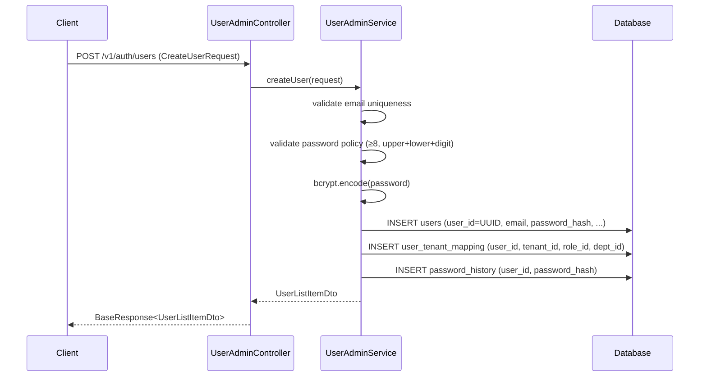
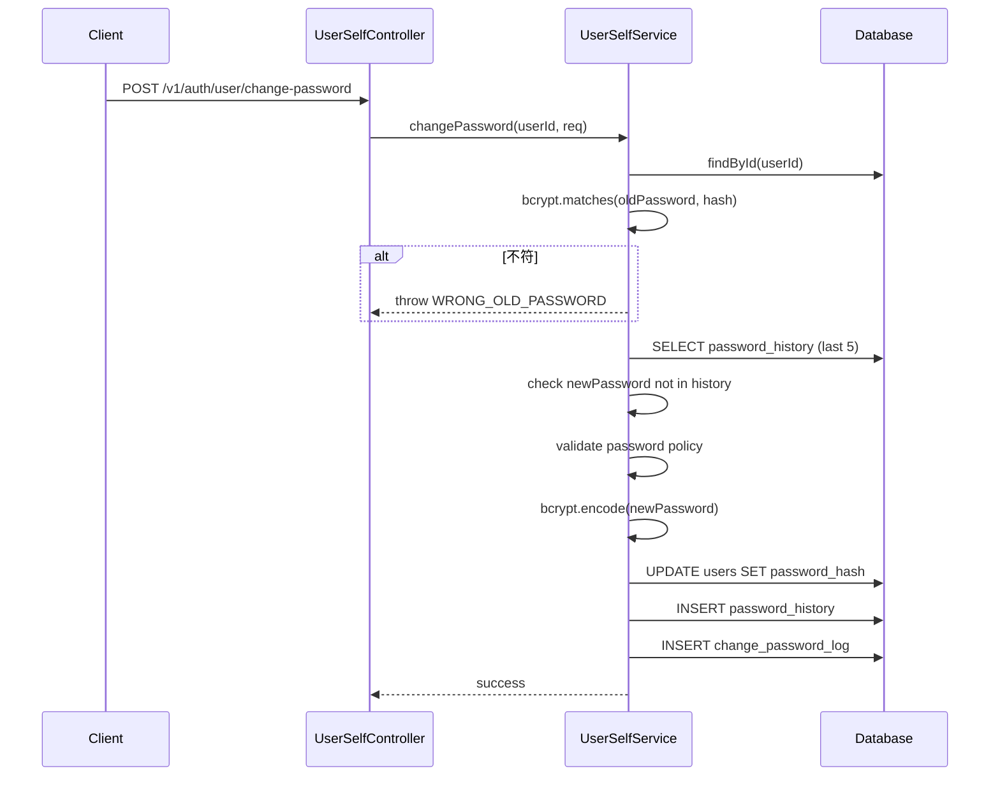
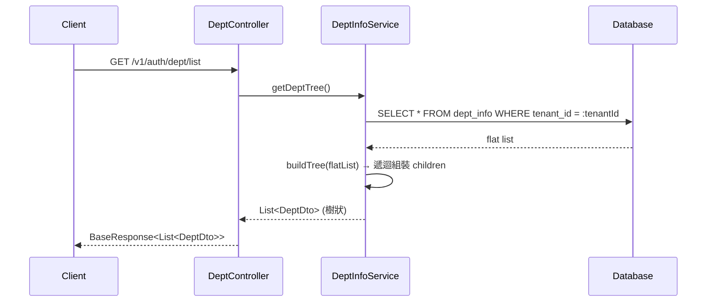
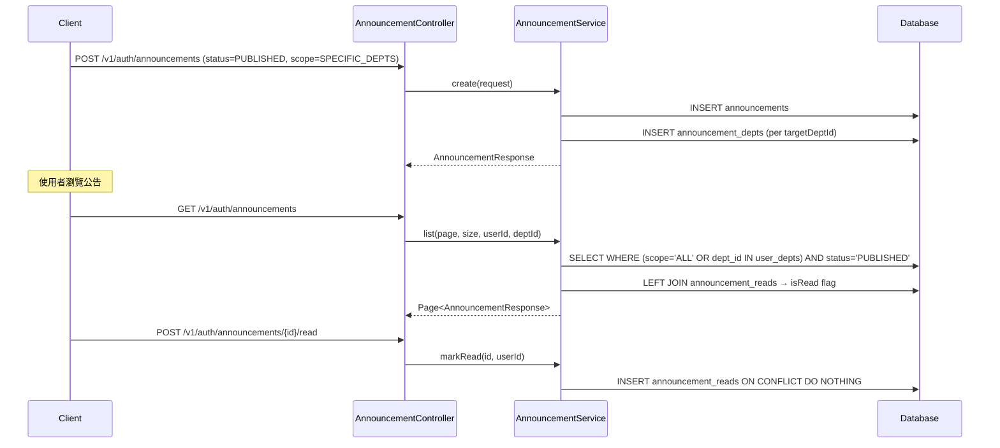
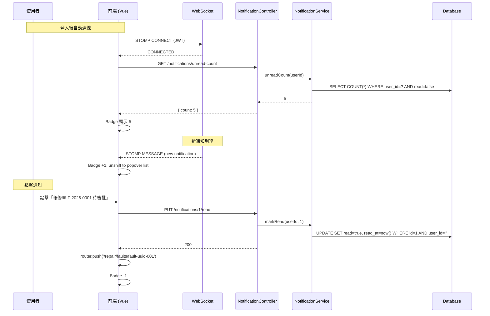

# SD-01 系統管理

> **對應 SA**：SA-01-system-mgmt.md (FN-01-001 ~ FN-01-055)  
> **實作狀態**：✅ Phase 1 已完成 ｜ §5 通知/待辦 Phase 5 待實作  
> **Package**：`auth`, `user`, `rbac`, `dept`, `announcement`, `setting`, `notification`

---

## 1. DB Schema

### 1.1 users

```sql
CREATE TABLE users (
    user_id         VARCHAR(50) PRIMARY KEY,
    email           VARCHAR(200) NOT NULL UNIQUE,
    password_hash   VARCHAR(255) NOT NULL,
    display_name    VARCHAR(200) NOT NULL,
    phone           VARCHAR(50),
    enabled         BOOLEAN NOT NULL DEFAULT true,
    locked          BOOLEAN NOT NULL DEFAULT false,
    locked_at       TIMESTAMP,
    login_fail_count INT NOT NULL DEFAULT 0,
    is_super_admin  BOOLEAN NOT NULL DEFAULT false,
    last_login_at   TIMESTAMP,
    deleted         BOOLEAN NOT NULL DEFAULT false,
    deleted_at      TIMESTAMP,
    create_time     TIMESTAMP NOT NULL DEFAULT NOW(),
    update_time     TIMESTAMP NOT NULL DEFAULT NOW()
);
```

### 1.2 roles

```sql
CREATE TABLE roles (
    role_id     VARCHAR(50) PRIMARY KEY,
    code        VARCHAR(50) NOT NULL UNIQUE,
    name        VARCHAR(100) NOT NULL,
    description VARCHAR(500),
    built_in    BOOLEAN NOT NULL DEFAULT true,
    enabled     BOOLEAN NOT NULL DEFAULT true,
    data_scope  VARCHAR(30) DEFAULT 'ALL',
    create_time TIMESTAMP NOT NULL DEFAULT NOW(),
    update_time TIMESTAMP NOT NULL DEFAULT NOW()
);
```

### 1.3 permissions

```sql
CREATE TABLE permissions (
    permission_id VARCHAR(50) PRIMARY KEY,
    code          VARCHAR(100) NOT NULL UNIQUE,
    name          VARCHAR(200) NOT NULL,
    group_name    VARCHAR(100),
    sort_order    INT DEFAULT 0
);
```

### 1.4 role_permissions

```sql
CREATE TABLE role_permissions (
    role_id       VARCHAR(50) NOT NULL REFERENCES roles(role_id),
    permission_id VARCHAR(50) NOT NULL REFERENCES permissions(permission_id),
    tenant_id     VARCHAR(50) REFERENCES tenant(tenant_id),
    UNIQUE(role_id, permission_id, tenant_id)
);
```

### 1.5 user_tenant_mapping

```sql
CREATE TABLE user_tenant_mapping (
    id          BIGINT GENERATED ALWAYS AS IDENTITY PRIMARY KEY,
    user_id     VARCHAR(50) NOT NULL REFERENCES users(user_id),
    tenant_id   VARCHAR(50) NOT NULL REFERENCES tenant(tenant_id),
    role_id     VARCHAR(50) NOT NULL REFERENCES roles(role_id),
    dept_id     BIGINT REFERENCES dept_info(dept_id),
    enabled     BOOLEAN NOT NULL DEFAULT true,
    create_time TIMESTAMP NOT NULL DEFAULT NOW(),
    update_time TIMESTAMP NOT NULL DEFAULT NOW(),
    UNIQUE(user_id, tenant_id)
);
```

### 1.6 menus

```sql
CREATE TABLE menus (
    menu_id         BIGINT GENERATED ALWAYS AS IDENTITY PRIMARY KEY,
    parent_id       BIGINT,
    name            VARCHAR(100) NOT NULL,
    menu_type       VARCHAR(20) NOT NULL,  -- DIRECTORY / PAGE / BUTTON
    route_name      VARCHAR(100),
    route_path      VARCHAR(200),
    component       VARCHAR(200),
    permission_code VARCHAR(100),
    icon            VARCHAR(50),
    sort_order      INT DEFAULT 0,
    visible         BOOLEAN DEFAULT true,
    keep_alive      BOOLEAN DEFAULT false,
    redirect        VARCHAR(200),
    create_time     TIMESTAMP NOT NULL DEFAULT NOW(),
    update_time     TIMESTAMP
);
```

### 1.7 dept_info

```sql
CREATE TABLE dept_info (
    dept_id     BIGSERIAL PRIMARY KEY,
    tenant_id   VARCHAR(50) NOT NULL,
    pid         BIGINT REFERENCES dept_info(dept_id),
    dept_name   VARCHAR(100) NOT NULL,
    dept_sort   INTEGER DEFAULT 0,
    status      SMALLINT DEFAULT 1,
    hierarchy_path VARCHAR(500),
    create_by   VARCHAR(50),
    update_by   VARCHAR(50),
    create_time TIMESTAMP WITH TIME ZONE NOT NULL DEFAULT NOW(),
    update_time TIMESTAMP WITH TIME ZONE,
    UNIQUE(tenant_id, dept_name, pid)
);
```

### 1.8 announcements / announcement_depts / announcement_reads

```sql
CREATE TABLE announcements (
    id              BIGSERIAL PRIMARY KEY,
    tenant_id       VARCHAR(50) NOT NULL,
    title           VARCHAR(200) NOT NULL,
    content         TEXT NOT NULL,
    status          VARCHAR(20) NOT NULL DEFAULT 'DRAFT',  -- DRAFT / PUBLISHED / ARCHIVED
    scope           VARCHAR(20) NOT NULL DEFAULT 'ALL',    -- ALL / SPECIFIC_DEPTS
    pinned          BOOLEAN NOT NULL DEFAULT false,
    publish_at      TIMESTAMP,
    expire_at       TIMESTAMP,
    created_by      VARCHAR(50),
    created_by_name VARCHAR(100),
    created_at      TIMESTAMP NOT NULL DEFAULT now(),
    updated_at      TIMESTAMP NOT NULL DEFAULT now()
);

CREATE TABLE announcement_depts (
    announcement_id BIGINT REFERENCES announcements(id) ON DELETE CASCADE,
    dept_id         BIGINT REFERENCES dept_info(dept_id),
    PRIMARY KEY (announcement_id, dept_id)
);

CREATE TABLE announcement_reads (
    id              BIGSERIAL PRIMARY KEY,
    announcement_id BIGINT NOT NULL REFERENCES announcements(id) ON DELETE CASCADE,
    user_id         VARCHAR(50) NOT NULL,
    read_at         TIMESTAMP NOT NULL DEFAULT now(),
    UNIQUE(announcement_id, user_id)
);
```

### 1.9 system_settings

```sql
CREATE TABLE system_settings (
    id            BIGSERIAL PRIMARY KEY,
    tenant_id     VARCHAR(50) NOT NULL REFERENCES tenant(tenant_id),
    setting_key   VARCHAR(100) NOT NULL,
    setting_value VARCHAR(500) NOT NULL,
    description   VARCHAR(500),
    created_at    TIMESTAMP NOT NULL DEFAULT now(),
    updated_at    TIMESTAMP NOT NULL DEFAULT now(),
    UNIQUE(tenant_id, setting_key)
);
```

---

## 2. Class Structure

```
auth/
├── controller/AuthController           # 11 endpoints (login/logout/captcha/token/tenant)
├── security/JwtAuthenticationFilter    # OncePerRequestFilter
├── security/JwtTokenProvider           # HS512 JWT 簽發/驗證
├── service/AuthService                 # login/refresh/logout/idle-logout
├── service/CaptchaService              # 圖形驗證碼+Turnstile
├── service/impl/UserDetailsServiceImpl
├── entity/UserEntity, UserResetPasswordTokenEntity, ChangePasswordLogEntity
├── dto/request/ (LoginRequest, ForgotPasswordRequest, ResetPasswordRequest, ...)
└── dto/response/ (LoginResult, TokenResult, CaptchaResponse, UserInfoDto, ...)

user/
├── controller/UserAdminController      # 8 endpoints (CRUD + tenant-role)
├── controller/UserSelfController       # 2 endpoints (profile + change-pwd)
├── service/UserAdminService            # CRUD + soft-delete + tenant mapping
├── service/UserSelfService             # change-password + profile
├── entity/UserInfoLogEntity, PasswordHistoryEntity
└── dto/ (CreateUserRequest, UpdateUserRequest, UserListItemDto, ...)

rbac/
├── controller/MenuController           # 6 endpoints (tree/my/CRUD/visible)
├── controller/PermissionController     # 1 endpoint (list all)
├── controller/RoleController           # 7 endpoints (CRUD/enabled/permissions)
├── service/MenuService                 # 樹狀建構 + 角色過濾
├── service/RoleService                 # CRUD + permission assign
├── service/PermissionService           # read-only list
├── entity/ (MenuEntity, PermissionEntity, RolePermissionEntity)
└── dto/ (MenuDto, RoleDto, PermissionDto, ...)

dept/
├── controller/DeptController           # 7 endpoints (list/tree/options/CRUD)
├── annotation/DataScope                # @DataScope AOP
├── aspect/DataScopeAspect              # 部門資料範圍過濾
├── service/DeptInfoService             # CRUD + hierarchy
├── entity/DeptInfoEntity
└── dto/ (CreateDeptRequest, DeptDto, DeptOptionVO)

announcement/
├── controller/AnnouncementController   # 8 endpoints
├── service/AnnouncementService
├── entity/ (Announcement, AnnouncementScope, AnnouncementDept, AnnouncementRead)
└── dto/ (AnnouncementRequest, AnnouncementResponse)

setting/
├── controller/SystemSettingController  # 4 endpoints
├── service/SystemSettingService
├── entity/SystemSettingEntity
├── enums/SettingKey
└── dto/SystemSettingDto
```

---

## 3. API Contract

### 3.1 帳號管理 (UserAdminController)

| Method | Path | Auth | 說明 |
|--------|------|------|------|
| GET | `/v1/auth/users` | authenticated | 帳號列表 (分頁+搜尋) |
| POST | `/v1/auth/users` | authenticated | 新增帳號 |
| PUT | `/v1/auth/users/{userId}` | authenticated | 編輯帳號 |
| DELETE | `/v1/auth/users/{userId}` | authenticated | 刪除帳號 |
| PATCH | `/v1/auth/users/{userId}/soft-delete` | authenticated | 軟刪除 |
| GET | `/v1/auth/users/{userId}/tenant-roles` | SUPER_ADMIN | 查看租戶角色 |
| POST | `/v1/auth/users/{userId}/tenant-roles` | SUPER_ADMIN | 新增租戶角色 |
| DELETE | `/v1/auth/users/{userId}/tenant-roles/{mappingId}` | SUPER_ADMIN | 刪除租戶角色 |

#### POST /v1/auth/users
```json
// Request
{
  "email": "user@taipei.gov.tw",
  "displayName": "王小明",
  "phone": "0912345678",
  "initialPassword": "Password1!",
  "tenantId": "DEFAULT",
  "roleId": "GOV_ADMIN",
  "deptId": 2
}
// Response
{
  "errorCode": "00000",
  "body": {
    "userId": "u002",
    "email": "user@taipei.gov.tw",
    "displayName": "王小明",
    "enabled": true,
    "roleCode": "GOV_ADMIN",
    "deptName": "養工處"
  }
}
```

### 3.2 角色權限 (RoleController)

| Method | Path | Auth | 說明 |
|--------|------|------|------|
| GET | `/v1/auth/roles` | authenticated | 角色列表 |
| GET | `/v1/auth/roles/assignable` | authenticated | 可指派角色 |
| POST | `/v1/auth/roles` | authenticated | 新增角色 |
| PUT | `/v1/auth/roles/{roleId}` | authenticated | 編輯角色 |
| PATCH | `/v1/auth/roles/{roleId}/enabled` | authenticated | 啟停用 |
| GET | `/v1/auth/roles/{roleId}/permissions` | authenticated | 角色權限 |
| PUT | `/v1/auth/roles/{roleId}/permissions` | authenticated | 指派權限 |

### 3.3 選單管理 (MenuController)

| Method | Path | Auth | 說明 |
|--------|------|------|------|
| GET | `/v1/auth/menus/tree` | authenticated | 完整選單樹 |
| GET | `/v1/auth/menus/my` | authenticated | 當前使用者選單 |
| POST | `/v1/auth/menus` | authenticated | 新增選單 |
| PUT | `/v1/auth/menus` | authenticated | 編輯選單 |
| DELETE | `/v1/auth/menus/{menuId}` | authenticated | 刪除選單 |
| PATCH | `/v1/auth/menus/{menuId}/visible` | authenticated | 顯示/隱藏 |

### 3.4 部門管理 (DeptController)

| Method | Path | Auth | 說明 |
|--------|------|------|------|
| GET | `/v1/auth/dept/list` | authenticated | 部門列表(樹) |
| GET | `/v1/auth/dept/options` | authenticated | 部門下拉選項 |
| GET | `/v1/auth/dept/scope-options` | authenticated | DataScope 範圍選項 |
| GET | `/v1/auth/dept/{deptId}` | authenticated | 部門詳情 |
| POST | `/v1/auth/dept` | SUPER_ADMIN/DEPT_CREATE | 新增部門 |
| PUT | `/v1/auth/dept` | SUPER_ADMIN/DEPT_UPDATE | 編輯部門 |
| DELETE | `/v1/auth/dept/{deptId}` | SUPER_ADMIN/DEPT_DELETE | 刪除部門 |

### 3.5 公告管理 (AnnouncementController)

| Method | Path | Auth | 說明 |
|--------|------|------|------|
| GET | `/v1/auth/announcements` | authenticated | 公告列表 (分頁) |
| GET | `/v1/auth/announcements/{id}` | authenticated | 公告詳情 |
| GET | `/v1/auth/announcements/unread-count` | authenticated | 未讀數 |
| POST | `/v1/auth/announcements/{id}/read` | authenticated | 標記已讀 |
| POST | `/v1/auth/announcements/read-all` | authenticated | 全部已讀 |
| POST | `/v1/auth/announcements` | ADMIN/ANNOUNCEMENT_MANAGE | 新增公告 |
| PUT | `/v1/auth/announcements/{id}` | ADMIN/ANNOUNCEMENT_MANAGE | 編輯公告 |
| DELETE | `/v1/auth/announcements/{id}` | ADMIN/ANNOUNCEMENT_MANAGE | 刪除公告 |

### 3.6 系統設定 (SystemSettingController)

| Method | Path | Auth | 說明 |
|--------|------|------|------|
| GET | `/v1/auth/system-settings` | ADMIN/SYSTEM_SETTINGS_VIEW | 全部設定 |
| PUT | `/v1/auth/system-settings/{key}` | ADMIN/SYSTEM_SETTINGS_MANAGE | 更新設定 |
| GET | `/v1/auth/system-settings/idle-timeout` | authenticated | 閒置超時值 |
| PUT | `/v1/auth/system-settings/idle-timeout` | ADMIN/SYSTEM_SETTINGS_MANAGE | 設定閒置超時 |

---

## 4. Sequence Diagrams

### 4.1 帳號建立



### 4.2 密碼修改



### 4.3 部門樹建構



### 4.4 公告發佈 + 已讀



---

## 5. 通知/待辦 (§2-10)

> **對應 SA**：SA-01 FN-01-045 ~ FN-01-049  
> **對應 SRS**：SRS-02-010  
> **引擎設計**：SD-11 §9 通知引擎  
> **實作狀態**：🔲 Phase 5 待實作

本節描述通知/待辦的**前端 UI** 與 **Controller 層**。後端引擎核心設計見 SD-11 §9。

### 5.1 Controller

```java
@RestController
@RequestMapping("/v1/auth/notifications")
@RequiredArgsConstructor
public class NotificationController {

    private final NotificationService notificationService;

    @GetMapping                              // FN-01-045
    public BaseResponse<Page<NotificationResponse>> list(
            NotificationQuery query, Pageable pageable) { ... }

    @GetMapping("/unread-count")             // FN-01-046
    public BaseResponse<UnreadCountResponse> unreadCount() { ... }

    @PutMapping("/{id}/read")                // FN-01-047
    public BaseResponse<Void> markRead(@PathVariable Long id) { ... }

    @PutMapping("/read-all")                 // FN-01-047
    public BaseResponse<Map<String, Integer>> markAllRead() { ... }

    @GetMapping("/todos")                    // FN-01-048
    public BaseResponse<Page<NotificationResponse>> listTodos(
            @RequestParam(required = false) String refType,
            Pageable pageable) { ... }
}
```

### 5.2 API Contract

完整 Request/Response 格式見 SD-11 §9.4。

| Method | Path | Auth | 說明 | FN |
|--------|------|------|------|----|
| GET | `/v1/auth/notifications` | ALL | 通知列表（分頁+篩選） | FN-01-045 |
| GET | `/v1/auth/notifications/unread-count` | ALL | 未讀數量 | FN-01-046 |
| PUT | `/v1/auth/notifications/{id}/read` | ALL | 標記單筆已讀 | FN-01-047 |
| PUT | `/v1/auth/notifications/read-all` | ALL | 全部已讀 | FN-01-047 |
| GET | `/v1/auth/notifications/todos` | ALL | 待辦案件列表 | FN-01-048 |
| WS | `/ws/notifications` | JWT (STOMP) | 即時推送 | FN-01-049 |

### 5.3 前端頁面

#### NotificationBell.vue（Header 鈴鐺元件）

| 項目 | 說明 |
|------|------|
| 位置 | 全域 Header，登入後顯示 |
| 資料來源 | WebSocket (STOMP) 即時推送 + 首次 HTTP 拉取 |
| 降級 | WebSocket 斷線 → 自動 fallback 30s HTTP polling |
| Badge | 顯示 `unreadCount`，0 則隱藏 |
| 展開 | `el-popover` 列出最新 5 筆通知 |
| 點擊項目 | 依 `refType` 跳轉到對應業務頁面（見 SD-11 §9.11 跳轉路由對應） |
| 全部已讀 | 一鍵呼叫 `PUT /read-all` |
| 查看全部 | 跳轉 `/notifications` 完整頁面 |

#### NotificationsView.vue（通知中心頁面）

| 項目 | 說明 |
|------|------|
| 路由 | `/notifications` |
| Tab 切換 | 全部 / 未讀 / 待辦(TODO) / 告警(ALERT) |
| 列表欄位 | 類型 icon + 標題 + 來源(refType) + 時間 + 已讀狀態 |
| 操作 | 單筆已讀、全部已讀 |
| 分頁 | `el-pagination`，每頁 20 筆 |
| 點擊 | 跳轉關聯頁面 + 自動標記已讀 |

### 5.4 Sequence — 通知查看與跳轉



### 5.5 前端 Store

```typescript
// stores/notification.ts
export const useNotificationStore = defineStore('notification', () => {
  const notifications = ref<NotificationItem[]>([])
  const unreadCount = ref(0)
  const stompClient = ref<Client | null>(null)

  // WebSocket 連線
  function connect(token: string) { ... }
  function disconnect() { ... }

  // REST API
  async function fetchUnreadCount() { ... }
  async function fetchNotifications(query: NotificationQuery) { ... }
  async function markRead(id: number) { ... }
  async function markAllRead() { ... }

  // STOMP 訊息處理
  function onMessage(notification: NotificationItem) {
    notifications.value.unshift(notification)
    unreadCount.value++
  }

  return { notifications, unreadCount, connect, disconnect, ... }
})
```

### 5.6 用戶通知偏好

使用者可在個人資料頁控制是否接收 Email / SMS 通知：

| 欄位 | 位置 | 說明 |
|------|------|------|
| `notifyEmailFlag` | `UpdateOwnProfileRequest` → `users.notify_email_flag` | 控制 Email 管道開關 |
| `notifySmsFlag` | `UpdateOwnProfileRequest` → `users.notify_sms_flag` | 控制 SMS 管道開關 |

> ⚠️ 目前這兩個欄位**僅存在於 DTO**，尚未持久化至 DB。
> 實作時需新增 `users` 表欄位 + Entity 欄位，`NotificationService` 發送前查詢用戶偏好。
