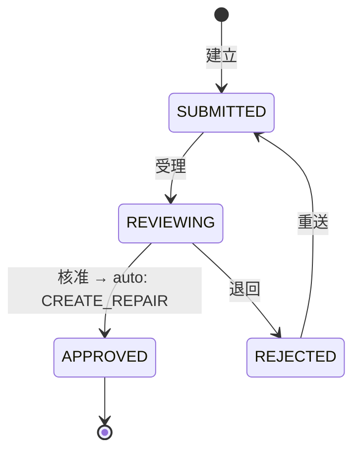
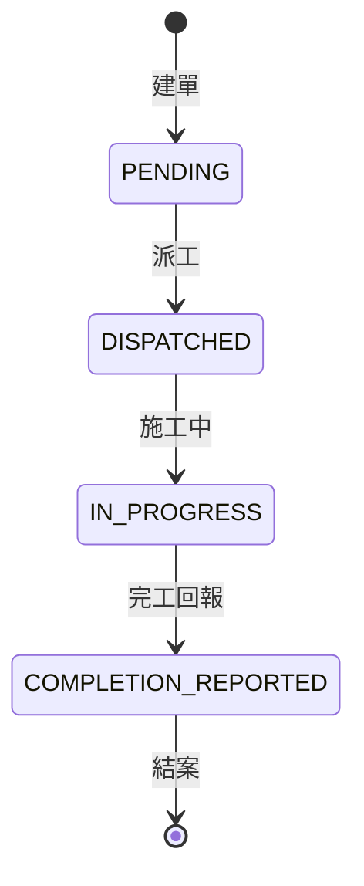
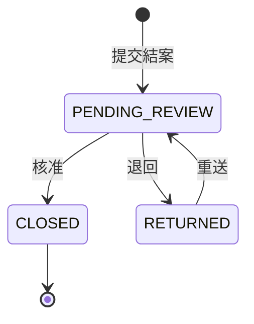
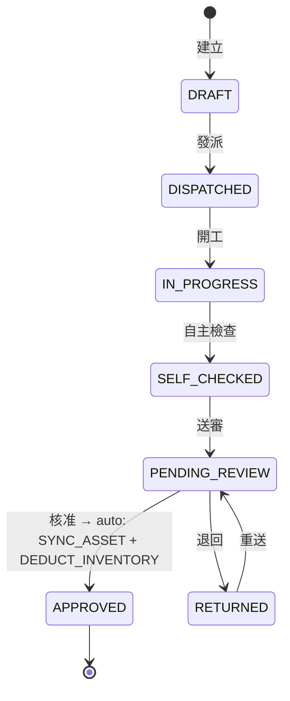
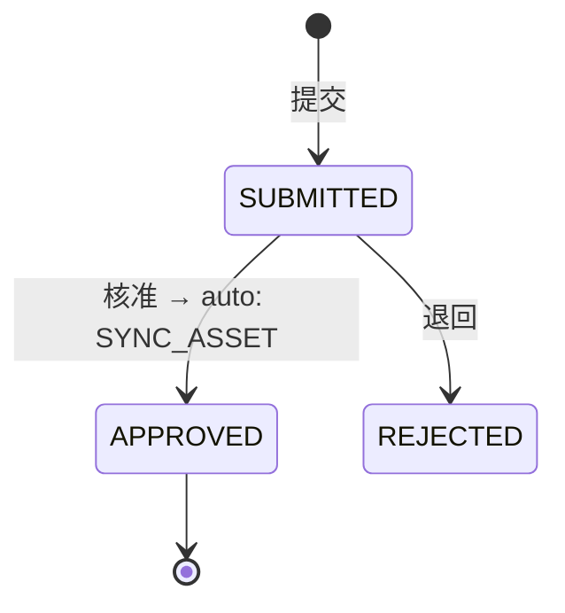
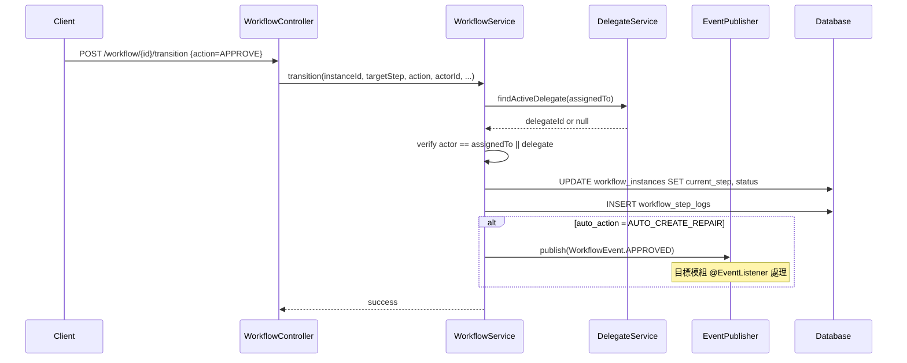
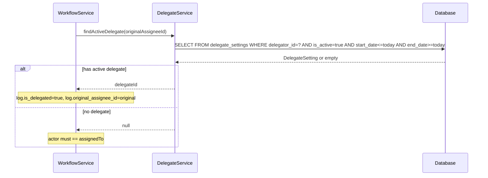

# SD-02 簽核引擎

> **對應 SA**：SA-02-approval.md (FN-02-001 ~ FN-02-022)  
> **實作狀態**：✅ Phase 1 已完成  
> **Package**：`com.taipei.iot.workflow`

---

## 1. DB Schema

### workflow_definitions

```sql
CREATE TABLE workflow_definitions (
    id            BIGSERIAL PRIMARY KEY,
    workflow_type VARCHAR(50) NOT NULL UNIQUE,
    workflow_name VARCHAR(200) NOT NULL,
    description   TEXT,
    is_active     BOOLEAN NOT NULL DEFAULT true,
    created_at    TIMESTAMP NOT NULL DEFAULT now(),
    updated_at    TIMESTAMP NOT NULL DEFAULT now()
);
-- Types: FAULT_REVIEW, REPAIR_DISPATCH, REPAIR_CLOSE, REPLACEMENT_REVIEW, ASSET_CHANGE
```

### workflow_steps_template

```sql
CREATE TABLE workflow_steps_template (
    id            BIGSERIAL PRIMARY KEY,
    workflow_type VARCHAR(50) NOT NULL REFERENCES workflow_definitions(workflow_type),
    step_order    INT NOT NULL,
    step_code     VARCHAR(50) NOT NULL,
    step_name     VARCHAR(200) NOT NULL,
    required_role VARCHAR(50),
    auto_action   VARCHAR(50),  -- AUTO_CREATE_REPAIR / AUTO_SYNC_ASSET / AUTO_DEDUCT_INVENTORY
    timeout_hours INT,
    created_at    TIMESTAMP NOT NULL DEFAULT now(),
    UNIQUE(workflow_type, step_order)
);
```

### workflow_instances

```sql
CREATE TABLE workflow_instances (
    id            BIGSERIAL PRIMARY KEY,
    tenant_id     VARCHAR(50) NOT NULL REFERENCES tenant(tenant_id),
    workflow_type VARCHAR(50) NOT NULL REFERENCES workflow_definitions(workflow_type),
    ticket_type   VARCHAR(50) NOT NULL,  -- FAULT_TICKET / REPAIR_TICKET / REPLACEMENT_ORDER / ASSET_CHANGE
    ticket_id     BIGINT NOT NULL,
    current_step  VARCHAR(50) NOT NULL,
    status        VARCHAR(20) NOT NULL DEFAULT 'ACTIVE',  -- ACTIVE / COMPLETED / CANCELLED
    assigned_to   VARCHAR(50),
    creator_id    VARCHAR(50) NOT NULL,
    started_at    TIMESTAMP NOT NULL DEFAULT now(),
    completed_at  TIMESTAMP,
    created_at    TIMESTAMP NOT NULL DEFAULT now(),
    updated_at    TIMESTAMP NOT NULL DEFAULT now()
);
```

### workflow_step_logs

```sql
CREATE TABLE workflow_step_logs (
    id                    BIGSERIAL PRIMARY KEY,
    tenant_id             VARCHAR(50) NOT NULL REFERENCES tenant(tenant_id),
    instance_id           BIGINT NOT NULL REFERENCES workflow_instances(id),
    step_code             VARCHAR(50) NOT NULL,
    action                VARCHAR(30) NOT NULL,  -- SUBMIT/APPROVE/REJECT/RETURN/DISPATCH/MERGE/COMPLETE/CANCEL
    actor_id              VARCHAR(50) NOT NULL,
    actor_name            VARCHAR(100),
    original_assignee_id  VARCHAR(50),
    is_delegated          BOOLEAN NOT NULL DEFAULT false,
    comment               TEXT,
    attachments           JSONB DEFAULT '[]',
    before_snapshot       JSONB,
    after_snapshot        JSONB,
    acted_at              TIMESTAMP NOT NULL DEFAULT now()
);
```

### delegate_settings

```sql
CREATE TABLE delegate_settings (
    id            BIGSERIAL PRIMARY KEY,
    tenant_id     VARCHAR(50) NOT NULL REFERENCES tenant(tenant_id),
    delegator_id  VARCHAR(50) NOT NULL,
    delegate_id   VARCHAR(50) NOT NULL,
    start_date    DATE NOT NULL,
    end_date      DATE NOT NULL,
    reason        VARCHAR(200),
    is_active     BOOLEAN NOT NULL DEFAULT true,
    created_at    TIMESTAMP NOT NULL DEFAULT now(),
    CHECK (end_date >= start_date),
    CHECK (delegator_id != delegate_id)
);
```

---

## 2. Class Structure

```
workflow/
├── controller/
│   ├── WorkflowController       # 4 endpoints: pending/logs/transition/cancel
│   └── DelegateController       # 4 endpoints: candidates/list/create/delete
├── dto/
│   ├── WorkflowInstanceResponse
│   ├── WorkflowStepLogResponse
│   ├── WorkflowTransitionRequest  # {targetStep, action, comment, attachments}
│   ├── DelegateSettingRequest     # {delegateId, startDate, endDate, reason}
│   ├── DelegateSettingResponse
│   └── DelegateCandidateDto
├── entity/
│   ├── WorkflowDefinition
│   ├── WorkflowInstance
│   ├── WorkflowStepsTemplate
│   ├── WorkflowStepLog
│   └── DelegateSetting
├── enums/
│   ├── WorkflowType              # FAULT_REVIEW, REPAIR_DISPATCH, ...
│   ├── TicketType                # FAULT_TICKET, REPAIR_TICKET, ...
│   ├── WorkflowAction            # SUBMIT, APPROVE, REJECT, RETURN, ...
│   └── WorkflowStatus            # ACTIVE, COMPLETED, CANCELLED
├── event/WorkflowEvent           # ApplicationEvent (approved/rejected)
├── repository/
│   ├── WorkflowDefinitionRepository
│   ├── WorkflowInstanceRepository
│   ├── WorkflowStepsTemplateRepository
│   ├── WorkflowStepLogRepository
│   └── DelegateSettingRepository
└── service/
    ├── WorkflowService           # core engine
    ├── WorkflowInstanceService   # CRUD + query
    └── DelegateService           # delegate management
```

---

## 3. API Contract

| Method | Path | Auth | 說明 |
|--------|------|------|------|
| GET | `/v1/auth/workflow/pending` | WORKFLOW_VIEW | 待辦清單 (分頁) |
| GET | `/v1/auth/workflow/{instanceId}/logs` | WORKFLOW_VIEW | 簽核歷程 |
| POST | `/v1/auth/workflow/{instanceId}/transition` | WORKFLOW_VIEW | 簽核動作 |
| POST | `/v1/auth/workflow/{instanceId}/cancel` | WORKFLOW_VIEW | 取消流程 |
| GET | `/v1/auth/delegates/candidates` | DELEGATE_MANAGE | 可代理人選 |
| GET | `/v1/auth/delegates` | DELEGATE_MANAGE | 我的代理設定 |
| POST | `/v1/auth/delegates` | DELEGATE_MANAGE | 新增代理 |
| DELETE | `/v1/auth/delegates/{id}` | DELEGATE_MANAGE | 刪除代理 |

#### POST /v1/auth/workflow/{instanceId}/transition
```json
// Request
{
  "targetStep": "APPROVED",
  "action": "APPROVE",
  "comment": "同意",
  "attachments": []
}
// Response: BaseResponse<Void>
```

---

## 4. 五種簽核流程 FSM

### 4.1 FAULT_REVIEW (故障審核)



### 4.2 REPAIR_DISPATCH (維修派工)



### 4.3 REPAIR_CLOSE (維修結案)



### 4.4 REPLACEMENT_REVIEW (換裝審核)



### 4.5 ASSET_CHANGE (資產異動)



---

## 5. Sequence — 簽核轉移



### 5.1 代理判斷邏輯


