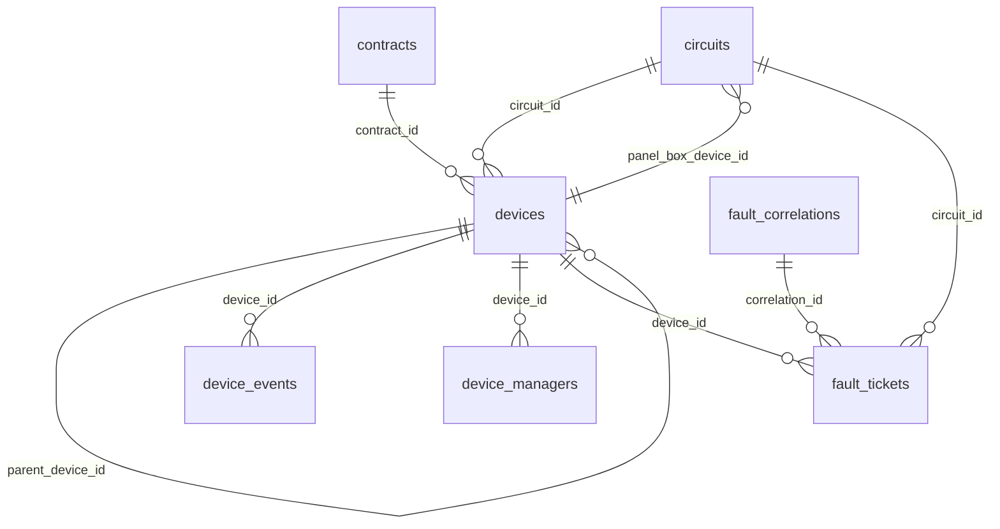
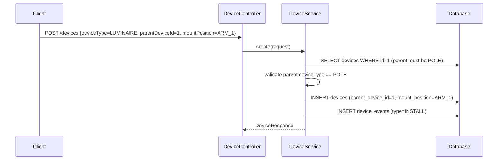
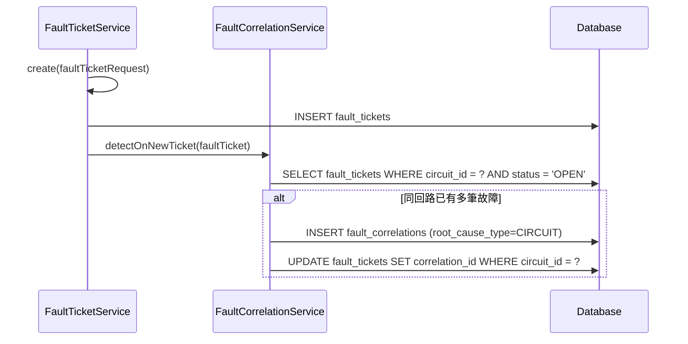
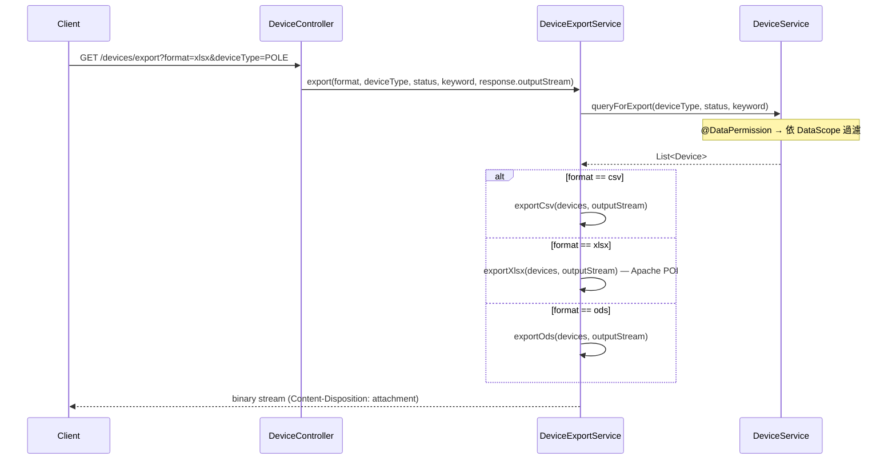
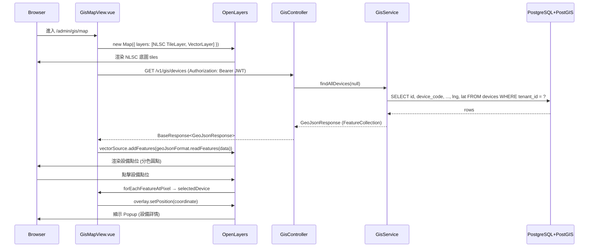
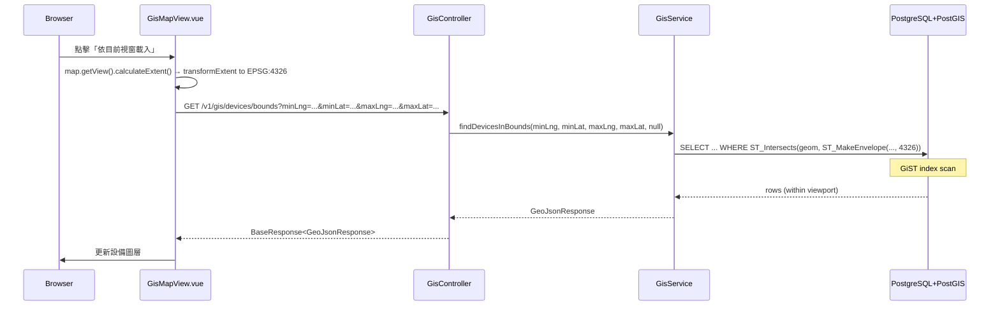

# SD-03 資產管理

> **對應 SA**：SA-03-asset.md (FN-03-001 ~ FN-03-060)  
> **實作狀態**：✅ Phase 1 已完成, ✅ Phase 5C GIS 基礎已完成  
> **Package**：`com.taipei.iot.device`, `com.taipei.iot.fault`, `com.taipei.iot.gis`

---

## 1. DB Schema

### devices

```sql
CREATE TABLE devices (
    id                BIGSERIAL PRIMARY KEY,
    tenant_id         VARCHAR(50) NOT NULL REFERENCES tenant(tenant_id),
    device_type       VARCHAR(30) NOT NULL,     -- POLE/LUMINAIRE/PANEL_BOX/CONTROLLER/POWER_EQUIPMENT/ATTACHMENT
    device_code       VARCHAR(100) NOT NULL,
    device_name       VARCHAR(200),
    twd97_x           NUMERIC(12,3),
    twd97_y           NUMERIC(12,3),
    lng               NUMERIC(11,7),
    lat               NUMERIC(10,7),
    elevation         NUMERIC(8,3),
    taipower_coord    VARCHAR(100),
    dept_id           BIGINT REFERENCES dept_info(dept_id),
    contract_id       BIGINT REFERENCES contracts(id),
    property_owner    VARCHAR(200),
    status            VARCHAR(20) NOT NULL DEFAULT 'ACTIVE',
    installed_at      DATE,
    decommissioned_at DATE,
    parent_device_id  BIGINT REFERENCES devices(id),    -- 拓撲 self-ref
    connectivity_type VARCHAR(20) DEFAULT 'NONE',        -- NONE/DIRECT/GATEWAY
    network_config    JSONB DEFAULT '{}',
    last_heartbeat_at TIMESTAMP,
    last_telemetry_at TIMESTAMP,                          -- IoT: 最後 telemetry 時間 (無訊號偵測用)
    device_token      VARCHAR(200) UNIQUE,                -- IoT: 設備認證 token
    auth_type         VARCHAR(20),                        -- IoT: TOKEN / CERT / PSK
    firmware_version  VARCHAR(50),                         -- IoT: 韌體版本
    format_id         BIGINT REFERENCES telemetry_formats(id),  -- IoT: 對應 telemetry format
    circuit_id        BIGINT REFERENCES circuits(id),
    attributes        JSONB DEFAULT '{}',                -- per device_type specific
    mount_position    VARCHAR(50),                       -- ARM_1/ARM_2/CTRL_1
    created_by        VARCHAR(50),
    created_at        TIMESTAMP NOT NULL DEFAULT now(),
    updated_at        TIMESTAMP NOT NULL DEFAULT now()
);
```

### circuits

```sql
CREATE TABLE circuits (
    id                  BIGSERIAL PRIMARY KEY,
    tenant_id           VARCHAR(50) NOT NULL REFERENCES tenant(tenant_id),
    panel_box_device_id BIGINT REFERENCES devices(id),
    circuit_number      VARCHAR(50) NOT NULL,
    circuit_name        VARCHAR(200),
    taipower_account    VARCHAR(50),
    usage_type          VARCHAR(50),
    status              VARCHAR(20) NOT NULL DEFAULT 'ACTIVE',
    created_at          TIMESTAMP NOT NULL DEFAULT now(),
    updated_at          TIMESTAMP NOT NULL DEFAULT now(),
    UNIQUE(tenant_id, circuit_number)
);
```

### contracts

```sql
CREATE TABLE contracts (
    id                  BIGSERIAL PRIMARY KEY,
    tenant_id           VARCHAR(50) NOT NULL REFERENCES tenant(tenant_id),
    contract_code       VARCHAR(100) NOT NULL,
    contract_name       VARCHAR(300) NOT NULL,
    budget_year         INT,
    procurement_number  VARCHAR(100),
    contractor_name     VARCHAR(200),
    contractor_contact  VARCHAR(200),
    asset_category      VARCHAR(50),
    quantity            INT,
    start_date          DATE,
    end_date            DATE,
    acceptance_date     DATE,
    warranty_years      INT,
    warranty_expiry     DATE,
    status              VARCHAR(20) NOT NULL DEFAULT 'ACTIVE',
    attributes          JSONB DEFAULT '{}',
    created_by          VARCHAR(50),
    created_at          TIMESTAMP NOT NULL DEFAULT now(),
    updated_at          TIMESTAMP NOT NULL DEFAULT now(),
    UNIQUE(tenant_id, contract_code)
);
```

### device_events

```sql
CREATE TABLE device_events (
    id          BIGSERIAL PRIMARY KEY,
    tenant_id   VARCHAR(50) NOT NULL REFERENCES tenant(tenant_id),
    device_id   BIGINT NOT NULL REFERENCES devices(id) ON DELETE CASCADE,
    event_type  VARCHAR(30) NOT NULL,  -- INSTALL/REPLACE/REPAIR/INSPECT/ADOPT/DECOMMISSION/MATERIAL_CHANGE
    event_date  TIMESTAMP NOT NULL DEFAULT now(),
    description TEXT,
    attachments JSONB DEFAULT '[]',
    created_by  VARCHAR(50),
    created_at  TIMESTAMP NOT NULL DEFAULT now()
);
```

### device_managers

```sql
CREATE TABLE device_managers (
    id          BIGSERIAL PRIMARY KEY,
    tenant_id   VARCHAR(50) NOT NULL REFERENCES tenant(tenant_id),
    device_id   BIGINT NOT NULL REFERENCES devices(id) ON DELETE CASCADE,
    user_id     VARCHAR(50) NOT NULL,
    assigned_at TIMESTAMP NOT NULL DEFAULT now(),
    assigned_by VARCHAR(50),
    UNIQUE(device_id, user_id)
);
```

### fault_tickets

```sql
CREATE TABLE fault_tickets (
    id              BIGSERIAL PRIMARY KEY,
    tenant_id       VARCHAR(50) NOT NULL REFERENCES tenant(tenant_id),
    device_id       BIGINT REFERENCES devices(id),
    circuit_id      BIGINT REFERENCES circuits(id),
    correlation_id  BIGINT REFERENCES fault_correlations(id),
    source          VARCHAR(30) NOT NULL,    -- CITIZEN_REPORT/PATROL/AUTO_ALERT
    status          VARCHAR(20) NOT NULL DEFAULT 'OPEN',
    priority        VARCHAR(10) DEFAULT 'NORMAL',
    description     TEXT,
    reported_by     VARCHAR(50),
    reported_at     TIMESTAMP NOT NULL DEFAULT now(),
    resolved_at     TIMESTAMP,
    resolved_by     VARCHAR(50),
    resolution_note TEXT,
    created_at      TIMESTAMP NOT NULL DEFAULT now(),
    updated_at      TIMESTAMP NOT NULL DEFAULT now()
);
```

### fault_correlations

```sql
CREATE TABLE fault_correlations (
    id              BIGSERIAL PRIMARY KEY,
    tenant_id       VARCHAR(50) NOT NULL REFERENCES tenant(tenant_id),
    root_cause_type VARCHAR(30) NOT NULL,    -- CIRCUIT/PANEL_BOX/GATEWAY/POWER_OUTAGE
    root_cause_id   BIGINT NOT NULL,
    affected_count  INT NOT NULL DEFAULT 0,
    status          VARCHAR(20) NOT NULL DEFAULT 'DETECTED',
    detected_at     TIMESTAMP NOT NULL DEFAULT now(),
    confirmed_at    TIMESTAMP,
    resolved_at     TIMESTAMP,
    resolution_note TEXT,
    created_at      TIMESTAMP NOT NULL DEFAULT now()
);
```

---

## 2. ER Diagram



---

## 3. Class Structure

```
device/
├── controller/
│   ├── DeviceController         # 10 endpoints
│   ├── CircuitController        # 5 endpoints
│   └── ContractController       # 5 endpoints
├── dto/
│   ├── DeviceRequest/Response
│   ├── CircuitRequest/Response
│   ├── ContractRequest/Response
│   └── ComponentReplaceRequest
├── entity/
│   ├── Device                   # @Filter(tenantFilter)
│   ├── Circuit                  # @Filter(tenantFilter)
│   ├── Contract                 # @Filter(tenantFilter)
│   ├── DeviceEvent
│   └── DeviceManager
├── enums/
│   ├── DeviceType               # POLE/LUMINAIRE/PANEL_BOX/CONTROLLER/...
│   ├── DeviceStatus             # ACTIVE/INACTIVE/DECOMMISSIONED
│   ├── ConnectivityType         # NONE/DIRECT/GATEWAY
│   ├── DeviceEventType          # INSTALL/REPLACE/REPAIR/...
│   └── ContractStatus           # ACTIVE/EXPIRED/TERMINATED
├── repository/ (5)
└── service/
    ├── DeviceService            # @DataPermission
    ├── CircuitService
    ├── ContractService
    ├── DeviceEventService
    └── DeviceExportService      # CSV/XLSX/ODS
```

---

## 4. API Contract

### 4.1 設備管理 (DeviceController)

| Method | Path | Auth | 說明 |
|--------|------|------|------|
| GET | `/v1/auth/devices` | DEVICE_VIEW | 設備列表 (分頁+篩選) |
| GET | `/v1/auth/devices/{id}` | DEVICE_VIEW | 設備詳情 |
| POST | `/v1/auth/devices` | DEVICE_MANAGE | 新增設備 |
| PUT | `/v1/auth/devices/{id}` | DEVICE_MANAGE | 編輯設備 |
| DELETE | `/v1/auth/devices/{id}` | DEVICE_MANAGE | 刪除設備 |
| POST | `/v1/auth/devices/{id}/decommission` | DEVICE_MANAGE | 除役 |
| GET | `/v1/auth/devices/{id}/events` | DEVICE_VIEW | 設備歷程 |
| GET | `/v1/auth/devices/{id}/components` | DEVICE_VIEW | 子設備清單 |
| POST | `/v1/auth/devices/{id}/components/replace` | DEVICE_MANAGE | 元件置換 |
| GET | `/v1/auth/devices/export` | DEVICE_EXPORT | 匯出 (csv/xlsx/ods) |

### 4.2 迴路管理 (CircuitController)

| Method | Path | Auth | 說明 |
|--------|------|------|------|
| GET | `/v1/auth/circuits` | CIRCUIT_VIEW | 迴路列表 |
| GET | `/v1/auth/circuits/{id}` | CIRCUIT_VIEW | 迴路詳情 |
| POST | `/v1/auth/circuits` | CIRCUIT_MANAGE | 新增 |
| PUT | `/v1/auth/circuits/{id}` | CIRCUIT_MANAGE | 編輯 |
| DELETE | `/v1/auth/circuits/{id}` | CIRCUIT_MANAGE | 刪除 |

### 4.3 契約管理 (ContractController)

| Method | Path | Auth | 說明 |
|--------|------|------|------|
| GET | `/v1/auth/contracts` | CONTRACT_VIEW | 契約列表 |
| GET | `/v1/auth/contracts/{id}` | CONTRACT_VIEW | 契約詳情 |
| POST | `/v1/auth/contracts` | CONTRACT_MANAGE | 新增 |
| PUT | `/v1/auth/contracts/{id}` | CONTRACT_MANAGE | 編輯 |
| DELETE | `/v1/auth/contracts/{id}` | CONTRACT_MANAGE | 刪除 |

### 4.4 故障通報 (FaultTicketController)

| Method | Path | Auth | 說明 |
|--------|------|------|------|
| GET | `/v1/auth/faults` | FAULT_VIEW | 故障列表 |
| GET | `/v1/auth/faults/{id}` | FAULT_VIEW | 故障詳情 |
| POST | `/v1/auth/faults` | FAULT_MANAGE | 新增故障 |
| POST | `/v1/auth/faults/{id}/resolve` | FAULT_MANAGE | 結案 |

---

## 5. Sequence Diagrams

### 5.1 設備拓撲 (parent-child)



### 5.2 故障關聯偵測



### 5.3 設備匯出



### 5.4 JSONB attributes 欄位用法

```json
// POLE
{"height": 10, "material": "鋼管", "armCount": 2, "armLength": 3.0}

// LUMINAIRE  
{"wattage": 100, "colorTemp": 4000, "brand": "飛利浦", "model": "BRP392"}

// PANEL_BOX
{"capacity": "3P100A", "breaker_count": 6}

// CONTROLLER
{"protocol": "DALI", "firmware": "v2.1.3", "sim_iccid": "8988..."}
```

---

## 6. GIS 地理資訊設計 (FN-03-013 ~ FN-03-018)

> **對應 SA**：SA-03 §GIS 地理資訊 (§4-1)  
> **實作狀態**：✅ Phase 5C 已完成（基礎 GIS）  
> **Package**：`com.taipei.iot.gis`  
> **ADR**：ADR-003-gis-open-source.md  
> **Migration**：V49 (PostGIS), V50 (GIS menus/permissions)

### 6.1 PostGIS 空間欄位

devices 表新增 `geom` 欄位（V49 migration）：

```sql
-- WGS84 Point geometry (SRID 4326)
ALTER TABLE devices ADD COLUMN geom geometry(Point, 4326);

-- GiST 空間索引
CREATE INDEX idx_devices_geom ON devices USING GIST (geom);

-- 自動同步觸發器：lng/lat 變更時自動更新 geom
CREATE FUNCTION fn_devices_sync_geom() RETURNS TRIGGER AS $$
BEGIN
    IF NEW.lng IS NOT NULL AND NEW.lat IS NOT NULL THEN
        NEW.geom := ST_SetSRID(ST_MakePoint(NEW.lng::double precision,
                                             NEW.lat::double precision), 4326);
    ELSE
        NEW.geom := NULL;
    END IF;
    RETURN NEW;
END;
$$ LANGUAGE plpgsql;

CREATE TRIGGER trg_devices_sync_geom
    BEFORE INSERT OR UPDATE OF lng, lat ON devices
    FOR EACH ROW EXECUTE FUNCTION fn_devices_sync_geom();
```

### 6.2 DTO — GeoJSON FeatureCollection

```
gis/dto/
└── GeoJsonResponse.java       # Java record
    ├── type: "FeatureCollection"
    ├── features: List<Feature>
    │   ├── type: "Feature"
    │   ├── geometry: Geometry
    │   │   ├── type: "Point"
    │   │   └── coordinates: double[] {lng, lat}
    │   └── properties: Map<String, Object>
    │       ├── id, deviceCode, deviceName
    │       ├── deviceType, status, deptId
```

回應範例：

```json
{
  "type": "FeatureCollection",
  "features": [
    {
      "type": "Feature",
      "geometry": {
        "type": "Point",
        "coordinates": [121.5200, 25.0338]
      },
      "properties": {
        "id": 1,
        "deviceCode": "SL-001",
        "deviceName": "路燈-001",
        "deviceType": "STREETLIGHT",
        "status": "ACTIVE",
        "deptId": 6
      }
    }
  ]
}
```

### 6.3 Class Structure

```
gis/
├── controller/
│   └── GisController            # 3 endpoints, @PreAuthorize("hasAuthority('GIS_VIEW')")
├── dto/
│   └── GeoJsonResponse          # record (FeatureCollection → Feature → Geometry)
└── service/
    └── GisService               # EntityManager native SQL + PostGIS functions
```

### 6.4 API Contract (GisController)

| Method | Path | Auth | 參數 | 說明 |
|--------|------|------|------|------|
| GET | `/v1/gis/devices` | GIS_VIEW | `?deviceType=` (opt) | 全部設備點位 GeoJSON |
| GET | `/v1/gis/devices/bounds` | GIS_VIEW | `minLng, minLat, maxLng, maxLat, ?deviceType` | 邊界框內設備 |
| GET | `/v1/gis/devices/nearby` | GIS_VIEW | `lng, lat, ?radius=500` | 指定點半徑範圍設備 |

### 6.5 GisService 空間查詢

| 方法 | PostGIS 函數 | 說明 |
|------|-------------|------|
| `findAllDevices(deviceType)` | — | `WHERE lng IS NOT NULL AND lat IS NOT NULL`，全量查詢 |
| `findDevicesInBounds(minLng, minLat, maxLng, maxLat, deviceType)` | `ST_Intersects` + `ST_MakeEnvelope` | 邊界框空間查詢，使用 GiST 索引 |
| `findDevicesNearby(lng, lat, radius)` | `ST_DWithin` (geography cast) | 距離查詢（公尺），結果依距離排序（`<->` 運算子） |

- 所有查詢加 `tenant_id = :tenantId` 多租戶隔離
- 使用 `EntityManager.createNativeQuery()` 直接操作 PostGIS SQL
- 結果透過 `toFeatures()` 轉為 GeoJSON Feature 列表

### 6.6 權限設計

| Permission | 角色 | 說明 |
|-----------|------|------|
| `GIS_VIEW` | ADMIN, DEPT_ADMIN, OPERATOR, DEPT_USER, FIELD_USER, VIEWER | 檢視地圖 |
| `GIS_MANAGE` | ADMIN, DEPT_ADMIN | 管理 GIS 資源 |

選單結構 (V50 migration)：

```
GIS 地圖 (DIRECTORY, sort_order=3, icon=Location)
└── 設備地圖 (PAGE, component=GisMap, path=/admin/gis/map)
    └── GIS 操作 (BUTTON)
```

### 6.7 前端架構

| 元件 | 技術 | 說明 |
|------|------|------|
| GisMapView.vue | OpenLayers 9 | 主地圖頁面 |
| 底圖圖層 | NLSC WMTS (XYZ pattern) | `https://wmts.nlsc.gov.tw/wmts/EMAP/default/GoogleMapsCompatible/{z}/{y}/{x}` |
| 底圖 fallback | OpenStreetMap | NLSC 載入失敗自動切換 |
| 設備圖層 | VectorLayer + GeoJSON | 依 deviceType 分色渲染 |
| 投影 | EPSG:3857 (Web Mercator) | `fromLonLat()` / `transformExtent()` 轉換 |
| Popup | ol/Overlay | 點擊設備顯示詳情 |

設備類型顏色：

| deviceType | 顏色 | 中文 |
|-----------|------|------|
| STREETLIGHT | `#f5a623` | 路燈 |
| POLE | `#4a90d9` | 桿件 |
| CONTROLLER | `#7ed321` | 控制器 |
| LUMINAIRE | `#bd10e0` | 燈具 |
| 其他 | `#9b9b9b` | 預設 |

工具列功能：設備類型篩選、重新載入、全部範圍、依目前視窗載入

### 6.8 Sequence Diagram — 設備地圖載入



### 6.9 Sequence Diagram — 邊界框查詢


