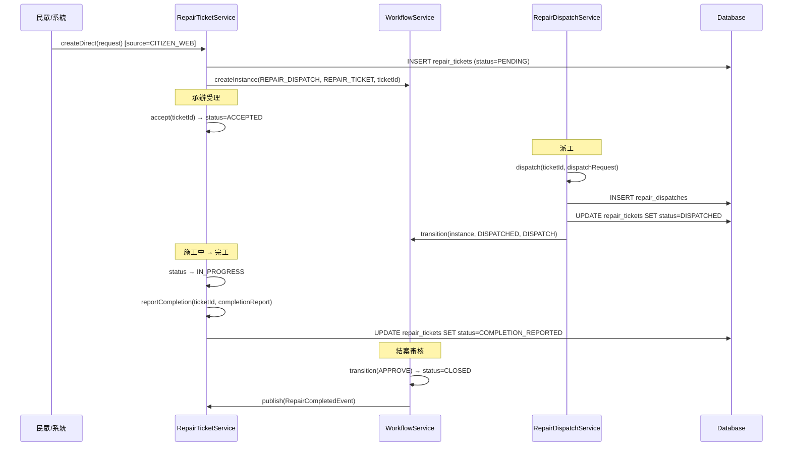
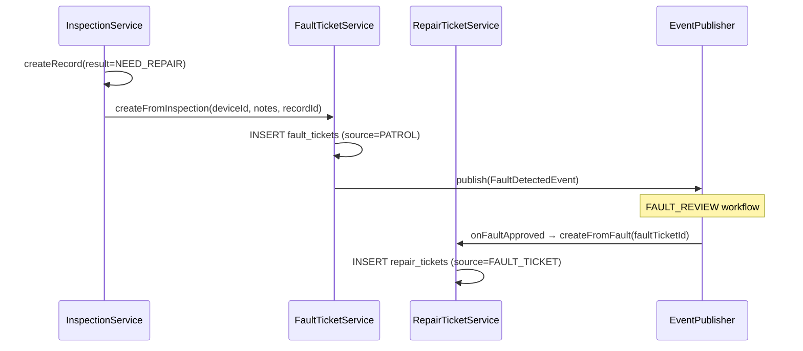

# SD-04 報修維護

> **對應 SA**：SA-04-repair.md (FN-04-001 ~ FN-04-047)  
> **實作狀態**：✅ Phase 2 已完成  
> **Package**：`com.taipei.iot.repair`

---

## 1. DB Schema

### repair_tickets

```sql
CREATE TABLE repair_tickets (
    id                 BIGSERIAL PRIMARY KEY,
    tenant_id          VARCHAR(50) NOT NULL REFERENCES tenant(tenant_id),
    ticket_number      VARCHAR(50) NOT NULL,
    fault_ticket_id    BIGINT REFERENCES fault_tickets(id),
    device_id          BIGINT REFERENCES devices(id),
    circuit_id         BIGINT REFERENCES circuits(id),
    contract_id        BIGINT REFERENCES contracts(id),
    source             VARCHAR(30) NOT NULL,        -- FAULT_TICKET/CITIZEN_WEB/EXTERNAL_1999/PATROL/PHONE
    reporter_name      VARCHAR(100),
    reporter_phone     VARCHAR(50),
    reporter_email     VARCHAR(200),
    report_address     TEXT,
    report_description TEXT,
    reported_at        TIMESTAMP NOT NULL DEFAULT now(),
    fault_category     VARCHAR(50),
    fault_cause        VARCHAR(50),
    repair_description TEXT,
    completed_at       TIMESTAMP,
    status             VARCHAR(30) NOT NULL DEFAULT 'PENDING',
    priority           VARCHAR(10) DEFAULT 'NORMAL',
    dept_id            BIGINT REFERENCES dept_info(dept_id),
    created_by         VARCHAR(50),
    created_at         TIMESTAMP NOT NULL DEFAULT now(),
    updated_at         TIMESTAMP NOT NULL DEFAULT now(),
    UNIQUE(tenant_id, ticket_number)
);
```

**Status FSM**: `PENDING → ACCEPTED → DISPATCHED → IN_PROGRESS → COMPLETION_REPORTED → PENDING_REVIEW → RETURNED → TRANSFERRED → TRACKING → CLOSED`

### repair_dispatches

```sql
CREATE TABLE repair_dispatches (
    id               BIGSERIAL PRIMARY KEY,
    tenant_id        VARCHAR(50) NOT NULL REFERENCES tenant(tenant_id),
    repair_ticket_id BIGINT NOT NULL REFERENCES repair_tickets(id),
    contract_id      BIGINT REFERENCES contracts(id),
    assigned_to      BIGINT,
    assigned_org     VARCHAR(200),
    dispatch_note    TEXT,
    dispatched_at    TIMESTAMP NOT NULL DEFAULT now(),
    dispatched_by    BIGINT NOT NULL,
    due_date         DATE,
    status           VARCHAR(20) NOT NULL DEFAULT 'DISPATCHED',
    created_at       TIMESTAMP NOT NULL DEFAULT now()
);
```

### ticket_attachments (跨模組共用)

```sql
CREATE TABLE ticket_attachments (
    id          BIGSERIAL PRIMARY KEY,
    tenant_id   VARCHAR(50) NOT NULL REFERENCES tenant(tenant_id),
    ticket_type VARCHAR(30) NOT NULL,     -- FAULT_TICKET/REPAIR_TICKET/REPLACEMENT_ORDER
    ticket_id   BIGINT NOT NULL,
    file_type   VARCHAR(20) NOT NULL,     -- PHOTO/VIDEO/AUDIO/DOCUMENT
    file_url    VARCHAR(500) NOT NULL,
    file_name   VARCHAR(300),
    file_size   BIGINT,
    description VARCHAR(500),
    gps_lat     NUMERIC(10,7),
    gps_lng     NUMERIC(11,7),
    taken_at    TIMESTAMP,
    phase       VARCHAR(20),              -- BEFORE/DURING/AFTER/REPORT
    scan_status VARCHAR(20) DEFAULT 'PENDING',  -- PENDING/CLEAN/INFECTED
    uploaded_by VARCHAR(50),
    uploaded_at TIMESTAMP NOT NULL DEFAULT now()
);
```

### inspection_tasks / inspection_records

```sql
CREATE TABLE inspection_tasks (
    id           BIGSERIAL PRIMARY KEY,
    tenant_id    VARCHAR(50) NOT NULL REFERENCES tenant(tenant_id),
    task_name    VARCHAR(200) NOT NULL,
    task_type    VARCHAR(20) NOT NULL,     -- ONE_TIME/RECURRING
    schedule_cron VARCHAR(100),
    start_date   DATE,
    end_date     DATE,
    area_scope   JSONB DEFAULT '{}',
    dept_id      BIGINT REFERENCES dept_info(dept_id),
    assigned_to  BIGINT,
    status       VARCHAR(20) NOT NULL DEFAULT 'ACTIVE',
    created_by   VARCHAR(50),
    created_at   TIMESTAMP NOT NULL DEFAULT now(),
    updated_at   TIMESTAMP NOT NULL DEFAULT now()
);

CREATE TABLE inspection_records (
    id               BIGSERIAL PRIMARY KEY,
    tenant_id        VARCHAR(50) NOT NULL REFERENCES tenant(tenant_id),
    task_id          BIGINT NOT NULL REFERENCES inspection_tasks(id),
    inspector_id     BIGINT NOT NULL,
    inspection_date  TIMESTAMP NOT NULL DEFAULT now(),
    device_id        BIGINT REFERENCES devices(id),
    result           VARCHAR(20) NOT NULL,    -- NORMAL/ABNORMAL/NEED_REPAIR
    notes            TEXT,
    attachments      JSONB DEFAULT '[]',
    fault_ticket_id  BIGINT REFERENCES fault_tickets(id),
    created_at       TIMESTAMP NOT NULL DEFAULT now()
);
```

---

## 2. Class Structure

```
repair/
├── controller/
│   ├── RepairTicketController      # 9 endpoints
│   ├── InspectionController        # 8 endpoints
│   └── TicketAttachmentController  # 3 endpoints
├── dto/
│   ├── RepairTicketRequest/Response
│   ├── RepairTicketQueryParams
│   ├── DispatchRequest/Response
│   ├── CompletionReportRequest
│   ├── InspectionTaskRequest/Response
│   ├── InspectionRecordRequest/Response
│   └── AttachmentResponse/AttachmentUploadRequest
├── entity/
│   ├── RepairTicket               # @Filter(tenantFilter)
│   ├── RepairDispatch
│   ├── TicketAttachment           # polymorphic (ticket_type)
│   ├── InspectionTask
│   └── InspectionRecord
├── enums/
│   ├── RepairTicketStatus (10 states)
│   ├── RepairSource
│   ├── RepairPriority
│   ├── FaultCategory / FaultCause
│   ├── DispatchStatus
│   ├── InspectionTaskType / InspectionResult
│   ├── TicketType / FileType / Phase / ScanStatus
│   └── AttachmentFileType
├── listener/
│   ├── FaultApprovedListener       # E1: fault approved → auto create repair + device REPORTED
│   ├── RepairDispatchedListener    # E4: repair dispatched → device UNDER_REPAIR
│   └── RepairClosedListener        # E9: repair closed → device ACTIVE + device_events history
│   # Note: E13 由 InspectionService 內部直接呼叫 FaultTicketService，非獨立 listener
├── repository/ (5)
└── service/
    ├── RepairTicketService          # CRUD + state transitions
    ├── RepairDispatchService        # 派工
    ├── InspectionService            # 巡查任務+紀錄
    └── TicketAttachmentService      # 附件上傳/下載
```

---

## 3. API Contract

### 3.1 報修工單

| Method | Path | Auth | 說明 |
|--------|------|------|------|
| GET | `/v1/auth/repair/tickets` | REPAIR_VIEW | 列表 (分頁+篩選) |
| GET | `/v1/auth/repair/tickets/{id}` | REPAIR_VIEW | 詳情 |
| POST | `/v1/auth/repair/tickets` | REPAIR_MANAGE | 新增 |
| PUT | `/v1/auth/repair/tickets/{id}` | REPAIR_MANAGE | 編輯 |
| POST | `/v1/auth/repair/tickets/{id}/accept` | REPAIR_MANAGE | 受理 |
| POST | `/v1/auth/repair/tickets/{id}/dispatch` | REPAIR_DISPATCH | 派工 |
| POST | `/v1/auth/repair/tickets/{id}/complete` | REPAIR_MANAGE | 完工回報 |
| POST | `/v1/auth/repair/tickets/{id}/transfer` | REPAIR_MANAGE | 移轉 |
| GET | `/v1/auth/repair/tickets/{id}/dispatches` | REPAIR_VIEW | 派工紀錄 |

### 3.2 巡查管理

| Method | Path | Auth | 說明 |
|--------|------|------|------|
| GET | `/v1/auth/inspection/tasks` | INSPECTION_VIEW | 巡查任務列表 |
| GET | `/v1/auth/inspection/tasks/{id}` | INSPECTION_VIEW | 任務詳情 |
| POST | `/v1/auth/inspection/tasks` | INSPECTION_MANAGE | 新增任務 |
| PUT | `/v1/auth/inspection/tasks/{id}` | INSPECTION_MANAGE | 編輯任務 |
| DELETE | `/v1/auth/inspection/tasks/{id}` | INSPECTION_MANAGE | 停用任務 |
| GET | `/v1/auth/inspection/tasks/{taskId}/records` | INSPECTION_VIEW | 巡查紀錄 |
| POST | `/v1/auth/inspection/records` | INSPECTION_MANAGE | 新增紀錄 |
| GET | `/v1/auth/inspection/records/{id}` | INSPECTION_VIEW | 紀錄詳情 |

### 3.3 附件管理

| Method | Path | Auth | 說明 |
|--------|------|------|------|
| GET | `/v1/auth/repair/tickets/{id}/attachments` | REPAIR_VIEW | 附件列表 |
| POST | `/v1/auth/repair/tickets/{id}/attachments` | REPAIR_MANAGE | 上傳附件 |
| GET | `/v1/auth/repair/attachments/{id}/download` | REPAIR_VIEW | 下載附件 |

---

## 4. Sequence Diagrams

### 4.1 報修完整生命週期



### 4.2 巡查異常 → 自動建故障 → 維修 (E13)


