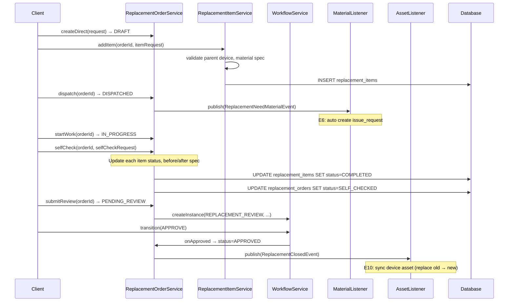
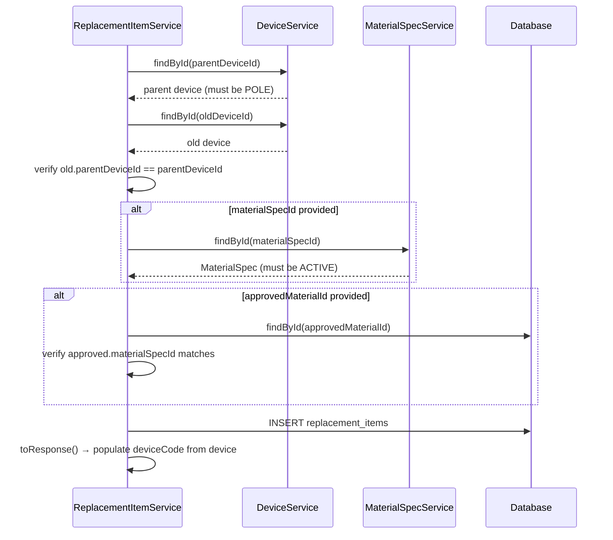
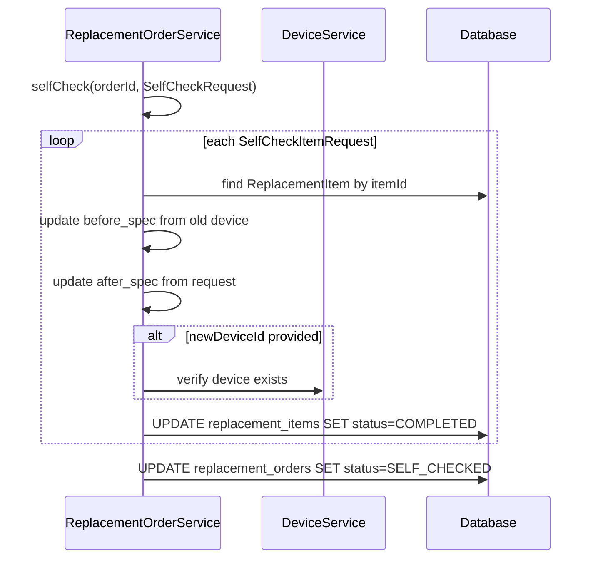

# SD-05 換裝維護

> **對應 SA**：SA-05-replacement.md (FN-05-001 ~ FN-05-035)  
> **實作狀態**：✅ Phase 4 已完成  
> **Package**：`com.taipei.iot.replacement`

---

## 1. DB Schema

### replacement_orders

```sql
CREATE TABLE replacement_orders (
    id                  BIGSERIAL PRIMARY KEY,
    tenant_id           VARCHAR(50) NOT NULL REFERENCES tenant(tenant_id),
    order_number        VARCHAR(50) NOT NULL,
    repair_ticket_id    BIGINT REFERENCES repair_tickets(id),
    contract_id         BIGINT REFERENCES contracts(id),
    order_type          VARCHAR(30) NOT NULL,       -- MAINTENANCE/EMERGENCY
    dispatch_reason     TEXT,
    location            TEXT,
    expected_quantity   INT,
    work_period_start   DATE,
    work_period_end     DATE,
    assigned_contractor VARCHAR(200),
    status              VARCHAR(30) NOT NULL DEFAULT 'DRAFT',
    dept_id             BIGINT REFERENCES dept_info(dept_id),
    created_by          VARCHAR(50),
    created_at          TIMESTAMP NOT NULL DEFAULT now(),
    updated_at          TIMESTAMP NOT NULL DEFAULT now(),
    UNIQUE(tenant_id, order_number)
);
```

**Status FSM**: `DRAFT → DISPATCHED → IN_PROGRESS → SELF_CHECKED → PENDING_REVIEW → APPROVED / RETURNED → (resubmit) PENDING_REVIEW`

### replacement_items

```sql
CREATE TABLE replacement_items (
    id                  BIGSERIAL PRIMARY KEY,
    tenant_id           VARCHAR(50) NOT NULL REFERENCES tenant(tenant_id),
    order_id            BIGINT NOT NULL REFERENCES replacement_orders(id),
    parent_device_id    BIGINT NOT NULL REFERENCES devices(id),
    old_device_id       BIGINT NOT NULL REFERENCES devices(id),
    new_device_id       BIGINT REFERENCES devices(id),
    before_device_type  VARCHAR(30),
    before_spec         JSONB DEFAULT '{}',
    after_device_type   VARCHAR(30),
    after_spec          JSONB DEFAULT '{}',
    material_spec_id    BIGINT REFERENCES material_specs(id),
    approved_material_id BIGINT REFERENCES approved_materials(id),
    status              VARCHAR(20) NOT NULL DEFAULT 'PENDING',
    completed_at        TIMESTAMP,
    completed_by        VARCHAR(50),
    notes               TEXT,
    created_at          TIMESTAMP NOT NULL DEFAULT now()
);
```

### light_pole_numbers

```sql
CREATE TABLE light_pole_numbers (
    id          BIGSERIAL PRIMARY KEY,
    tenant_id   VARCHAR(50) NOT NULL REFERENCES tenant(tenant_id),
    pole_number VARCHAR(100) NOT NULL,
    device_id   BIGINT REFERENCES devices(id),
    qr_code_url VARCHAR(500),
    issued_at   DATE,
    status      VARCHAR(20) NOT NULL DEFAULT 'ACTIVE',
    created_at  TIMESTAMP NOT NULL DEFAULT now(),
    UNIQUE(tenant_id, pole_number)
);
```

---

## 2. Class Structure

```
replacement/
├── controller/
│   ├── ReplacementOrderController   # 16 endpoints
│   └── LightPoleNumberController    # 2 endpoints
├── dto/
│   ├── ReplacementOrderRequest/Response
│   ├── ReplacementOrderQueryParams
│   ├── ReplacementItemRequest/Response
│   ├── SelfCheckRequest/SelfCheckItemRequest
│   └── PoleNumberRequest/Response
├── entity/
│   ├── ReplacementOrder              # @Filter(tenantFilter)
│   ├── ReplacementItem               # @Filter(tenantFilter)
│   └── LightPoleNumber               # @Filter(tenantFilter)
├── enums/
│   ├── ReplacementOrderStatus        # 7 states
│   ├── ReplacementOrderType          # MAINTENANCE/EMERGENCY
│   ├── ReplacementItemStatus         # PENDING/COMPLETED/CANCELLED
│   └── PoleNumberStatus              # ACTIVE/DEACTIVATED
├── listener/
│   ├── ReplacementNeedMaterialListener  # E6: order dispatch → issue request
│   └── ReplacementClosedListener        # E10: approved → sync asset
├── repository/
│   ├── ReplacementOrderRepository
│   ├── ReplacementItemRepository
│   └── LightPoleNumberRepository
└── service/
    ├── ReplacementOrderService       # CRUD + state machine
    ├── ReplacementItemService        # item CRUD + validation
    └── LightPoleNumberService
```

---

## 3. API Contract

### 3.1 換裝工單

| Method | Path | Auth | 說明 |
|--------|------|------|------|
| GET | `/v1/auth/replacement/orders` | REPLACEMENT_VIEW | 列表 (分頁+篩選) |
| GET | `/v1/auth/replacement/orders/{id}` | REPLACEMENT_VIEW | 詳情 |
| POST | `/v1/auth/replacement/orders` | REPLACEMENT_MANAGE | 新增 (直接建立) |
| POST | `/v1/auth/replacement/orders/from-repair/{repairTicketId}` | REPLACEMENT_MANAGE | 從維修單建立 |
| PUT | `/v1/auth/replacement/orders/{id}` | REPLACEMENT_MANAGE | 編輯 |
| POST | `/v1/auth/replacement/orders/{id}/dispatch` | REPLACEMENT_MANAGE | 發派 |
| POST | `/v1/auth/replacement/orders/{id}/start-work` | REPLACEMENT_MANAGE | 開工 |
| POST | `/v1/auth/replacement/orders/{id}/self-check` | REPLACEMENT_MANAGE | 自主檢查 |
| POST | `/v1/auth/replacement/orders/{id}/submit-review` | REPLACEMENT_MANAGE | 送審 |
| POST | `/v1/auth/replacement/orders/{id}/approve` | REPLACEMENT_MANAGE | 核准 |
| POST | `/v1/auth/replacement/orders/{id}/return` | REPLACEMENT_MANAGE | 退回 |
| POST | `/v1/auth/replacement/orders/{id}/resubmit` | REPLACEMENT_MANAGE | 重送 |
| GET | `/v1/auth/replacement/orders/{orderId}/items` | REPLACEMENT_VIEW | 換裝項目 |
| POST | `/v1/auth/replacement/orders/{orderId}/items` | REPLACEMENT_MANAGE | 新增項目 |
| PUT | `/v1/auth/replacement/orders/{orderId}/items/{itemId}` | REPLACEMENT_MANAGE | 編輯項目 |
| DELETE | `/v1/auth/replacement/orders/{orderId}/items/{itemId}` | REPLACEMENT_MANAGE | 刪除項目 |

### 3.2 燈桿號

| Method | Path | Auth | 說明 |
|--------|------|------|------|
| GET | `/v1/auth/replacement/pole-numbers` | POLE_NUMBER_MANAGE | 列表 |
| POST | `/v1/auth/replacement/pole-numbers` | POLE_NUMBER_MANAGE | 產生 |

---

## 4. Sequence Diagrams

### 4.1 換裝完整生命週期



### 4.2 addItem 驗證邏輯



### 4.3 selfCheck 元件置換 + 資產回寫


