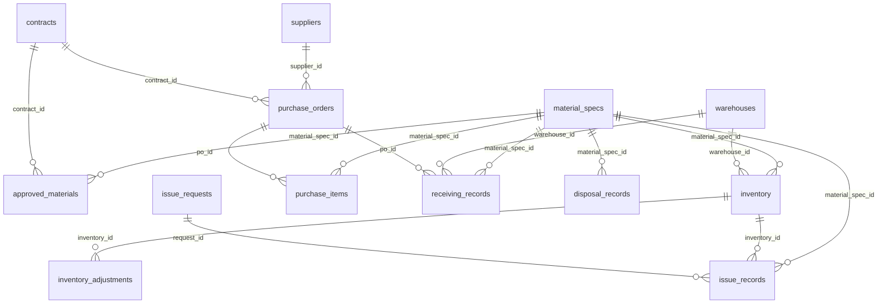
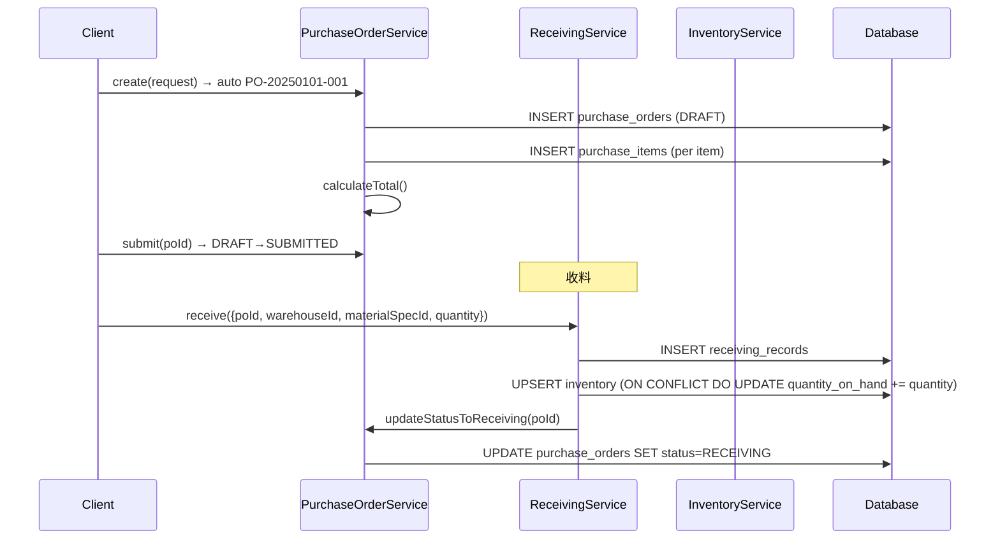
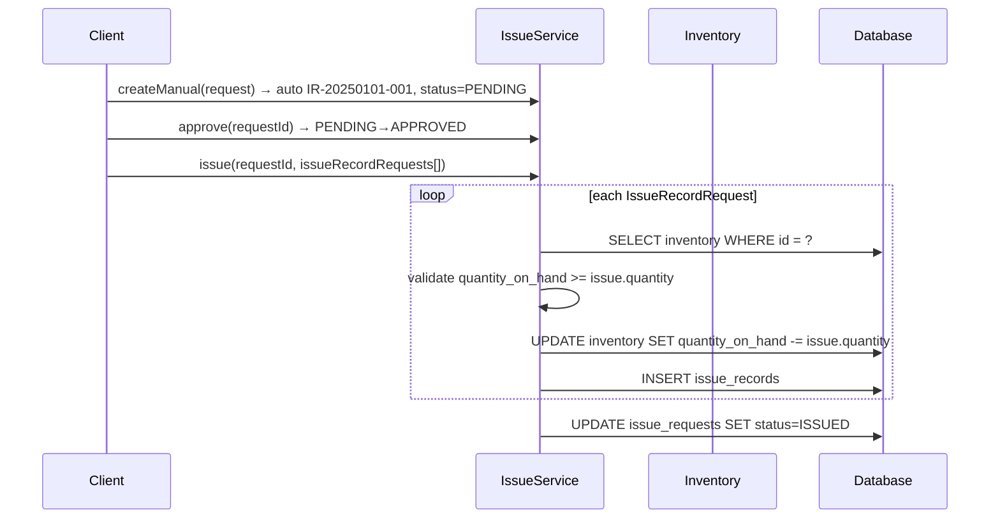
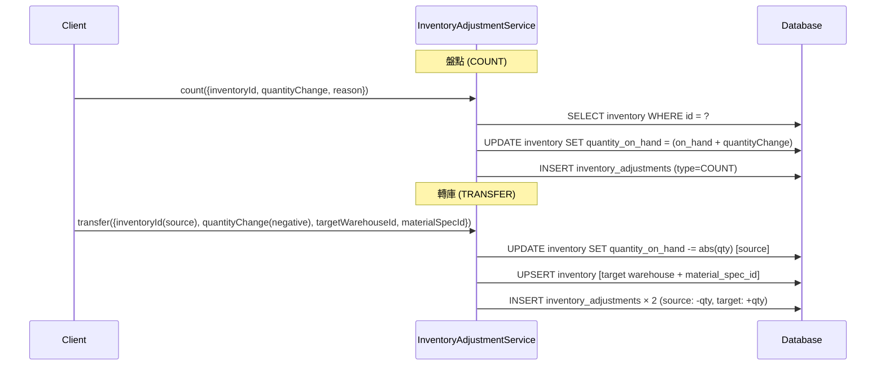
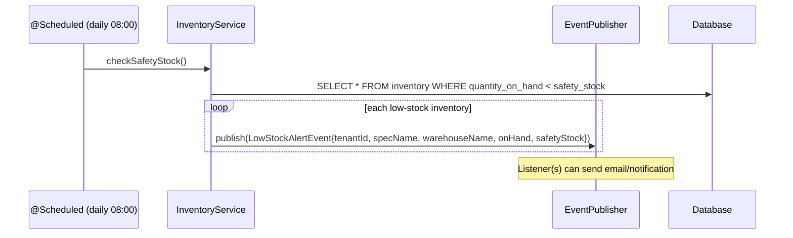
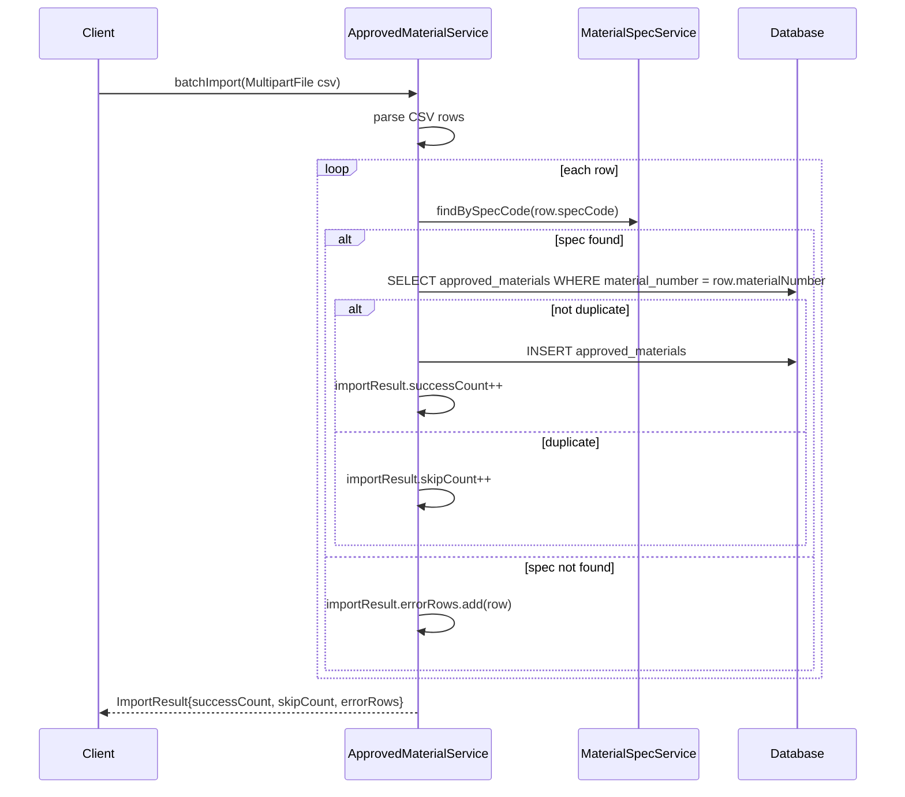
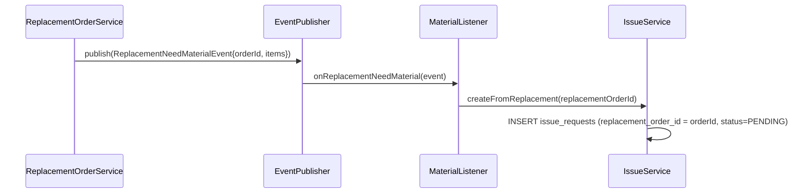

# SD-06 材料管理

> **對應 SA**：SA-06-material.md (FN-06-001 ~ FN-06-045)  
> **實作狀態**：✅ Phase 3 已完成 (FN-06-001~039)；❌ Phase 5 廠商端未實作  
> **Package**：`com.taipei.iot.material`

---

## 1. DB Schema

### 基礎資料 (V40)

#### warehouses

```sql
CREATE TABLE warehouses (
    id              BIGSERIAL PRIMARY KEY,
    tenant_id       VARCHAR(50) NOT NULL REFERENCES tenant(tenant_id),
    warehouse_code  VARCHAR(50) NOT NULL,
    warehouse_name  VARCHAR(200) NOT NULL,
    location        VARCHAR(500),
    status          VARCHAR(20) NOT NULL DEFAULT 'ACTIVE',
    created_at      TIMESTAMP NOT NULL DEFAULT now(),
    updated_at      TIMESTAMP NOT NULL DEFAULT now(),
    UNIQUE(tenant_id, warehouse_code)
);
```

#### material_specs

```sql
CREATE TABLE material_specs (
    id          BIGSERIAL PRIMARY KEY,
    tenant_id   VARCHAR(50) NOT NULL REFERENCES tenant(tenant_id),
    spec_code   VARCHAR(100) NOT NULL,
    spec_name   VARCHAR(300) NOT NULL,
    category    VARCHAR(50) NOT NULL,  -- LUMINAIRE/CONTROLLER/POLE/POLE_NUMBER/CABLE/OTHER
    unit        VARCHAR(20) NOT NULL DEFAULT 'PCS',
    attributes  JSONB DEFAULT '{}',
    status      VARCHAR(20) NOT NULL DEFAULT 'ACTIVE',
    created_at  TIMESTAMP NOT NULL DEFAULT now(),
    updated_at  TIMESTAMP NOT NULL DEFAULT now(),
    UNIQUE(tenant_id, spec_code)
);
```

#### suppliers

```sql
CREATE TABLE suppliers (
    id              BIGSERIAL PRIMARY KEY,
    tenant_id       VARCHAR(50) NOT NULL REFERENCES tenant(tenant_id),
    supplier_code   VARCHAR(100) NOT NULL,
    supplier_name   VARCHAR(300) NOT NULL,
    contact_name    VARCHAR(100),
    contact_phone   VARCHAR(50),
    contact_email   VARCHAR(200),
    address         TEXT,
    status          VARCHAR(20) NOT NULL DEFAULT 'ACTIVE',
    created_at      TIMESTAMP NOT NULL DEFAULT now(),
    updated_at      TIMESTAMP NOT NULL DEFAULT now(),
    UNIQUE(tenant_id, supplier_code)
);
```

#### inventory

```sql
CREATE TABLE inventory (
    id               BIGSERIAL PRIMARY KEY,
    tenant_id        VARCHAR(50) NOT NULL REFERENCES tenant(tenant_id),
    warehouse_id     BIGINT NOT NULL REFERENCES warehouses(id),
    material_spec_id BIGINT NOT NULL REFERENCES material_specs(id),
    quantity_on_hand INT NOT NULL DEFAULT 0,
    safety_stock     INT NOT NULL DEFAULT 0,
    updated_at       TIMESTAMP NOT NULL DEFAULT now(),
    UNIQUE(tenant_id, warehouse_id, material_spec_id)
);
```

#### approved_materials

```sql
CREATE TABLE approved_materials (
    id               BIGSERIAL PRIMARY KEY,
    tenant_id        VARCHAR(50) NOT NULL REFERENCES tenant(tenant_id),
    material_spec_id BIGINT NOT NULL REFERENCES material_specs(id),
    contract_id      BIGINT REFERENCES contracts(id),
    material_number  VARCHAR(100) NOT NULL,
    approval_date    DATE NOT NULL,
    batch_number     VARCHAR(100),
    brand            VARCHAR(200),
    model            VARCHAR(200),
    spec_details     JSONB DEFAULT '{}',
    status           VARCHAR(20) NOT NULL DEFAULT 'ACTIVE',
    created_at       TIMESTAMP NOT NULL DEFAULT now(),
    UNIQUE(tenant_id, material_number)
);
```

### 操作資料 (V41)

#### purchase_orders / purchase_items

```sql
CREATE TABLE purchase_orders (
    id            BIGSERIAL PRIMARY KEY,
    tenant_id     VARCHAR(50) NOT NULL REFERENCES tenant(tenant_id),
    po_number     VARCHAR(100) NOT NULL,
    supplier_id   BIGINT REFERENCES suppliers(id),
    contract_id   BIGINT REFERENCES contracts(id),
    order_date    DATE NOT NULL DEFAULT CURRENT_DATE,
    status        VARCHAR(20) NOT NULL DEFAULT 'DRAFT',
    total_amount  NUMERIC(12,2),
    notes         TEXT,
    created_by    VARCHAR(50),
    created_at    TIMESTAMP NOT NULL DEFAULT now(),
    updated_at    TIMESTAMP NOT NULL DEFAULT now(),
    UNIQUE(tenant_id, po_number)
);

CREATE TABLE purchase_items (
    id               BIGSERIAL PRIMARY KEY,
    po_id            BIGINT NOT NULL REFERENCES purchase_orders(id),
    material_spec_id BIGINT NOT NULL REFERENCES material_specs(id),
    quantity         INT NOT NULL,
    unit_price       NUMERIC(10,2),
    notes            TEXT
);
```

**PO Status FSM**: `DRAFT → SUBMITTED → APPROVED → RECEIVING → COMPLETED → CANCELLED`

#### receiving_records

```sql
CREATE TABLE receiving_records (
    id               BIGSERIAL PRIMARY KEY,
    tenant_id        VARCHAR(50) NOT NULL REFERENCES tenant(tenant_id),
    po_id            BIGINT REFERENCES purchase_orders(id),
    warehouse_id     BIGINT NOT NULL REFERENCES warehouses(id),
    material_spec_id BIGINT NOT NULL REFERENCES material_specs(id),
    quantity         INT NOT NULL,
    received_date    DATE NOT NULL DEFAULT CURRENT_DATE,
    delivery_note    VARCHAR(200),
    received_by      VARCHAR(50),
    created_at       TIMESTAMP NOT NULL DEFAULT now()
);
```

#### issue_requests / issue_records

```sql
CREATE TABLE issue_requests (
    id                   BIGSERIAL PRIMARY KEY,
    tenant_id            VARCHAR(50) NOT NULL REFERENCES tenant(tenant_id),
    request_number       VARCHAR(100) NOT NULL,
    repair_ticket_id     BIGINT REFERENCES repair_tickets(id),
    replacement_order_id BIGINT,
    requested_by         VARCHAR(50) NOT NULL,
    status               VARCHAR(20) NOT NULL DEFAULT 'PENDING',
    created_at           TIMESTAMP NOT NULL DEFAULT now(),
    updated_at           TIMESTAMP NOT NULL DEFAULT now(),
    UNIQUE(tenant_id, request_number)
);

CREATE TABLE issue_records (
    id               BIGSERIAL PRIMARY KEY,
    tenant_id        VARCHAR(50) NOT NULL REFERENCES tenant(tenant_id),
    request_id       BIGINT NOT NULL REFERENCES issue_requests(id),
    inventory_id     BIGINT NOT NULL REFERENCES inventory(id),
    material_spec_id BIGINT NOT NULL REFERENCES material_specs(id),
    quantity         INT NOT NULL,
    issued_by        VARCHAR(50),
    issued_at        TIMESTAMP NOT NULL DEFAULT now()
);
```

**Issue Status FSM**: `PENDING → APPROVED → ISSUED / REJECTED`

#### inventory_adjustments / disposal_records

```sql
CREATE TABLE inventory_adjustments (
    id              BIGSERIAL PRIMARY KEY,
    tenant_id       VARCHAR(50) NOT NULL REFERENCES tenant(tenant_id),
    inventory_id    BIGINT NOT NULL REFERENCES inventory(id),
    adjustment_type VARCHAR(20) NOT NULL,  -- COUNT/TRANSFER/CORRECTION/DISPOSAL
    quantity_change INT NOT NULL,
    reason          TEXT,
    adjusted_by     VARCHAR(50),
    adjusted_at     TIMESTAMP NOT NULL DEFAULT now()
);

CREATE TABLE disposal_records (
    id               BIGSERIAL PRIMARY KEY,
    tenant_id        VARCHAR(50) NOT NULL REFERENCES tenant(tenant_id),
    material_spec_id BIGINT NOT NULL REFERENCES material_specs(id),
    quantity         INT NOT NULL,
    disposal_type    VARCHAR(20) NOT NULL,  -- RETURN_WAREHOUSE/SCRAP
    reason           TEXT,
    disposed_by      VARCHAR(50),
    disposed_at      TIMESTAMP NOT NULL DEFAULT now()
);
```

---

## 2. ER Diagram



---

## 3. Enums

| Enum | Values |
|------|--------|
| `MaterialCategory` | LUMINAIRE, CONTROLLER, POLE, POLE_NUMBER, CABLE, OTHER |
| `MaterialStatus` | ACTIVE, DEPRECATED |
| `WarehouseStatus` | ACTIVE, INACTIVE |
| `SupplierStatus` | ACTIVE, INACTIVE |
| `PurchaseOrderStatus` | DRAFT, SUBMITTED, APPROVED, RECEIVING, COMPLETED, CANCELLED |
| `ApprovedMaterialStatus` | ACTIVE, EXPIRED, REVOKED |
| `IssueRequestStatus` | PENDING, APPROVED, ISSUED, REJECTED |
| `AdjustmentType` | COUNT, TRANSFER, CORRECTION, DISPOSAL |
| `DisposalType` | RETURN_WAREHOUSE, SCRAP |

---

## 4. Class Structure

```
material/
├── controller/ (10)
│   ├── WarehouseController          # 5 endpoints
│   ├── MaterialSpecController       # 4 endpoints
│   ├── SupplierController           # 4 endpoints
│   ├── ApprovedMaterialController   # 5 endpoints (+CSV import)
│   ├── PurchaseOrderController      # 5 endpoints
│   ├── ReceivingController          # 2 endpoints
│   ├── InventoryController          # 3 endpoints
│   ├── InventoryAdjustmentController # 4 endpoints
│   ├── IssueController              # 5 endpoints
│   └── DisposalController           # 2 endpoints
├── dto/ (20+)
│   ├── WarehouseRequest/Response
│   ├── MaterialSpecRequest/Response
│   ├── SupplierRequest/Response
│   ├── ApprovedMaterialRequest/Response, ImportResult
│   ├── PurchaseOrderRequest/Response, PurchaseItemRequest
│   ├── ReceivingRequest/Response
│   ├── InventoryResponse, InventorySummaryResponse
│   ├── InventoryAdjustmentRequest/Response
│   ├── IssueRequestRequest/Response, IssueRecordRequest
│   └── DisposalRequest/Response
├── entity/ (12)
│   ├── Warehouse, MaterialSpec, Supplier
│   ├── Inventory, ApprovedMaterial
│   ├── PurchaseOrder, PurchaseItem
│   ├── ReceivingRecord, IssueRequest, IssueRecord
│   ├── InventoryAdjustment, DisposalRecord
├── enums/ (9)
├── event/
│   └── LowStockAlertEvent          # daily 08:00 safety stock check
├── repository/ (12)
└── service/ (10)
    ├── WarehouseService
    ├── MaterialSpecService
    ├── SupplierService
    ├── ApprovedMaterialService       # CSV batch import
    ├── PurchaseOrderService          # auto PO-YYYYMMDD-NNN
    ├── ReceivingService              # UPSERT inventory on receive
    ├── InventoryService              # @Scheduled safety stock check
    ├── InventoryAdjustmentService    # count/transfer/correction
    ├── IssueService                  # auto IR-YYYYMMDD-NNN
    └── DisposalService
```

---

## 5. API Contract

### 5.1 庫別管理 (WarehouseController)

| Method | Path | Auth | 說明 |
|--------|------|------|------|
| GET | `/v1/auth/material/warehouses` | MATERIAL_VIEW | 列表 (分頁) |
| GET | `/v1/auth/material/warehouses/active` | MATERIAL_VIEW | 啟用庫列表 (dropdown) |
| POST | `/v1/auth/material/warehouses` | MATERIAL_MANAGE | 新增 |
| PUT | `/v1/auth/material/warehouses/{id}` | MATERIAL_MANAGE | 編輯 |
| DELETE | `/v1/auth/material/warehouses/{id}` | MATERIAL_MANAGE | 停用 (soft delete) |

### 5.2 材料規格 (MaterialSpecController)

| Method | Path | Auth | 說明 |
|--------|------|------|------|
| GET | `/v1/auth/material/specs` | MATERIAL_VIEW | 列表 (category/status/keyword) |
| GET | `/v1/auth/material/specs/{id}` | MATERIAL_VIEW | 詳情 |
| POST | `/v1/auth/material/specs` | MATERIAL_MANAGE | 新增 |
| PUT | `/v1/auth/material/specs/{id}` | MATERIAL_MANAGE | 編輯 |

### 5.3 廠商管理 (SupplierController)

| Method | Path | Auth | 說明 |
|--------|------|------|------|
| GET | `/v1/auth/material/suppliers` | MATERIAL_VIEW | 列表 |
| GET | `/v1/auth/material/suppliers/active` | MATERIAL_VIEW | 啟用廠商 |
| POST | `/v1/auth/material/suppliers` | MATERIAL_MANAGE | 新增 |
| PUT | `/v1/auth/material/suppliers/{id}` | MATERIAL_MANAGE | 編輯 |

### 5.4 合格材料 (ApprovedMaterialController)

| Method | Path | Auth | 說明 |
|--------|------|------|------|
| GET | `/v1/auth/material/approved-materials` | MATERIAL_VIEW | 列表 |
| GET | `/v1/auth/material/approved-materials/{id}` | MATERIAL_VIEW | 詳情 |
| POST | `/v1/auth/material/approved-materials` | MATERIAL_MANAGE | 新增 |
| PUT | `/v1/auth/material/approved-materials/{id}` | MATERIAL_MANAGE | 編輯 |
| POST | `/v1/auth/material/approved-materials/import` | MATERIAL_MANAGE | CSV 批次匯入 |

### 5.5 採購管理 (PurchaseOrderController)

| Method | Path | Auth | 說明 |
|--------|------|------|------|
| GET | `/v1/auth/material/purchase-orders` | MATERIAL_VIEW | 列表 |
| GET | `/v1/auth/material/purchase-orders/{id}` | MATERIAL_VIEW | 詳情 (含 items) |
| POST | `/v1/auth/material/purchase-orders` | MATERIAL_MANAGE | 新增 (auto PO-YYYYMMDD-NNN) |
| PUT | `/v1/auth/material/purchase-orders/{id}` | MATERIAL_MANAGE | 編輯 (DRAFT only) |
| POST | `/v1/auth/material/purchase-orders/{id}/submit` | MATERIAL_MANAGE | 送審 (DRAFT→SUBMITTED) |

### 5.6 收料入庫 (ReceivingController)

| Method | Path | Auth | 說明 |
|--------|------|------|------|
| GET | `/v1/auth/material/receiving` | MATERIAL_VIEW | 紀錄列表 |
| POST | `/v1/auth/material/receiving` | MATERIAL_MANAGE | 收料 (UPSERT inventory) |

### 5.7 庫存管理 (InventoryController)

| Method | Path | Auth | 說明 |
|--------|------|------|------|
| GET | `/v1/auth/material/inventory` | INVENTORY_VIEW | 庫存列表 (含 belowSafetyStock 篩選) |
| GET | `/v1/auth/material/inventory/summary` | INVENTORY_VIEW | 分類彙總 |
| GET | `/v1/auth/material/inventory/alerts` | INVENTORY_VIEW | 低於安全庫存清單 |

### 5.8 庫存調整 (InventoryAdjustmentController)

| Method | Path | Auth | 說明 |
|--------|------|------|------|
| GET | `/v1/auth/material/adjustments` | INVENTORY_VIEW | 調整紀錄 |
| POST | `/v1/auth/material/adjustments/count` | INVENTORY_MANAGE | 盤點 |
| POST | `/v1/auth/material/adjustments/transfer` | INVENTORY_MANAGE | 轉庫 |
| POST | `/v1/auth/material/adjustments/correction` | INVENTORY_MANAGE | 修正 |

### 5.9 出料管理 (IssueController)

| Method | Path | Auth | 說明 |
|--------|------|------|------|
| GET | `/v1/auth/material/issue-requests` | MATERIAL_VIEW | 申請列表 |
| POST | `/v1/auth/material/issue-requests` | MATERIAL_MANAGE | 建立申請 (auto IR-YYYYMMDD-NNN) |
| POST | `/v1/auth/material/issue-requests/{id}/approve` | MATERIAL_MANAGE | 核准 |
| POST | `/v1/auth/material/issue-requests/{id}/reject` | MATERIAL_MANAGE | 駁回 |
| POST | `/v1/auth/material/issue-requests/{id}/issue` | MATERIAL_MANAGE | 實際出料 (扣庫存) |

### 5.10 報廢處理 (DisposalController)

| Method | Path | Auth | 說明 |
|--------|------|------|------|
| GET | `/v1/auth/material/disposals` | MATERIAL_VIEW | 列表 |
| POST | `/v1/auth/material/disposals` | MATERIAL_MANAGE | 新增 |

---

## 6. Sequence Diagrams

### 6.1 採購 → 收料 → 庫存 完整流程



### 6.2 出料申請 → 核准 → 出料扣庫



### 6.3 庫存盤點 / 轉庫



### 6.4 安全庫存每日排程告警



### 6.5 合格材料 CSV 批次匯入



### 6.6 跨模組事件: 換裝派工 → 自動建出料申請 (E6)


