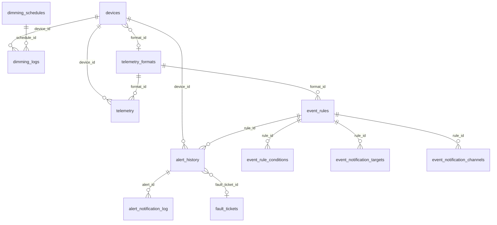
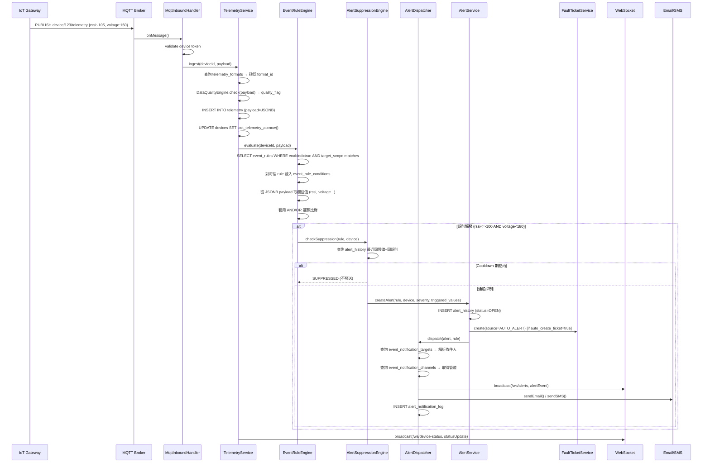
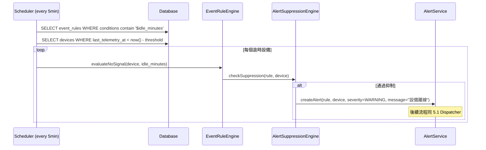
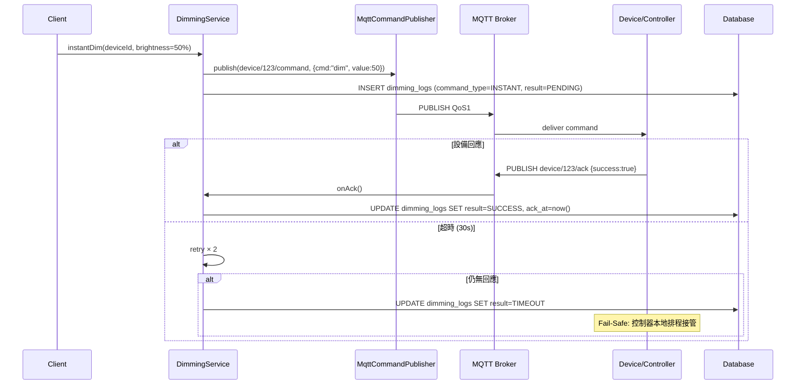
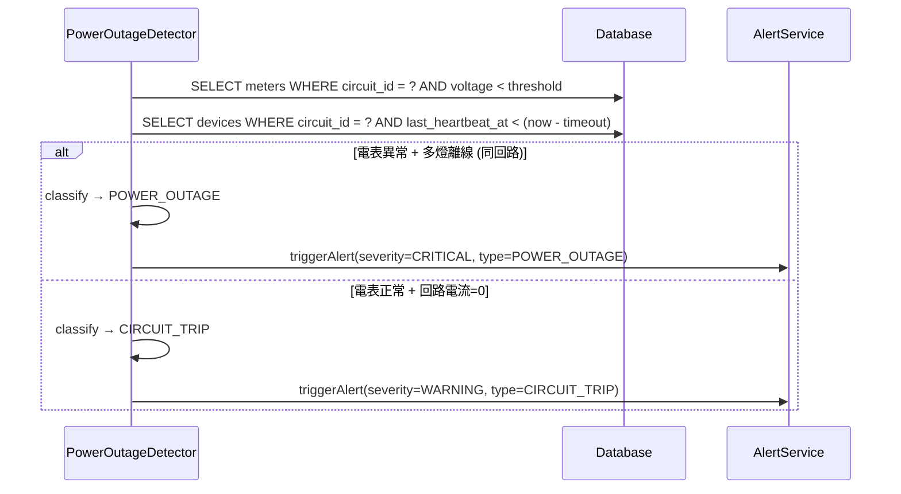

# SD-07 智慧路燈 (IoT)

> **對應 SA**：SA-07-smart.md (FN-07-001 ~ FN-07-043)  
> **實作狀態**：❌ Phase 5 尚未實作 — 本文件為 Forward Design  
> **Package (規劃)**：`com.taipei.iot.iot`

---

## 1. DB Schema (規劃)

### devices 表 IoT 擴充欄位

> **不另建 `iot_devices` 表**，直接在 SD-03 `devices` 表新增 IoT 專屬欄位。
> 傳統設備這些欄位為 NULL；IoT 設備透過 `connectivity_type != 'NONE'` 且 `device_token IS NOT NULL` 識別。
> 詳見 SD-03-asset.md § devices 表。

```sql
-- Phase 7 Migration: 在 devices 表新增 IoT 欄位
ALTER TABLE devices ADD COLUMN device_token      VARCHAR(200) UNIQUE;
ALTER TABLE devices ADD COLUMN auth_type          VARCHAR(20);          -- TOKEN / CERT / PSK
ALTER TABLE devices ADD COLUMN firmware_version   VARCHAR(50);
ALTER TABLE devices ADD COLUMN last_telemetry_at  TIMESTAMP;
ALTER TABLE devices ADD COLUMN format_id          BIGINT REFERENCES telemetry_formats(id);
```

原有欄位對應：
| 原 `iot_devices` 欄位 | 合併至 `devices` 欄位 | 說明 |
|---|---|---|
| `protocol` | `connectivity_type` + `network_config` | `connectivity_type` 已有 MQTT/REST 等；細節放 `network_config` JSONB |
| `device_token` | `device_token` (新增) | IoT 認證 token |
| `auth_type` | `auth_type` (新增) | TOKEN / CERT / PSK |
| `firmware_version` | `firmware_version` (新增) | 韌體版本 |
| `status` | `status` | 共用，不重複 |
| `last_heartbeat_at` | `last_heartbeat_at` | 已存在 |
| `config` | `network_config` | 已存在 JSONB |

### telemetry_formats (動態 Format 定義)

```sql
CREATE TABLE telemetry_formats (
    id                BIGSERIAL PRIMARY KEY,
    tenant_id         VARCHAR(50) NOT NULL REFERENCES tenant(tenant_id),
    vendor_name       VARCHAR(100) NOT NULL,
    device_model      VARCHAR(100) NOT NULL,
    version           INT NOT NULL DEFAULT 1,
    field_definitions JSONB NOT NULL,          -- [{"name":"rssi","type":"NUMBER","unit":"dBm"}, ...]
    sample_payload    JSONB,                    -- 原始 JSON 範例
    description       TEXT,
    enabled           BOOLEAN NOT NULL DEFAULT true,
    created_at        TIMESTAMP NOT NULL DEFAULT now(),
    updated_at        TIMESTAMP NOT NULL DEFAULT now(),
    UNIQUE(tenant_id, vendor_name, device_model, version)
);
```

### telemetry (時序資料 — JSONB 儲存)

```sql
CREATE TABLE telemetry (
    time             TIMESTAMPTZ NOT NULL,
    tenant_id        VARCHAR(50) NOT NULL,
    device_id        BIGINT NOT NULL REFERENCES devices(id),
    format_id        BIGINT REFERENCES telemetry_formats(id),
    payload          JSONB NOT NULL,            -- 動態欄位，依 format 定義存放
    quality_flag     VARCHAR(10) DEFAULT 'OK'   -- OK / SUSPECT / MISSING
);
-- SELECT create_hypertable('telemetry', 'time');  -- 若用 TimescaleDB
-- 或使用 PostgreSQL 原生分區:
CREATE INDEX idx_telemetry_device_time ON telemetry (device_id, time DESC);
CREATE INDEX idx_telemetry_payload ON telemetry USING GIN (payload);  -- JSONB 查詢加速
```

### event_rules (Config-Driven 事件規則)

```sql
CREATE TABLE event_rules (
    id                    BIGSERIAL PRIMARY KEY,
    tenant_id             VARCHAR(50) NOT NULL REFERENCES tenant(tenant_id),
    rule_name             VARCHAR(200) NOT NULL,
    description           TEXT,
    severity              VARCHAR(10) NOT NULL,        -- CRITICAL / WARNING / INFO
    target_scope          JSONB DEFAULT '{}',           -- {"deviceType":"LUMINAIRE","areaIds":[1,2]}
    format_id             BIGINT REFERENCES telemetry_formats(id),  -- 欄位來源
    condition_logic        VARCHAR(5) NOT NULL DEFAULT 'AND',  -- AND / OR (頂層群組間邏輯)
    suppress_duration_min  INT DEFAULT 30,              -- 同設備同規則 cooldown
    auto_create_ticket     BOOLEAN DEFAULT false,       -- 是否自動建單
    enabled               BOOLEAN NOT NULL DEFAULT true,
    created_at            TIMESTAMP NOT NULL DEFAULT now(),
    updated_at            TIMESTAMP NOT NULL DEFAULT now()
);
```

### event_rule_conditions (規則條件 — 支援複合條件)

```sql
CREATE TABLE event_rule_conditions (
    id              BIGSERIAL PRIMARY KEY,
    rule_id         BIGINT NOT NULL REFERENCES event_rules(id) ON DELETE CASCADE,
    condition_group INT NOT NULL DEFAULT 1,        -- 群組編號，同群組內為 AND
    field           VARCHAR(100) NOT NULL,          -- 廠商欄位 'rssi' 或系統虛擬欄位 '$idle_minutes'
    operator        VARCHAR(10) NOT NULL,           -- >, >=, <, <=, ==, !=
    threshold_value VARCHAR(100) NOT NULL,           -- 字串存放，執行時依欄位型態轉型
    sort_order      INT NOT NULL DEFAULT 0
);
-- 條件群組範例：
-- group 1: rssi <= -100 AND voltage < 180  (同群組 AND)
-- group 2: $idle_minutes >= 120            (另一個群組)
-- condition_logic = 'OR' → group1 OR group2 任一成立即觸發
```

### event_notification_targets (告警通知對象)

```sql
CREATE TABLE event_notification_targets (
    id          BIGSERIAL PRIMARY KEY,
    rule_id     BIGINT NOT NULL REFERENCES event_rules(id) ON DELETE CASCADE,
    target_type VARCHAR(20) NOT NULL,       -- ROLE / USER / GROUP
    target_id   VARCHAR(100) NOT NULL,       -- role_code / user_id / group_id
    created_at  TIMESTAMP NOT NULL DEFAULT now()
);
```

### event_notification_channels (告警發送管道)

```sql
CREATE TABLE event_notification_channels (
    id          BIGSERIAL PRIMARY KEY,
    rule_id     BIGINT NOT NULL REFERENCES event_rules(id) ON DELETE CASCADE,
    channel     VARCHAR(20) NOT NULL,       -- EMAIL / SMS / WEBSOCKET / LINE
    config      JSONB DEFAULT '{}',          -- 管道專屬設定（如 SMS template_id）
    enabled     BOOLEAN NOT NULL DEFAULT true,
    created_at  TIMESTAMP NOT NULL DEFAULT now(),
    UNIQUE(rule_id, channel)
);
```

### alert_history (告警歷史 — 含狀態機)

```sql
CREATE TABLE alert_history (
    id              BIGSERIAL PRIMARY KEY,
    tenant_id       VARCHAR(50) NOT NULL REFERENCES tenant(tenant_id),
    rule_id         BIGINT REFERENCES event_rules(id),
    device_id       BIGINT REFERENCES devices(id),
    severity        VARCHAR(10) NOT NULL,
    status          VARCHAR(20) NOT NULL DEFAULT 'OPEN',  -- OPEN / ACKNOWLEDGED / RESOLVED
    message         TEXT NOT NULL,
    triggered_values JSONB,                    -- 觸發時的實際欄位值快照
    triggered_at    TIMESTAMPTZ NOT NULL DEFAULT now(),
    ack_by          VARCHAR(50),
    ack_at          TIMESTAMPTZ,
    resolved_at     TIMESTAMPTZ,
    mttr_minutes    INT,                       -- 自動計算: resolved_at - triggered_at
    fault_ticket_id BIGINT REFERENCES fault_tickets(id),
    notification_sent BOOLEAN DEFAULT false
);
CREATE INDEX idx_alert_history_status ON alert_history (tenant_id, status, triggered_at DESC);
```

### alert_notification_log (通知發送紀錄)

```sql
CREATE TABLE alert_notification_log (
    id            BIGSERIAL PRIMARY KEY,
    alert_id      BIGINT NOT NULL REFERENCES alert_history(id),
    channel       VARCHAR(20) NOT NULL,       -- EMAIL / SMS / WEBSOCKET / LINE
    recipient     VARCHAR(200) NOT NULL,       -- email / phone / user_id
    status        VARCHAR(20) NOT NULL,        -- SENT / FAILED / SUPPRESSED
    error_message TEXT,
    sent_at       TIMESTAMPTZ NOT NULL DEFAULT now()
);
```

### dimming_groups / dimming_schedules / dimming_logs

```sql
CREATE TABLE dimming_groups (
    id          BIGSERIAL PRIMARY KEY,
    tenant_id   VARCHAR(50) NOT NULL REFERENCES tenant(tenant_id),
    group_name  VARCHAR(200) NOT NULL,
    device_ids  BIGINT[] NOT NULL,
    created_at  TIMESTAMP NOT NULL DEFAULT now()
);

CREATE TABLE dimming_schedules (
    id             BIGSERIAL PRIMARY KEY,
    tenant_id      VARCHAR(50) NOT NULL REFERENCES tenant(tenant_id),
    schedule_name  VARCHAR(200) NOT NULL,
    target_type    VARCHAR(20) NOT NULL,     -- DEVICE / GROUP / AREA
    target_id      BIGINT,
    brightness_pct INT NOT NULL,
    schedule_cron  VARCHAR(100),
    one_time_at    TIMESTAMPTZ,
    enabled        BOOLEAN DEFAULT true,
    created_at     TIMESTAMP NOT NULL DEFAULT now()
);

CREATE TABLE dimming_logs (
    id             BIGSERIAL PRIMARY KEY,
    tenant_id      VARCHAR(50) NOT NULL REFERENCES tenant(tenant_id),
    device_id      BIGINT NOT NULL REFERENCES devices(id),
    command_type   VARCHAR(20) NOT NULL,     -- INSTANT / SCHEDULED / FAILSAFE
    brightness_pct INT NOT NULL,
    result         VARCHAR(20) NOT NULL,     -- SUCCESS / TIMEOUT / FAILED
    sent_at        TIMESTAMPTZ NOT NULL DEFAULT now(),
    ack_at         TIMESTAMPTZ,
    schedule_id    BIGINT REFERENCES dimming_schedules(id)
);
```

### alert_configs (示警設定)

```sql
CREATE TABLE alert_configs (
    id           BIGSERIAL PRIMARY KEY,
    tenant_id    VARCHAR(50) NOT NULL REFERENCES tenant(tenant_id),
    config_type  VARCHAR(30) NOT NULL,      -- DAYTIME / NIGHTTIME / TIMEOUT / POWER
    area_scope   JSONB DEFAULT '{}',
    config_value JSONB NOT NULL,            -- {"startHour":6,"endHour":18} / {"timeoutMinutes":30}
    updated_at   TIMESTAMP NOT NULL DEFAULT now(),
    UNIQUE(tenant_id, config_type, area_scope)
);
```

---

## 2. ER Diagram



---

## 3. Class Structure (規劃)

```
iot/
├── controller/
│   ├── IoTDeviceController          # CRUD + 註冊 (FN-07-001~002)
│   ├── TelemetryController          # REST 上行 + 查詢 (FN-07-004, 011, 012)
│   ├── TelemetryFormatController    # Format 定義 CRUD + 欄位查詢 (FN-07-044~047)
│   ├── EventRuleController          # 事件規則 CRUD + 條件群組 + 通知配置 (FN-07-013, 048~052)
│   ├── AlertHistoryController       # 告警歷史 + ACK + Resolve + 匯出 (FN-07-016~017, 053~054)
│   ├── DimmingController            # 單燈/群組/排程 (FN-07-023~029)
│   ├── AlertConfigController        # 示警設定 (FN-07-033~036)
│   ├── MeterController              # 電表接收 + 總覽 (FN-07-019, 022)
│   ├── TunnelController             # 隧道監控 + 控制 (FN-07-041~043)
│   ├── IoTStatisticsController      # 統計分析 (FN-07-038~040)
│   └── ConnectionController         # 連線紀錄 (FN-07-030~032)
├── mqtt/
│   ├── MqttInboundHandler           # telemetry 上行 (FN-07-003)
│   ├── MqttCommandPublisher         # 指令下行 (FN-07-006)
│   └── MqttConfig                   # Spring Integration MQTT config
├── engine/
│   ├── EventRuleEngine              # Config-Driven 規則匹配 (FN-07-014)
│   │   ├── 收到 telemetry → 遍歷 active event_rules
│   │   ├── 從 JSONB payload 取欄位值
│   │   ├── 套用 event_rule_conditions (AND/OR 邏輯)
│   │   └── 虛擬欄位處理: $idle_minutes = now() - last_telemetry_at
│   ├── AlertSuppressionEngine       # Cooldown 抑制判斷 (FN-07-015)
│   │   └── 查詢同設備+同規則最近一筆 alert，判斷是否在 suppress_duration_min 內
│   ├── AlertDispatcher              # 通知分發 (FN-07-052)
│   │   ├── 查詢 event_notification_targets → 解析實際收件人
│   │   ├── 查詢 event_notification_channels → 多管道發送
│   │   └── 寫入 alert_notification_log
│   ├── DataQualityEngine            # 數據錯漏偵測 (FN-07-007)
│   └── PowerOutageDetector          # 區域停電 / 回路跳脫 (FN-07-020~021)
├── service/
│   ├── IoTDeviceService
│   ├── TelemetryService             # write (JSONB) + query + backfill (FN-07-008)
│   ├── TelemetryFormatService       # format CRUD + 欄位解析
│   ├── EventRuleService             # rule CRUD + conditions + targets + channels
│   ├── AlertService                 # alert lifecycle: OPEN → ACK → RESOLVED
│   ├── DimmingService               # instant/group/scheduled + failsafe (FN-07-027)
│   ├── MeterService
│   ├── TunnelService
│   └── ConnectionLogService
├── websocket/
│   ├── DeviceStatusWebSocket        # /ws/device-status (FN-07-010)
│   └── AlertWebSocket               # /ws/alerts (FN-07-018)
├── scheduler/
│   ├── NoSignalDetectionJob         # 無訊號偵測: 掃描 last_telemetry_at (FN-07-049)
│   ├── HeartbeatTimeoutJob          # 偵測離線設備
│   ├── DimmingScheduleJob           # cron → 批次調光 (FN-07-026)
│   └── ConnectionLogCleanupJob      # 7 天連線 Log 清理 (FN-07-031)
└── event/
    ├── AlertTriggeredEvent          # → Suppression → Dispatcher → 自動建 fault_ticket
    └── DeviceStatusChangedEvent     # → WebSocket broadcast
```

---

## 4. API Contract (規劃)

### 4.1 IoT 設備管理

| Method | Path | Auth | 說明 |
|--------|------|------|------|
| POST | `/v1/auth/iot/devices` | IOT_MANAGE | 設備註冊 |
| GET | `/v1/auth/iot/devices` | IOT_VIEW | 設備列表 |

### 4.2 Telemetry (無 Auth — device token)

| Method | Path | Auth | 說明 |
|--------|------|------|------|
| POST | `/v1/iot/telemetry` | Device Token | REST 上行 (JSONB payload) |
| POST | `/v1/iot/telemetry/batch` | Device Token | 批次回補 |
| POST | `/v1/iot/heartbeat` | Device Token | 心跳上報 |
| — | `MQTT device/{id}/telemetry` | Token | MQTT 上行 |
| — | `MQTT device/{id}/command` | — | MQTT 下行指令 |

### 4.2b Telemetry Format 管理

| Method | Path | Auth | 說明 |
|--------|------|------|------|
| POST | `/v1/auth/iot/telemetry-formats` | IOT_MANAGE | 建立 Format 定義 |
| GET | `/v1/auth/iot/telemetry-formats` | IOT_VIEW | Format 清單 |
| PUT | `/v1/auth/iot/telemetry-formats/{id}` | IOT_MANAGE | 更新 Format |
| GET | `/v1/auth/iot/telemetry-formats/{id}/fields` | IOT_VIEW | 欄位清單 (含 $ 系統虛擬欄位) |

### 4.3 即時監控

| Method | Path | Auth | 說明 |
|--------|------|------|------|
| GET | `/v1/auth/iot/map/status` | IOT_VIEW | GeoJSON 狀態地圖 |
| GET | `/v1/auth/iot/devices/{id}/telemetry/latest` | IOT_VIEW | 最新 telemetry |
| GET | `/v1/auth/iot/devices/{id}/telemetry/history` | IOT_VIEW | 歷史 telemetry |
| — | `WebSocket /ws/device-status` | JWT | 狀態即時推送 |

### 4.4 事件規則 & 告警管理

| Method | Path | Auth | 說明 |
|--------|------|------|------|
| GET | `/v1/auth/iot/event-rules` | IOT_VIEW | 事件規則列表 |
| POST | `/v1/auth/iot/event-rules` | IOT_MANAGE | 新增事件規則 (含複合條件) |
| PUT | `/v1/auth/iot/event-rules/{id}` | IOT_MANAGE | 編輯事件規則 |
| DELETE | `/v1/auth/iot/event-rules/{id}` | IOT_MANAGE | 刪除事件規則 |
| GET | `/v1/auth/iot/event-rules/{id}/conditions` | IOT_VIEW | 規則條件群組列表 |
| PUT | `/v1/auth/iot/event-rules/{id}/conditions` | IOT_MANAGE | 更新條件群組 (批次) |
| GET | `/v1/auth/iot/event-rules/{id}/recipients` | IOT_VIEW | 通知對象列表 |
| PUT | `/v1/auth/iot/event-rules/{id}/recipients` | IOT_MANAGE | 更新通知對象 |
| GET | `/v1/auth/iot/event-rules/{id}/channels` | IOT_VIEW | 通知管道列表 |
| PUT | `/v1/auth/iot/event-rules/{id}/channels` | IOT_MANAGE | 更新通知管道 |
| GET | `/v1/auth/iot/alerts` | IOT_VIEW | 告警歷史 (含狀態篩選) |
| GET | `/v1/auth/iot/alerts/export` | IOT_VIEW | 告警匯出 |
| PUT | `/v1/auth/iot/alerts/{id}/ack` | IOT_MANAGE | 告警確認 (OPEN→ACK) |
| PUT | `/v1/auth/iot/alerts/{id}/resolve` | IOT_MANAGE | 告警解除 (ACK→RESOLVED) |
| — | `WebSocket /ws/alerts` | JWT | 告警即時推送 |

### 4.5 調光控制

| Method | Path | Auth | 說明 |
|--------|------|------|------|
| POST | `/v1/auth/iot/dimming/instant` | IOT_DIMMING | 單燈即時調光 |
| POST | `/v1/auth/iot/dimming/group` | IOT_DIMMING | 群組即時調光 |
| GET | `/v1/auth/iot/dimming/groups` | IOT_VIEW | 群組列表 |
| POST | `/v1/auth/iot/dimming/groups` | IOT_MANAGE | 新增群組 |
| PUT | `/v1/auth/iot/dimming/groups/{id}` | IOT_MANAGE | 編輯群組 |
| DELETE | `/v1/auth/iot/dimming/groups/{id}` | IOT_MANAGE | 刪除群組 |
| GET | `/v1/auth/iot/dimming/schedules` | IOT_VIEW | 排程列表 |
| POST | `/v1/auth/iot/dimming/schedules` | IOT_MANAGE | 新增排程 |
| PUT | `/v1/auth/iot/dimming/schedules/{id}` | IOT_MANAGE | 編輯排程 |
| DELETE | `/v1/auth/iot/dimming/schedules/{id}` | IOT_MANAGE | 刪除排程 |
| GET | `/v1/auth/iot/dimming/logs` | IOT_VIEW | 指令歷史 |

### 4.6 示警設定

| Method | Path | Auth | 說明 |
|--------|------|------|------|
| PUT | `/v1/auth/iot/alert-config/daytime` | IOT_MANAGE | 日間亮燈設定 |
| PUT | `/v1/auth/iot/alert-config/nighttime` | IOT_MANAGE | 夜間異常設定 |
| PUT | `/v1/auth/iot/alert-config/timeout` | IOT_MANAGE | 訊號中斷閾值 |
| PUT | `/v1/auth/iot/alert-config/power` | IOT_MANAGE | 電力變化閾值 |

### 4.7 電表 / 連線 / 隧道 / 統計

| Method | Path | Auth | 說明 |
|--------|------|------|------|
| POST | `/v1/iot/meter/telemetry` | Device Token | 電表數據接收 |
| GET | `/v1/auth/iot/meters/status` | IOT_VIEW | 電表狀態總覽 |
| GET | `/v1/auth/iot/devices/{id}/connection` | IOT_VIEW | 最後連線時間 |
| GET | `/v1/auth/iot/devices/{id}/connection/logs` | IOT_VIEW | 7天連線Log |
| GET | `/v1/auth/iot/connection/export` | IOT_VIEW | 連線統計匯出 |
| GET | `/v1/auth/iot/tunnel/{id}/status` | IOT_VIEW | 隧道照明狀態 |
| POST | `/v1/auth/iot/tunnel/{id}/control` | IOT_MANAGE | 隧道遠端控制 |
| GET | `/v1/auth/iot/statistics/power` | IOT_VIEW | 用電統計 |
| GET | `/v1/auth/iot/statistics/alerts` | IOT_VIEW | 告警統計 |
| GET | `/v1/auth/iot/statistics/faults` | IOT_VIEW | 故障統計 |
| GET | `/v1/auth/iot/kpi-data` | IOT_VIEW | 績效數據供給 |

---

## 5. Sequence Diagrams

### 5.1 Telemetry 上行 → Config-Driven 告警引擎 → 多管道通知



### 5.1b 無訊號偵測 (NoSignalDetectionJob)



### 5.2 單燈即時調光 + Fail-Safe



### 5.3 區域停電偵測 (電表 + 路燈交叉比對)


