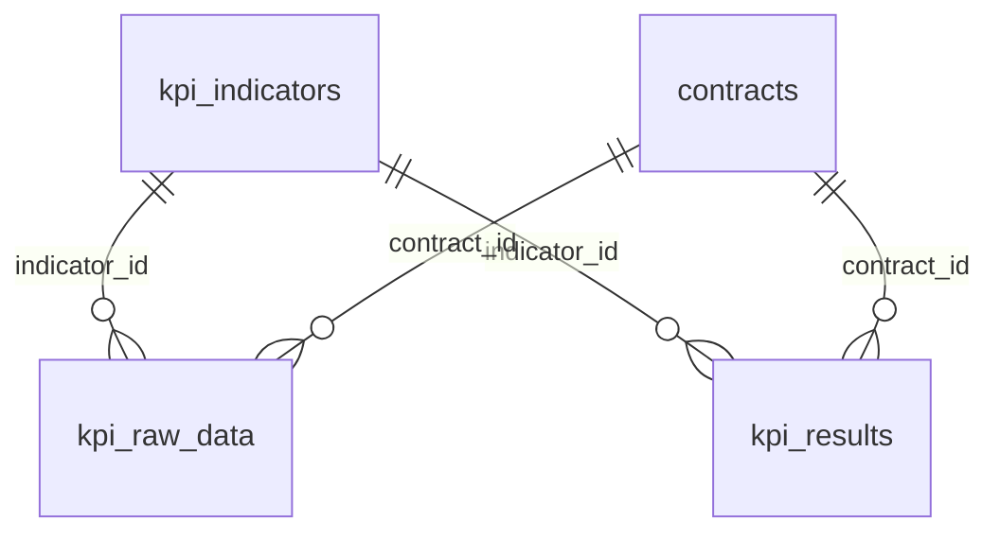
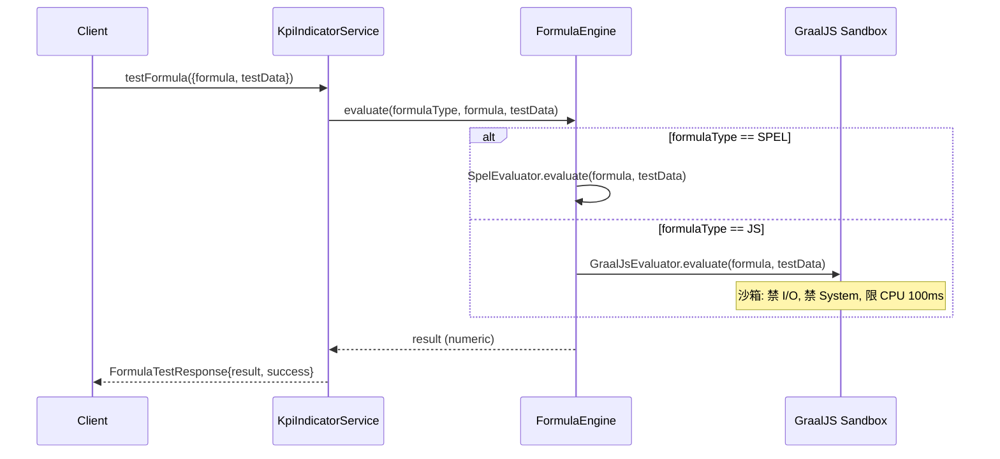
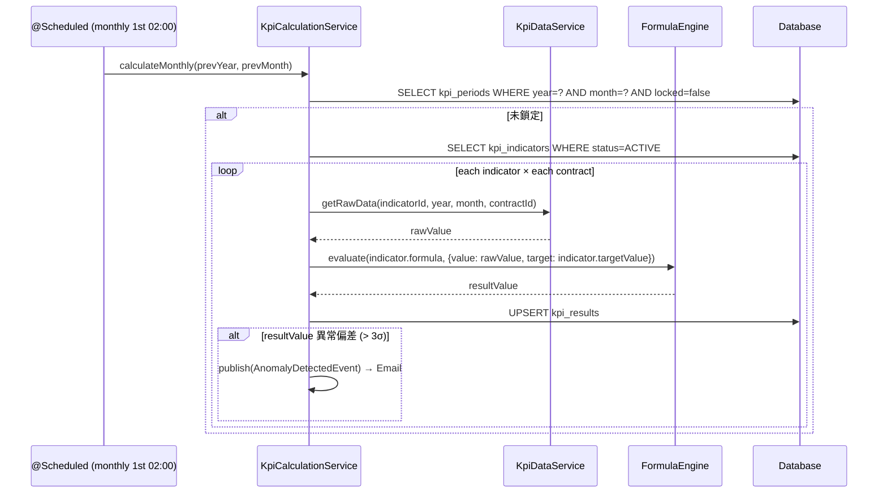
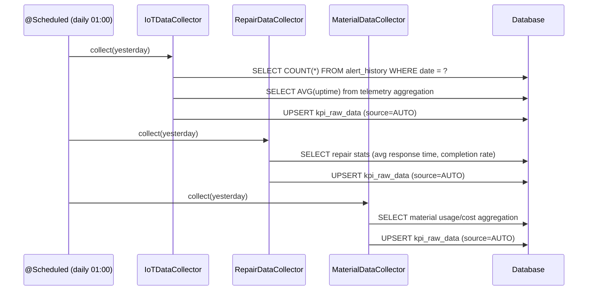

# SD-08 績效管理

> **對應 SA**：SA-08-performance.md (FN-08-001 ~ FN-08-020)  
> **實作狀態**：❌ Phase 6 尚未實作 — 本文件為 Forward Design  
> **Package (規劃)**：`com.taipei.iot.kpi`

---

## 1. DB Schema (規劃)

### kpi_indicators

```sql
CREATE TABLE kpi_indicators (
    id             BIGSERIAL PRIMARY KEY,
    tenant_id      VARCHAR(50) NOT NULL REFERENCES tenant(tenant_id),
    indicator_code VARCHAR(50) NOT NULL,
    indicator_name VARCHAR(200) NOT NULL,
    category       VARCHAR(30) NOT NULL,          -- MAINTENANCE / POWER / RESPONSE / QUALITY / CUSTOM
    formula_type   VARCHAR(10) NOT NULL,           -- SPEL / JS
    formula        TEXT NOT NULL,                   -- SpEL expression or GraalJS script
    target_value   NUMERIC(10,4),
    weight         NUMERIC(5,2) DEFAULT 1.0,
    data_source    VARCHAR(30),                    -- IOT / REPAIR / MATERIAL / MANUAL
    unit           VARCHAR(20),
    status         VARCHAR(20) NOT NULL DEFAULT 'ACTIVE',
    created_at     TIMESTAMP NOT NULL DEFAULT now(),
    updated_at     TIMESTAMP NOT NULL DEFAULT now(),
    UNIQUE(tenant_id, indicator_code)
);
```

### kpi_raw_data

```sql
CREATE TABLE kpi_raw_data (
    id            BIGSERIAL PRIMARY KEY,
    tenant_id     VARCHAR(50) NOT NULL REFERENCES tenant(tenant_id),
    indicator_id  BIGINT NOT NULL REFERENCES kpi_indicators(id),
    period_year   INT NOT NULL,
    period_month  INT NOT NULL,
    contract_id   BIGINT REFERENCES contracts(id),
    raw_value     NUMERIC(15,4) NOT NULL,
    source        VARCHAR(20) NOT NULL,            -- AUTO / MANUAL_IMPORT
    imported_at   TIMESTAMP NOT NULL DEFAULT now(),
    imported_by   VARCHAR(50),
    UNIQUE(tenant_id, indicator_id, period_year, period_month, contract_id)
);
```

### kpi_results

```sql
CREATE TABLE kpi_results (
    id            BIGSERIAL PRIMARY KEY,
    tenant_id     VARCHAR(50) NOT NULL REFERENCES tenant(tenant_id),
    indicator_id  BIGINT NOT NULL REFERENCES kpi_indicators(id),
    period_year   INT NOT NULL,
    period_month  INT NOT NULL,
    contract_id   BIGINT REFERENCES contracts(id),
    result_value  NUMERIC(15,4) NOT NULL,
    target_value  NUMERIC(10,4),
    achievement   NUMERIC(8,4),                    -- result / target * 100
    calculated_at TIMESTAMP NOT NULL DEFAULT now(),
    UNIQUE(tenant_id, indicator_id, period_year, period_month, contract_id)
);
```

### kpi_periods

```sql
CREATE TABLE kpi_periods (
    id           BIGSERIAL PRIMARY KEY,
    tenant_id    VARCHAR(50) NOT NULL REFERENCES tenant(tenant_id),
    period_year  INT NOT NULL,
    period_month INT NOT NULL,
    locked       BOOLEAN NOT NULL DEFAULT false,
    locked_at    TIMESTAMP,
    locked_by    VARCHAR(50),
    unlock_reason TEXT,
    UNIQUE(tenant_id, period_year, period_month)
);
```

---

## 2. ER Diagram



---

## 3. Class Structure (規劃)

```
kpi/
├── controller/
│   ├── KpiIndicatorController       # CRUD + 公式測試 (FN-08-001~005)
│   ├── KpiDataController            # 匯入 + 查詢 (FN-08-006~008)
│   ├── KpiCalculationController     # 手動計算 + 結果 (FN-08-010~011)
│   ├── KpiReportController          # 月報/年報/比較/匯出 (FN-08-013~016)
│   ├── KpiPeriodController          # 鎖定/解鎖 (FN-08-017~019)
│   └── ContractorKpiController      # 廠商查詢 (FN-08-020)
├── dto/
│   ├── KpiIndicatorRequest/Response
│   ├── FormulaTestRequest/Response
│   ├── KpiRawDataResponse, ImportRequest
│   ├── KpiResultResponse
│   ├── MonthlyReportResponse, YearlyReportResponse, CompareReportResponse
│   └── PeriodResponse
├── entity/
│   ├── KpiIndicator
│   ├── KpiRawData
│   ├── KpiResult
│   └── KpiPeriod
├── engine/
│   ├── FormulaEngine                # SpEL + GraalJS sandbox
│   ├── SpelEvaluator
│   └── GraalJsEvaluator             # GraalVM JS sandbox (read-only bindings)
├── collector/
│   ├── IoTDataCollector             # 從 IoT 模組收集 (FN-07-037)
│   ├── RepairDataCollector          # 報修/回應時間/完成率
│   └── MaterialDataCollector        # 材料耗用
├── scheduler/
│   ├── KpiDataCollectionJob         # @Scheduled daily — 自動收集
│   └── KpiCalculationJob            # @Scheduled monthly — 自動計算 (FN-08-009)
├── repository/ (4)
└── service/
    ├── KpiIndicatorService
    ├── KpiDataService               # import (Excel) + auto-collect
    ├── KpiCalculationService        # formula engine execution
    ├── KpiReportService             # aggregate + export
    └── KpiPeriodService             # lock / unlock
```

---

## 4. API Contract (規劃)

### 4.1 KPI 指標管理

| Method | Path | Auth | 說明 |
|--------|------|------|------|
| GET | `/v1/auth/kpi/indicators` | KPI_VIEW | 列表 |
| POST | `/v1/auth/kpi/indicators` | KPI_MANAGE | 新增 |
| PUT | `/v1/auth/kpi/indicators/{id}` | KPI_MANAGE | 編輯 |
| DELETE | `/v1/auth/kpi/indicators/{id}` | KPI_MANAGE | 刪除/停用 |
| POST | `/v1/auth/kpi/indicators/test-formula` | KPI_MANAGE | 公式沙箱測試 |

### 4.2 績效數據

| Method | Path | Auth | 說明 |
|--------|------|------|------|
| POST | `/v1/auth/kpi/data/import` | KPI_MANAGE | Excel 匯入 |
| GET | `/v1/auth/kpi/data` | KPI_VIEW | 原始數據查詢 |

### 4.3 績效計算

| Method | Path | Auth | 說明 |
|--------|------|------|------|
| POST | `/v1/auth/kpi/calculate` | KPI_MANAGE | 手動觸發 (鎖定期間不可) |
| GET | `/v1/auth/kpi/results` | KPI_VIEW | 計算結果列表 |

### 4.4 績效報表

| Method | Path | Auth | 說明 |
|--------|------|------|------|
| GET | `/v1/auth/kpi/reports/monthly` | KPI_VIEW | 月績效報表 |
| GET | `/v1/auth/kpi/reports/yearly` | KPI_VIEW | 年度報表 |
| GET | `/v1/auth/kpi/reports/compare` | KPI_VIEW | 廠商/契約比較 |
| GET | `/v1/auth/kpi/reports/export` | KPI_VIEW | 匯出 ODS/XLS/CSV |

### 4.5 期間管理

| Method | Path | Auth | 說明 |
|--------|------|------|------|
| GET | `/v1/auth/kpi/periods` | KPI_VIEW | 各期狀態 |
| PUT | `/v1/auth/kpi/periods/{yearMonth}/lock` | KPI_LOCK | 鎖定 |
| PUT | `/v1/auth/kpi/periods/{yearMonth}/unlock` | KPI_UNLOCK | 解鎖 (需主管) |

### 4.6 廠商端

| Method | Path | Auth | 說明 |
|--------|------|------|------|
| GET | `/v1/auth/kpi/contractor/results` | KPI_CONTRACTOR_VIEW | 自身績效 |

---

## 5. Sequence Diagrams

### 5.1 公式測試 (沙箱)



### 5.2 月度自動計算



### 5.3 跨模組數據收集


