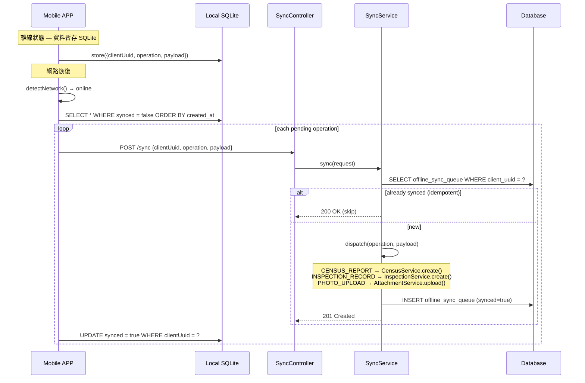
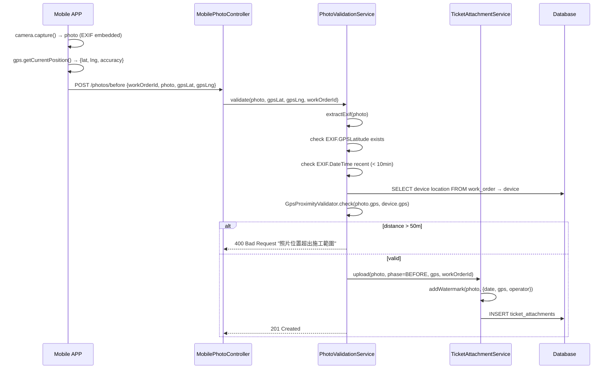
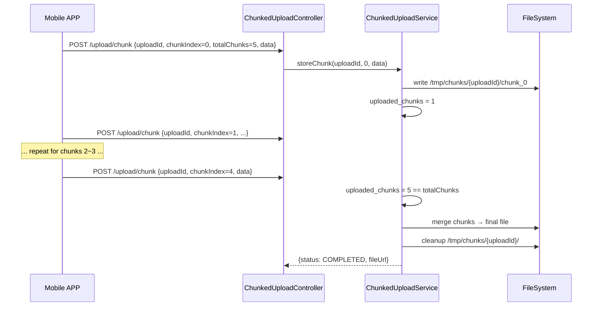

# SD-09 行動 APP

> **對應 SA**：SA-09-mobile.md (FN-09-001 ~ FN-09-021)  
> **實作狀態**：❌ Phase 7 尚未實作 — 本文件為 Forward Design  
> **Package (規劃)**：`com.taipei.iot.mobile`  
> **APP**: PWA (Vue 3 + Capacitor) 或 Native (Flutter/RN) — 架構決策待定

---

## 1. DB Schema (規劃)

### push_tokens

```sql
CREATE TABLE push_tokens (
    id          BIGSERIAL PRIMARY KEY,
    tenant_id   VARCHAR(50) NOT NULL REFERENCES tenant(tenant_id),
    user_id     VARCHAR(50) NOT NULL,
    platform    VARCHAR(10) NOT NULL,       -- IOS / ANDROID / WEB
    token       VARCHAR(500) NOT NULL,
    device_info VARCHAR(200),
    active      BOOLEAN NOT NULL DEFAULT true,
    created_at  TIMESTAMP NOT NULL DEFAULT now(),
    updated_at  TIMESTAMP NOT NULL DEFAULT now(),
    UNIQUE(token)
);
```

### census_tasks / census_reports

```sql
CREATE TABLE census_tasks (
    id          BIGSERIAL PRIMARY KEY,
    tenant_id   VARCHAR(50) NOT NULL REFERENCES tenant(tenant_id),
    task_name   VARCHAR(200) NOT NULL,
    area_scope  JSONB DEFAULT '{}',
    assigned_to BIGINT,
    status      VARCHAR(20) NOT NULL DEFAULT 'PENDING',  -- PENDING / IN_PROGRESS / COMPLETED
    due_date    DATE,
    created_by  VARCHAR(50),
    created_at  TIMESTAMP NOT NULL DEFAULT now()
);

CREATE TABLE census_reports (
    id           BIGSERIAL PRIMARY KEY,
    tenant_id    VARCHAR(50) NOT NULL REFERENCES tenant(tenant_id),
    task_id      BIGINT NOT NULL REFERENCES census_tasks(id),
    device_id    BIGINT NOT NULL REFERENCES devices(id),
    reported_by  VARCHAR(50) NOT NULL,
    status       VARCHAR(20) NOT NULL,     -- NORMAL / ABNORMAL / NOT_FOUND
    gps_lat      NUMERIC(10,7),
    gps_lng      NUMERIC(11,7),
    gps_accuracy NUMERIC(6,1),
    photos       JSONB DEFAULT '[]',
    notes        TEXT,
    reported_at  TIMESTAMP NOT NULL DEFAULT now()
);
```

### offline_sync_queue

```sql
CREATE TABLE offline_sync_queue (
    id            BIGSERIAL PRIMARY KEY,
    tenant_id     VARCHAR(50) NOT NULL REFERENCES tenant(tenant_id),
    user_id       VARCHAR(50) NOT NULL,
    operation     VARCHAR(30) NOT NULL,       -- CENSUS_REPORT / INSPECTION_RECORD / PHOTO_UPLOAD / WORK_COMPLETE
    payload       JSONB NOT NULL,
    client_uuid   UUID NOT NULL UNIQUE,       -- idempotency key
    synced        BOOLEAN NOT NULL DEFAULT false,
    synced_at     TIMESTAMP,
    error_message TEXT,
    created_at    TIMESTAMP NOT NULL DEFAULT now()
);
```

### chunked_uploads

```sql
CREATE TABLE chunked_uploads (
    id            BIGSERIAL PRIMARY KEY,
    tenant_id     VARCHAR(50) NOT NULL REFERENCES tenant(tenant_id),
    upload_id     UUID NOT NULL UNIQUE,
    file_name     VARCHAR(300) NOT NULL,
    total_chunks  INT NOT NULL,
    uploaded_chunks INT NOT NULL DEFAULT 0,
    file_size     BIGINT,
    content_type  VARCHAR(100),
    status        VARCHAR(20) NOT NULL DEFAULT 'UPLOADING',  -- UPLOADING / COMPLETED / EXPIRED
    expires_at    TIMESTAMP NOT NULL,
    created_at    TIMESTAMP NOT NULL DEFAULT now()
);
```

---

## 2. Class Structure (規劃)

```
mobile/
├── controller/
│   ├── PushTokenController          # 推播 Token 註冊 (FN-09-003)
│   ├── CensusController             # 資產清查 (FN-09-004~007)
│   ├── MobileInspectionController   # 巡查任務+打卡+紀錄 (FN-09-008~011)
│   ├── MobileWorkOrderController    # 工單列表+完工 (FN-09-012, 016)
│   ├── MobilePhotoController        # 施工前後拍照 (FN-09-013~014)
│   ├── SyncController               # 離線同步 (FN-09-019)
│   └── ChunkedUploadController      # 分塊上傳 (FN-09-020)
├── dto/
│   ├── PushTokenRequest
│   ├── CensusReportRequest/Response, AnomalyReportRequest
│   ├── CheckinRequest/Response
│   ├── MobileWorkOrderResponse
│   ├── PhotoUploadRequest (GPS + EXIF metadata)
│   ├── SyncRequest/Response
│   └── ChunkUploadRequest/Response
├── entity/
│   ├── PushToken
│   ├── CensusTask, CensusReport
│   ├── OfflineSyncQueue
│   └── ChunkedUpload
├── service/
│   ├── PushTokenService
│   ├── PushNotificationService       # FCM / APNs integration
│   ├── CensusService
│   ├── MobileInspectionService       # GPS validation (≤50m)
│   ├── MobileWorkOrderService        # proxy to RepairTicketService + ReplacementOrderService
│   ├── PhotoValidationService        # EXIF GPS + timestamp + watermark
│   ├── SyncService                   # idempotent sync (client_uuid dedup)
│   └── ChunkedUploadService          # chunk merge + cleanup
├── validator/
│   ├── GpsProximityValidator         # distance ≤ 50m check
│   └── ExifValidator                 # EXIF completeness check
├── scheduler/
│   └── ChunkedUploadCleanupJob       # 清理過期 chunks
└── repository/ (4)
```

---

## 3. API Contract (規劃)

### 3.1 推播 & 認證 (共用 Auth)

| Method | Path | Auth | 說明 |
|--------|------|------|------|
| POST | `/v1/auth/login` | — | APP 登入 (共用 AuthController) |
| POST | `/v1/auth/refresh` | RefreshToken | Token 更新 (共用) |
| POST | `/v1/auth/push-tokens` | JWT | 註冊推播 Token |

### 3.2 資產清查

| Method | Path | Auth | 說明 |
|--------|------|------|------|
| GET | `/v1/auth/devices/by-pole` | DEVICE_VIEW | QR Code 掃碼查詢 |
| GET | `/v1/auth/mobile/census/tasks` | CENSUS_VIEW | 清查任務列表 |
| POST | `/v1/auth/mobile/census/report` | CENSUS_MANAGE | 盤點回報 |
| POST | `/v1/auth/mobile/census/anomaly` | CENSUS_MANAGE | 異常回報 → 建 fault |

### 3.3 巡查

| Method | Path | Auth | 說明 |
|--------|------|------|------|
| GET | `/v1/auth/mobile/inspection/tasks` | INSPECTION_VIEW | 今日巡查任務 |
| POST | `/v1/auth/mobile/inspection/checkin` | INSPECTION_MANAGE | GPS 打卡 (≤50m) |
| POST | `/v1/auth/mobile/inspection/records` | INSPECTION_MANAGE | 巡查紀錄填報 |
| POST | `/v1/auth/mobile/inspection/anomaly` | INSPECTION_MANAGE | 異常通報 → E13 |

### 3.4 工單 & 拍照

| Method | Path | Auth | 說明 |
|--------|------|------|------|
| GET | `/v1/auth/mobile/work-orders` | REPAIR_VIEW | 待施工工單 (維修+換裝) |
| POST | `/v1/auth/mobile/photos/before` | REPAIR_MANAGE | 施工前拍照 |
| POST | `/v1/auth/mobile/photos/after` | REPAIR_MANAGE | 施工後拍照 (含浮水印) |
| PUT | `/v1/auth/mobile/work-orders/{id}/complete` | REPAIR_MANAGE | 完工回報 |

### 3.5 離線同步

| Method | Path | Auth | 說明 |
|--------|------|------|------|
| POST | `/v1/auth/mobile/sync` | JWT | 增量離線同步 (idempotent by client_uuid) |
| POST | `/v1/auth/mobile/upload/chunk` | JWT | 分塊上傳 (chunk ≤ 2MB) |

---

## 4. Sequence Diagrams

### 4.1 離線同步 (Offline → Online)



### 4.2 施工拍照 GPS + EXIF 驗證



### 4.3 分塊上傳 (Chunked Upload)


