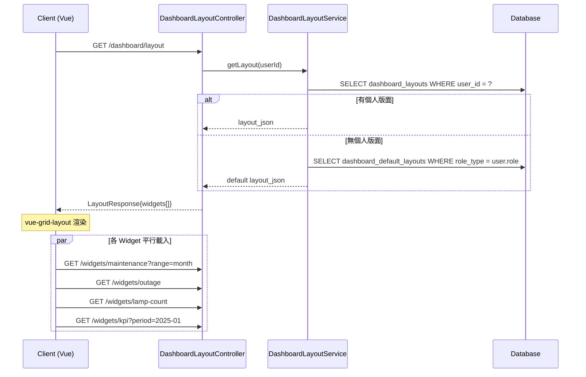
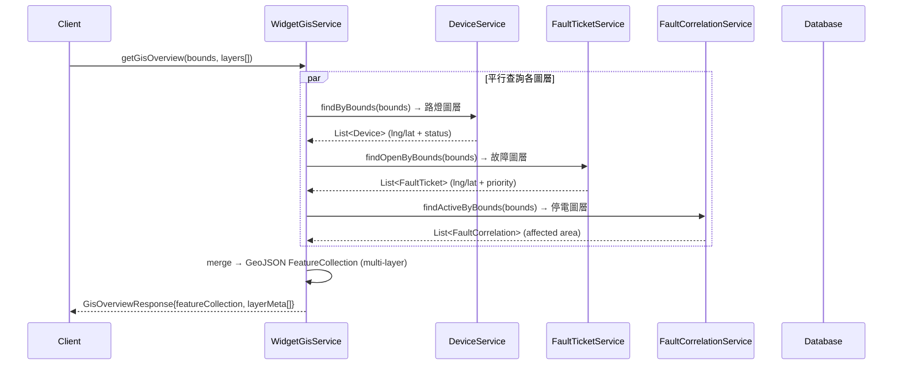
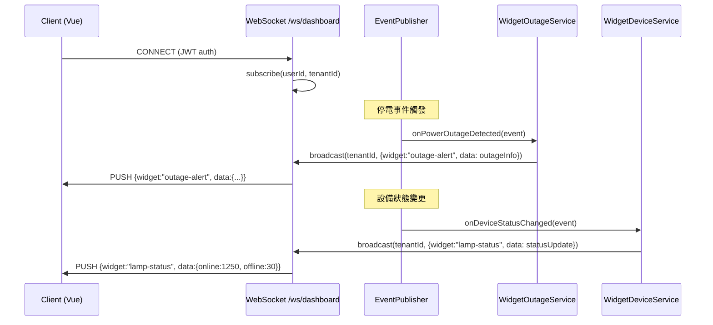

# SD-10 儀表板

> **對應 SA**：SA-10-dashboard.md (FN-10-001 ~ FN-10-022)  
> **實作狀態**：❌ Phase 8 尚未實作 — 本文件為 Forward Design  
> **Package (規劃)**：`com.taipei.iot.dashboard`

---

## 1. DB Schema (規劃)

### dashboard_layouts

```sql
CREATE TABLE dashboard_layouts (
    id           BIGSERIAL PRIMARY KEY,
    tenant_id    VARCHAR(50) NOT NULL REFERENCES tenant(tenant_id),
    user_id      VARCHAR(50) NOT NULL,
    layout_json  JSONB NOT NULL,             -- vue-grid-layout format: [{i,x,y,w,h,widget}]
    is_default   BOOLEAN NOT NULL DEFAULT false,
    created_at   TIMESTAMP NOT NULL DEFAULT now(),
    updated_at   TIMESTAMP NOT NULL DEFAULT now(),
    UNIQUE(tenant_id, user_id)
);
```

```json
// layout_json example (vue-grid-layout)
[
  {"i": "w1", "x": 0, "y": 0, "w": 6, "h": 4, "widget": "maintenance-stats"},
  {"i": "w2", "x": 6, "y": 0, "w": 6, "h": 4, "widget": "outage-alert"},
  {"i": "w3", "x": 0, "y": 4, "w": 12, "h": 6, "widget": "fault-heatmap"},
  {"i": "w4", "x": 0, "y": 10, "w": 4, "h": 4, "widget": "kpi-summary"},
  {"i": "w5", "x": 4, "y": 10, "w": 4, "h": 4, "widget": "lamp-count"},
  {"i": "w6", "x": 8, "y": 10, "w": 4, "h": 4, "widget": "lamp-status"}
]
```

### dashboard_default_layouts

```sql
CREATE TABLE dashboard_default_layouts (
    id           BIGSERIAL PRIMARY KEY,
    tenant_id    VARCHAR(50) NOT NULL REFERENCES tenant(tenant_id),
    role_type    VARCHAR(30),                -- ADMIN / MANAGER / CHIEF / null=global
    layout_json  JSONB NOT NULL,
    created_at   TIMESTAMP NOT NULL DEFAULT now()
);
```

---

## 2. Widget 清單

| Widget ID | 名稱 | 數據來源 | FN | 即時? |
|-----------|------|---------|-----|-------|
| `maintenance-stats` | 養護統計 | repair_tickets + inspection_records | FN-10-004~005 | No |
| `outage-alert` | 停電告警 | fault_correlations + alert_history | FN-10-006~007 | WebSocket |
| `fault-heatmap` | 故障熱力圖 | fault_tickets (GeoJSON) | FN-10-008~009 | No |
| `kpi-summary` | KPI 績效卡片 | kpi_results | FN-10-010~011 | No |
| `lamp-count` | 路燈數量 | devices (GROUP BY type, area) | FN-10-012 | No |
| `lamp-status` | 路燈在線/離線 | devices + iot_devices | FN-10-013 | WebSocket |
| `panel-box` | 配電箱用電 | telemetry (panel_box) | FN-10-014~015 | No |
| `attachments` | 附件統計 | ticket_attachments | FN-10-016 | No |
| `electricity-cost` | 電費 | telemetry aggregate | FN-10-017~018 | No |
| `meter` | 智慧電表 | telemetry (meter) | FN-10-019~020 | No |
| `gis-overview` | GIS 總覽 | devices + faults + outages (GeoJSON) | FN-10-021 | WebSocket |

---

## 3. Class Structure (規劃)

```
dashboard/
├── controller/
│   ├── DashboardLayoutController    # 版面 CRUD (FN-10-001~003)
│   └── WidgetDataController         # 各 Widget 數據端點 (FN-10-004~021)
├── dto/
│   ├── LayoutRequest/Response
│   ├── MaintenanceStatsResponse
│   ├── OutageAlertResponse
│   ├── FaultHeatmapResponse         # GeoJSON FeatureCollection
│   ├── FaultCategoryResponse
│   ├── KpiSummaryResponse
│   ├── LampCountResponse
│   ├── LampStatusResponse
│   ├── PanelBoxResponse
│   ├── AttachmentStatsResponse
│   ├── ElectricityCostResponse
│   ├── MeterReadingResponse
│   └── GisOverviewResponse          # multi-layer GeoJSON
├── entity/
│   ├── DashboardLayout
│   └── DashboardDefaultLayout
├── service/
│   ├── DashboardLayoutService       # layout CRUD + reset
│   ├── WidgetMaintenanceService     # 養護統計 (query repair + inspection)
│   ├── WidgetOutageService          # 停電 (query fault_correlations)
│   ├── WidgetFaultService           # 熱力圖 + 分類統計
│   ├── WidgetKpiService             # KPI 卡片 (query kpi_results)
│   ├── WidgetDeviceService          # 路燈數量 + 在線離線
│   ├── WidgetPanelBoxService        # 配電箱
│   ├── WidgetAttachmentService      # 附件統計
│   ├── WidgetElectricityService     # 電費
│   ├── WidgetMeterService           # 電表
│   └── WidgetGisService             # GIS 多圖層聚合
├── websocket/
│   └── DashboardWebSocket           # /ws/dashboard — 即時推送 (outage, lamp-status, gis)
└── repository/ (2)
```

---

## 4. API Contract (規劃)

### 4.1 版面配置

| Method | Path | Auth | 說明 |
|--------|------|------|------|
| GET | `/v1/auth/dashboard/layout` | DASHBOARD_VIEW | 取得個人版面 |
| PUT | `/v1/auth/dashboard/layout` | DASHBOARD_VIEW | 儲存版面 |
| POST | `/v1/auth/dashboard/layout/reset` | DASHBOARD_VIEW | 重置為預設 |

### 4.2 Widget 數據

| Method | Path | Auth | Widget |
|--------|------|------|--------|
| GET | `/v1/auth/dashboard/widgets/maintenance` | DASHBOARD_VIEW | 養護統計 |
| GET | `/v1/auth/dashboard/widgets/maintenance/trend` | DASHBOARD_VIEW | 養護趨勢 |
| GET | `/v1/auth/dashboard/widgets/outage` | DASHBOARD_VIEW | 停電即時 |
| GET | `/v1/auth/dashboard/widgets/outage/trend` | DASHBOARD_VIEW | 停電趨勢 |
| GET | `/v1/auth/dashboard/widgets/fault-heatmap` | DASHBOARD_VIEW | 故障熱力圖 |
| GET | `/v1/auth/dashboard/widgets/fault-category` | DASHBOARD_VIEW | 故障分類 |
| GET | `/v1/auth/dashboard/widgets/kpi` | DASHBOARD_VIEW | KPI 摘要 |
| GET | `/v1/auth/dashboard/widgets/kpi/trend` | DASHBOARD_VIEW | KPI 趨勢 |
| GET | `/v1/auth/dashboard/widgets/lamp-count` | DASHBOARD_VIEW | 路燈數量 |
| GET | `/v1/auth/dashboard/widgets/lamp-status` | DASHBOARD_VIEW | 在線/離線 |
| GET | `/v1/auth/dashboard/widgets/panel-box` | DASHBOARD_VIEW | 配電箱用電 |
| GET | `/v1/auth/dashboard/widgets/panel-box/alerts` | DASHBOARD_VIEW | 配電箱異常 |
| GET | `/v1/auth/dashboard/widgets/attachments` | DASHBOARD_VIEW | 附件統計 |
| GET | `/v1/auth/dashboard/widgets/electricity-cost` | DASHBOARD_VIEW | 電費統計 |
| GET | `/v1/auth/dashboard/widgets/electricity-cost/trend` | DASHBOARD_VIEW | 電費趨勢 |
| GET | `/v1/auth/dashboard/widgets/meter` | DASHBOARD_VIEW | 電表即時 |
| GET | `/v1/auth/dashboard/widgets/meter/trend` | DASHBOARD_VIEW | 電表趨勢 |
| GET | `/v1/auth/dashboard/widgets/gis` | DASHBOARD_VIEW | GIS 總覽 |

### 4.3 WebSocket

| Endpoint | Auth | 說明 |
|----------|------|------|
| `WebSocket /ws/dashboard` | JWT | 即時推送 (outage / lamp-status / gis updates) |

---

## 5. Sequence Diagrams

### 5.1 版面個人化 + 載入



### 5.2 GIS 多圖層聚合



### 5.3 即時推送 (WebSocket)


