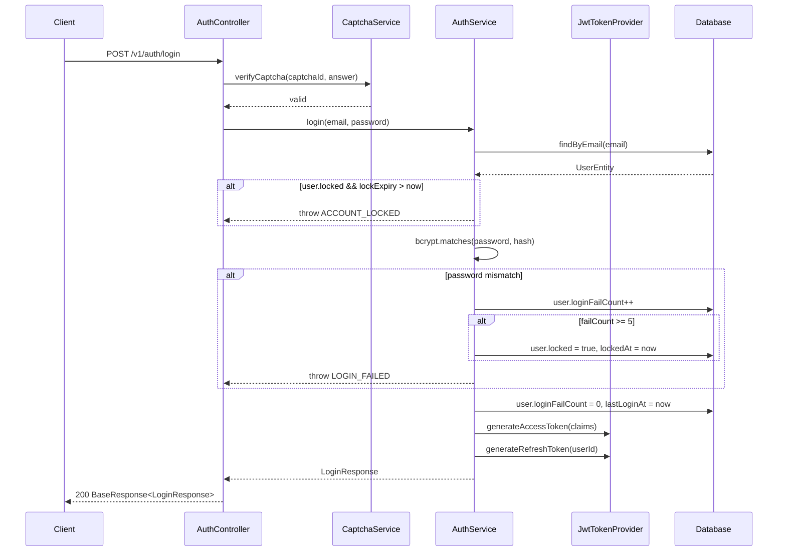
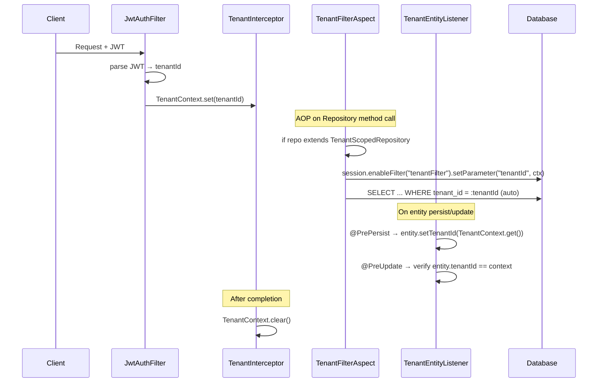
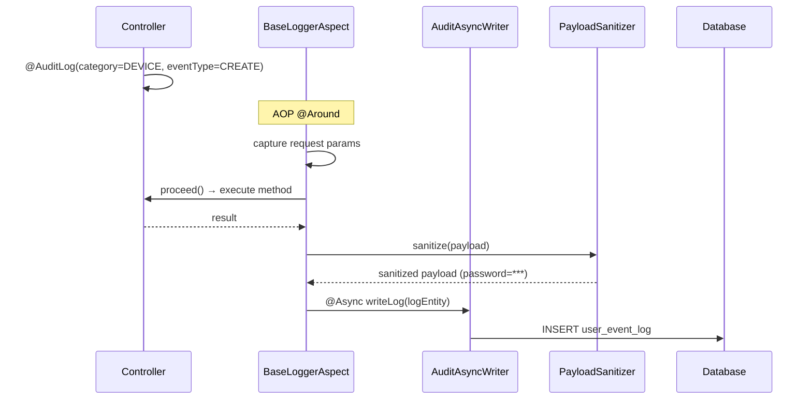
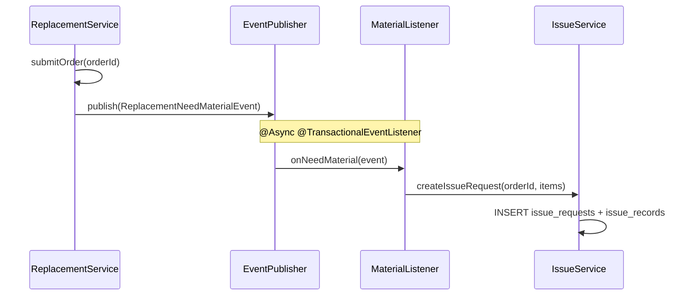
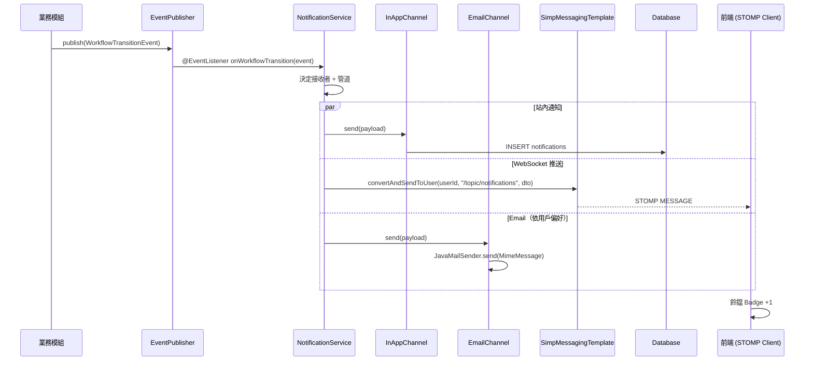

# SD-11 共用基礎設施

> **對應 SA**：SA-11-common.md (FN-00-001 ~ FN-00-030)  
> **實作狀態**：✅ Phase 1 已完成 ｜ §9 通知引擎 Phase 5 待實作  
> **Package**：`com.taipei.iot.config`, `com.taipei.iot.common`, `com.taipei.iot.tenant`, `com.taipei.iot.audit`, `com.taipei.iot.notification`

---

## 1. 認證核心

### 1.1 Class Structure

```
config/
├── SecurityConfig          # Filter chain, URL auth rules, BCrypt encoder
├── JacksonConfig           # JSON serialization (LocalDateTime, NON_NULL)
├── JpaAuditConfig          # @EnableJpaAuditing + AuditorAware
├── OpenApiConfig           # Swagger/OpenAPI 3 (conditional)
├── RedisConfig             # RedisTemplate (conditional on redis.host)
└── WebMvcConfig            # CORS + interceptor ordering

auth/
├── controller/AuthController
├── security/
│   ├── JwtAuthenticationFilter  # OncePerRequestFilter
│   └── JwtTokenProvider         # JWT 簽發/驗證/解析
├── service/
│   ├── AuthService              # login/logout/refresh
│   ├── CaptchaService           # 圖形驗證碼
│   └── impl/UserDetailsServiceImpl
├── entity/
│   ├── UserEntity               # users table
│   └── UserResetPasswordTokenEntity
├── dto/request/
│   ├── LoginRequest             # {email, password, captchaId, captchaAnswer}
│   └── RefreshTokenRequest      # {refreshToken}
└── dto/response/
    ├── LoginResponse            # {accessToken, refreshToken, userInfo}
    └── CaptchaResponse          # {captchaId, imageBase64}
```

### 1.2 API Contract

#### POST /v1/auth/login
```
Request:
{
  "email": "admin@example.com",
  "password": "Admin123!",
  "captchaId": "uuid",
  "captchaAnswer": "a1b2"
}

Response (200):
{
  "errorCode": "00000",
  "body": {
    "accessToken": "eyJhbG...",
    "refreshToken": "eyJhbG...",
    "userInfo": {
      "userId": "u001",
      "username": "admin",
      "displayName": "系統管理員",
      "email": "admin@example.com",
      "tenantId": "DEFAULT",
      "roleCode": "SUPER_ADMIN",
      "deptId": 1,
      "dataScope": "ALL",
      "permissions": ["USER_VIEW", "USER_CREATE", ...]
    }
  }
}
```

#### POST /v1/auth/refresh
```
Request: { "refreshToken": "eyJhbG..." }
Response: { "errorCode": "00000", "body": { "accessToken": "eyJhbG..." } }
```

#### POST /v1/auth/logout
```
Headers: Authorization: Bearer {accessToken}
Response: { "errorCode": "00000", "body": null }
```

#### GET /v1/auth/captcha
```
Response: { "errorCode": "00000", "body": { "captchaId": "uuid", "imageBase64": "data:image/png;base64,..." } }
```

### 1.3 JWT Token Structure

```json
{
  "sub": "u001",
  "uid": "u001",
  "tenantId": "DEFAULT",
  "deptId": 1,
  "dataScope": "ALL",
  "iat": 1714000000,
  "exp": 1714001800
}
```

| 參數 | 值 |
|------|-----|
| Algorithm | HS512 |
| Access Token TTL | 30 min (1800000ms) |
| Refresh Token TTL | 7 days (604800000ms) |
| Temporary Token TTL | 5 min |

### 1.4 Sequence — 登入流程



---

## 2. 多租戶機制

### 2.1 Class Structure

```
tenant/
├── TenantAware                # interface: getTenantId/setTenantId
├── TenantContext              # ThreadLocal<String> + SYSTEM marker
├── TenantEntity               # tenant table entity
├── TenantEntityListener       # @PrePersist(auto-fill) / @PreUpdate(verify)
├── TenantFilterAspect         # AOP: enable Hibernate @Filter on repository calls
├── TenantInterceptor          # MVC: extract tenantId from JWT → TenantContext
├── TenantProperties           # mode(single/multi), defaultId
├── TenantRepository           # JpaRepository<TenantEntity>
└── TenantScopedRepository     # marker interface for filtered repos
```

### 2.2 Sequence — 租戶過濾



---

## 3. 稽核日誌

### 3.1 Class Structure

```
audit/
├── annotation/AuditLog        # @AuditLog(category, eventType)
├── aspect/BaseLoggerAspect    # AOP: intercept @AuditLog, build log record
├── async/AuditAsyncWriter     # @Async write to DB
├── config/AuditAsyncConfig    # ThreadPoolTaskExecutor config
├── controller/AuditController # GET /v1/auth/audit/logs
├── dto/
│   ├── AuditLogQuery          # 查詢參數
│   ├── AuditLogResponse       # 回應 DTO
│   └── AuditStatResponse      # 統計 DTO
├── entity/
│   ├── UserEventLogEntity     # user_event_log table
│   ├── AuditRevisionEntity    # rev_info table (Envers)
│   └── AuditRevisionListener  # Envers listener
├── enums/
│   ├── AuditCategory          # USER, AUTH, RBAC, DEVICE, REPAIR, MATERIAL, ...
│   └── AuditEventType         # LOGIN, LOGOUT, CREATE, UPDATE, DELETE, EXPORT, ...
├── job/AuditPurgeJob          # @Scheduled: 清理過期日誌
├── repository/UserEventLogRepository
├── service/AuditService       # 查詢+統計+匯出
└── util/PayloadSanitizer      # 脫敏(password, token, secret)
```

### 3.2 DB Schema

```sql
CREATE TABLE user_event_log (
    user_event_log_pk  BIGSERIAL PRIMARY KEY,
    tenant_id          VARCHAR(50),
    user_id            VARCHAR(50)  NOT NULL,
    username           VARCHAR(100),
    user_label         VARCHAR(100),
    email              VARCHAR(200),
    event_type         VARCHAR(50)  NOT NULL,
    event_desc         VARCHAR(50),
    api_endpoint       VARCHAR(100),
    payload            VARCHAR(2000),
    error_code         VARCHAR(50),
    message            VARCHAR(50),
    ip_address         VARCHAR(50),
    user_agent         VARCHAR(500),
    execution_time     BIGINT,
    dept_id            BIGINT,
    create_time        TIMESTAMP WITH TIME ZONE NOT NULL DEFAULT NOW()
);
```

### 3.3 API Contract

#### GET /v1/auth/audit/logs
```
Query: ?userId=&eventType=&startDate=&endDate=&page=0&size=20
Response (200): BaseResponse<Page<AuditLogResponse>>
```

### 3.4 Sequence — 稽核記錄



---

## 4. Rate Limiting

### 4.1 機制

```
@RateLimit(key = "login", limit = 10, period = 60)
```

| 項目 | 說明 |
|------|------|
| 演算法 | Fixed Window (Redis INCR + EXPIRE) |
| Key 組成 | `rate_limit:{key}:{IP}` |
| 回應 | 429 Too Many Requests + `Retry-After` header |
| 降級 | Redis 不可用時放行 (fail-open) |
| IP 來源 | `request.getRemoteAddr()` — 不信任 X-Forwarded-For（防繞過） |

### 4.2 各端點配置

| Endpoint | Key | Limit | Period | 說明 |
|----------|-----|-------|--------|------|
| `POST /v1/noauth/captcha` | captcha | 20/min | 60s | 驗證碼產生 |
| `POST /v1/noauth/login` | login | 10/min | 60s | 登入嘗試 |
| `POST /v1/noauth/token/refresh` | refresh | 30/min | 60s | Token 刷新（自動刷新需寬鬆） |
| `POST /v1/noauth/user/forgot-password` | forgot-pwd | 5/5min | 300s | 忘記密碼（防郵件轟炸） |
| `PUT /v1/noauth/user/reset-password` | reset-pwd | 5/5min | 300s | 重設密碼 |

### 4.3 測試覆蓋

| 測試類別 | 數量 | 說明 |
|---------|------|------|
| `RateLimitInterceptorTest` | 12 | 單元測試：放行/攔截/邊界/Redis 失敗/IP 安全 |

---

## 5. 檔案管理

### 5.1 Class Structure

```
common/service/
├── FileStorageService         # interface: store/load/delete
└── LocalFileStorageService    # 本地磁碟實作
```

### 5.2 規則

| 項目 | 值 |
|------|-----|
| 儲存路徑 | `./uploads/{subDir}/` |
| 檔名 | `{UUID}_{originalName}` |
| 大小限制 | 20 MB |
| 安全 | Path traversal 防護 (normalize + startsWith) |
| 檔名清理 | 移除特殊字元 |

---

## 6. 錯誤處理

### 6.1 GlobalExceptionHandler

| 例外 | HTTP Status | 處理 |
|------|------------|------|
| BusinessException | 依 ErrorCode.httpStatus | errorCode + message |
| MethodArgumentNotValidException | 400 | 欄位驗證錯誤訊息 |
| ConstraintViolationException | 400 | 約束違反 |
| AccessDeniedException | 403 | SecurityLogger 記錄 |
| Exception (catch-all) | 500 | SQL injection pattern 偵測 |

---

## 7. 事件匯流排

### 7.1 機制

```java
// 發佈
applicationEventPublisher.publishEvent(new RepairStatusEvent(this, ticketId, newStatus));

// 訂閱
@EventListener
@Async
@TransactionalEventListener(phase = AFTER_COMMIT)
public void onRepairStatus(RepairStatusEvent event) { ... }
```

### 7.2 已實作事件

| 事件 | 發佈模組 | 訂閱模組 | Class |
|------|---------|---------|-------|
| WorkflowTransitionEvent | Workflow | 各模組 | `workflow.event.WorkflowTransitionEvent` |
| FaultApproved (E1) | Workflow | Repair | `repair.listener.FaultApprovedListener` |
| RepairDispatched (E4) | Workflow | Repair | `repair.listener.RepairDispatchedListener` |
| ReplacementNeedMaterial (E6) | Workflow | Material | `replacement.listener.ReplacementNeedMaterialListener` |
| RepairClosed (E9) | Workflow | Repair/Asset | `repair.listener.RepairClosedListener` |
| ReplacementClosed (E10) | Workflow | Asset | `replacement.listener.ReplacementClosedListener` |
| ReplacementSelfChecked (E11) | Workflow | Asset | `replacement.listener.ReplacementSelfCheckedListener` |
| LowStockAlert (E12) | Material(排程) | Notification | `material.listener.LowStockAlertListener` |
| InspectionAnomaly (E13) | Inspection | Repair | `InspectionService → FaultTicketService.createFromInspection()` (直接呼叫) |

### 7.3 Sequence — 跨模組事件



---

## 8. 共用 Entity

### BaseEntity

```java
@MappedSuperclass
public abstract class BaseEntity {
    @CreatedDate
    @Column(name = "created_at", updatable = false)
    private LocalDateTime createdAt;
    
    @LastModifiedDate
    @Column(name = "updated_at")
    private LocalDateTime updatedAt;
}
```

### BaseResponse\<T\>

```java
public class BaseResponse<T> {
    private String errorCode;   // "00000" = success
    private String errorMsg;
    private String errorDetail;
    private long timestamp;
    private T body;
    
    public static <T> BaseResponse<T> success(T body) { ... }
    public static <T> BaseResponse<T> fail(ErrorCode code) { ... }
    public static <T> BaseResponse<T> fail(ErrorCode code, String detail) { ... }
}
```

---

## 9. 通知引擎

> **對應 SA**：SA-11 FN-00-014 ~ FN-00-019 + SA-01 FN-01-045 ~ FN-01-049  
> **對應 SRS**：SRS-02-010（通知提示 / 待辦 / 列管）  
> **實作狀態**：🔲 Phase 5 待實作  
> **Package**：`com.taipei.iot.notification`

### 9.1 架構概觀

通知引擎由兩層組成：

1. **管道層 (Channel)**：負責「怎麼送出去」— InApp / Email / SMS / WebSocket
2. **領域層 (Domain)**：負責「送了什麼、給誰、讀了沒」— Entity + Service + REST API

```
┌─────────────────────────────────────────────────────┐
│                  業務模組 (caller)                    │
│   Repair / Replacement / Workflow / Material / ...   │
└────────────────────┬────────────────────────────────┘
                     │ Spring ApplicationEvent
                     ▼
┌─────────────────────────────────────────────────────┐
│            NotificationService（調度中心）             │
│  ┌─────────┐  ┌──────────┐  ┌─────────┐  ┌───────┐ │
│  │ InApp   │  │  Email   │  │   SMS   │  │  WS   │ │
│  │ Channel │  │ Channel  │  │ Channel │  │ Push  │ │
│  └────┬────┘  └────┬─────┘  └────┬────┘  └───┬───┘ │
│       │DB          │SMTP         │Gateway     │STOMP│
└───────┴────────────┴─────────────┴────────────┴─────┘
```

### 9.2 Class Structure

```
notification/
├── channel/
│   ├── NotificationChannel.java           # 介面：void send(NotificationPayload)
│   ├── InAppChannel.java                  # DB 寫入 → notifications 表
│   ├── EmailChannel.java                  # @Profile("!test") → JavaMailSender
│   ├── NoOpEmailChannel.java             # @Profile("test") → log only
│   ├── SmsChannel.java                   # @Profile("prod") → 簡訊閘道
│   └── NoOpSmsChannel.java              # @Profile("!prod") → log only
├── config/
│   └── WebSocketConfig.java              # @EnableWebSocketMessageBroker
├── controller/
│   └── NotificationController.java       # REST API
├── dto/
│   ├── NotificationPayload.java          # 內部：發送請求 DTO
│   ├── NotificationResponse.java         # API 回應 DTO
│   ├── NotificationQuery.java            # 查詢參數
│   └── UnreadCountResponse.java          # { count: number }
├── entity/
│   └── NotificationEntity.java           # notifications 表 Entity
├── enums/
│   ├── NotificationType.java             # TODO, ALERT, INFO
│   └── NotificationRefType.java          # FAULT, REPAIR, REPLACEMENT, WORKFLOW, ...
├── repository/
│   └── NotificationRepository.java       # JPA Repository
├── service/
│   └── NotificationService.java          # 調度中心：決定走哪些管道
└── websocket/
    └── NotificationWebSocketHandler.java # STOMP 推送到 /topic/notifications/{userId}
```

### 9.3 DB Schema

```sql
-- Flyway: V20260425__create_notifications.sql
CREATE TABLE taipei_streetlight.notifications (
    id              BIGSERIAL       PRIMARY KEY,
    tenant_id       VARCHAR(50)     NOT NULL,
    user_id         VARCHAR(50)     NOT NULL,
    type            VARCHAR(20)     NOT NULL,       -- TODO / ALERT / INFO
    title           VARCHAR(200)    NOT NULL,
    content         VARCHAR(2000),
    ref_type        VARCHAR(50),                    -- FAULT / REPAIR / REPLACEMENT / WORKFLOW / ANNOUNCEMENT
    ref_id          VARCHAR(50),                    -- 關聯業務單據 ID
    read            BOOLEAN         NOT NULL DEFAULT FALSE,
    read_at         TIMESTAMP WITH TIME ZONE,
    created_at      TIMESTAMP WITH TIME ZONE NOT NULL DEFAULT NOW()
);

-- 查詢索引
CREATE INDEX idx_notifications_user_read ON taipei_streetlight.notifications (user_id, read, created_at DESC);
CREATE INDEX idx_notifications_tenant    ON taipei_streetlight.notifications (tenant_id);
```

#### Entity 欄位對應

| 欄位 | Java 型別 | 說明 |
|------|----------|------|
| id | Long | PK, auto-generated |
| tenantId | String | 多租戶識別，由 `TenantEntityListener` 自動填入 |
| userId | String | 通知接收者 |
| type | NotificationType (enum) | TODO=待辦, ALERT=告警, INFO=一般資訊 |
| title | String | 通知標題 |
| content | String | 通知內容（可 null） |
| refType | NotificationRefType (enum) | 關聯業務類型（可 null） |
| refId | String | 關聯業務 ID（可 null），前端據此跳轉 |
| read | boolean | 是否已讀 |
| readAt | LocalDateTime | 已讀時間（可 null） |
| createdAt | LocalDateTime | 建立時間，@CreatedDate |

### 9.4 API Contract

#### GET /v1/auth/notifications

查詢當前使用者的通知列表（FN-01-045 / FN-00-015）

```
Query: ?read=false&type=TODO&page=0&size=20&sort=createdAt,desc
Headers: Authorization: Bearer {token}

Response (200):
{
  "errorCode": "00000",
  "body": {
    "content": [
      {
        "id": 1,
        "type": "TODO",
        "title": "報修單 F-2026-0001 待審批",
        "content": "信義區松仁路100號 路燈故障，請儘速審批",
        "refType": "FAULT",
        "refId": "fault-uuid-001",
        "read": false,
        "readAt": null,
        "createdAt": "2026-04-24T10:30:00"
      }
    ],
    "totalElements": 15,
    "totalPages": 1,
    "number": 0,
    "size": 20
  }
}
```

#### GET /v1/auth/notifications/unread-count

取得未讀通知數量（FN-01-046）

```
Headers: Authorization: Bearer {token}

Response (200):
{
  "errorCode": "00000",
  "body": {
    "count": 5
  }
}
```

#### PUT /v1/auth/notifications/{id}/read

標記單筆已讀（FN-01-047 / FN-00-016）

```
Headers: Authorization: Bearer {token}

Response (200):
{
  "errorCode": "00000",
  "body": null
}
```

| 錯誤 | ErrorCode | HTTP |
|------|-----------|------|
| 通知不存在 | NOTIFICATION_NOT_FOUND | 404 |
| 非本人通知 | ACCESS_DENIED | 403 |

#### PUT /v1/auth/notifications/read-all

全部已讀（FN-01-047 / FN-00-016）

```
Headers: Authorization: Bearer {token}

Response (200):
{
  "errorCode": "00000",
  "body": { "updatedCount": 5 }
}
```

#### GET /v1/auth/notifications/todos

待辦案件列表（FN-01-048）

```
Query: ?type=FAULT&page=0&size=20
Headers: Authorization: Bearer {token}

Response (200):
{
  "errorCode": "00000",
  "body": {
    "content": [
      {
        "id": 3,
        "type": "TODO",
        "title": "換裝單 R-2026-0010 待派工",
        "refType": "REPLACEMENT",
        "refId": "repl-uuid-010",
        "read": false,
        "createdAt": "2026-04-24T09:00:00"
      }
    ],
    "totalElements": 2,
    "totalPages": 1
  }
}
```

### 9.5 WebSocket 即時推送

#### 配置（FN-01-049 / FN-00-017）

| 項目 | 值 |
|------|-----|
| 協議 | STOMP over WebSocket + SockJS fallback |
| Endpoint | `/ws/notifications` |
| 訂閱頻道 | `/user/topic/notifications` (per-user) |
| 認證 | JWT Token 經由 `StompChannelInterceptor` 驗證 |
| Heartbeat | 10s / 10s (server / client) |

#### WebSocketConfig

```java
@Configuration
@EnableWebSocketMessageBroker
public class WebSocketConfig implements WebSocketMessageBrokerConfigurer {

    @Override
    public void configureMessageBroker(MessageBrokerRegistry config) {
        config.enableSimpleBroker("/topic", "/user");
        config.setApplicationDestinationPrefixes("/app");
        config.setUserDestinationPrefix("/user");
    }

    @Override
    public void registerStompEndpoints(StompEndpointRegistry registry) {
        registry.addEndpoint("/ws/notifications")
                .setAllowedOriginPatterns("*")
                .withSockJS();
    }
}
```

#### StompChannelInterceptor（認證）

```java
@Component
public class StompAuthInterceptor implements ChannelInterceptor {

    private final JwtTokenProvider jwtTokenProvider;

    @Override
    public Message<?> preSend(Message<?> message, MessageChannel channel) {
        StompHeaderAccessor accessor = StompHeaderAccessor.wrap(message);
        if (StompCommand.CONNECT.equals(accessor.getCommand())) {
            String token = accessor.getFirstNativeHeader("Authorization");
            // Bearer token → validate → set user principal
            String userId = jwtTokenProvider.getUserId(token.replace("Bearer ", ""));
            accessor.setUser(new StompPrincipal(userId));
        }
        return message;
    }
}
```

#### 推送訊息格式

```json
{
  "id": 1,
  "type": "TODO",
  "title": "報修單 F-2026-0001 待審批",
  "refType": "FAULT",
  "refId": "fault-uuid-001",
  "createdAt": "2026-04-24T10:30:00"
}
```

#### 推送流程



### 9.6 管道抽象 (Channel)

#### 介面定義

```java
public interface NotificationChannel {
    /** 管道類型識別 */
    String channelType();  // "IN_APP", "EMAIL", "SMS"

    /** 發送通知 */
    void send(NotificationPayload payload);
}
```

#### NotificationPayload（內部 DTO）

```java
@Builder
public class NotificationPayload {
    private String tenantId;
    private String userId;
    private String userEmail;        // Email 管道用
    private String userPhone;        // SMS 管道用
    private NotificationType type;   // TODO / ALERT / INFO
    private String title;
    private String content;
    private NotificationRefType refType;
    private String refId;
}
```

#### Profile 切換策略

| 管道 | 類別 | @Profile | 行為 |
|------|------|----------|------|
| 站內 | `InAppChannel` | (無，所有環境啟用) | DB INSERT + WebSocket push |
| Email | `EmailChannel` | `@Profile("!test")` | `JavaMailSender` 真寄 |
| Email | `NoOpEmailChannel` | `@Profile("test")` | `log.info("[NoOp-Email]...")` |
| SMS | `SmsChannel` | `@Profile("prod")` | 真閘道 HTTP 呼叫 |
| SMS | `NoOpSmsChannel` | `@Profile("!prod")` | `log.info("[NoOp-SMS]...")` |

> 此模式與 `CaptchaService` / `NoOpCaptchaServiceImpl` 一致。

#### 環境矩陣

| 環境 | Profile | InApp | Email | SMS |
|------|---------|:-----:|:-----:|:---:|
| `mvn test` | test | Mock Repository | NoOp (log) | NoOp (log) |
| 開發主機 | dev | 真 DB | Gmail SMTP | NoOp (log) |
| 正式環境 | prod | 真 DB | 正式 SMTP | 正式簡訊閘道 |

### 9.7 Email 管道配置

#### application-dev.yml

```yaml
spring:
  mail:
    host: smtp.gmail.com
    port: 587
    username: ${GMAIL_USERNAME}
    password: ${GMAIL_APP_PASSWORD}
    properties:
      mail.smtp.auth: true
      mail.smtp.starttls.enable: true
```

#### application-test.yml

```yaml
spring:
  mail:
    host: localhost
    port: 25
    # NoOpEmailChannel 生效，不會真的連 SMTP
```

#### EmailChannel 關鍵邏輯

```java
@Service
@Profile("!test")
public class EmailChannel implements NotificationChannel {

    private final JavaMailSender mailSender;

    @Override
    public String channelType() { return "EMAIL"; }

    @Override
    public void send(NotificationPayload payload) {
        try {
            MimeMessage msg = mailSender.createMimeMessage();
            MimeMessageHelper helper = new MimeMessageHelper(msg, true, "UTF-8");
            helper.setTo(payload.getUserEmail());
            helper.setSubject(payload.getTitle());
            helper.setText(payload.getContent(), true);  // HTML
            mailSender.send(msg);
        } catch (Exception e) {
            log.error("[Email] 寄送失敗: to={}, error={}", payload.getUserEmail(), e.getMessage());
            // best-effort：不拋例外，不影響業務
        }
    }
}
```

### 9.8 SMS 管道配置

#### 介面

```java
@Service
@Profile("!prod")
public class NoOpSmsChannel implements NotificationChannel {
    private static final Logger log = LoggerFactory.getLogger(NoOpSmsChannel.class);

    @Override
    public String channelType() { return "SMS"; }

    @Override
    public void send(NotificationPayload payload) {
        log.info("[NoOp-SMS] To: {}, Title: {}, Content: {}",
                payload.getUserPhone(), payload.getTitle(), payload.getContent());
    }
}
```

> 正式環境的 `SmsChannel`（`@Profile("prod")`）待確定簡訊閘道商（三竹/每客/Twilio）後實作。

### 9.9 NotificationService（調度中心）

```java
@Service
@RequiredArgsConstructor
public class NotificationService {

    private final List<NotificationChannel> channels;  // Spring 自動注入所有實作
    private final SimpMessagingTemplate messagingTemplate;
    private final NotificationRepository notificationRepository;

    /**
     * 發送通知（由事件監聽器或業務模組呼叫）
     * @param payload 通知內容
     * @param targetChannels 目標管道（"IN_APP", "EMAIL", "SMS"），null = 全部
     */
    @Async
    public void send(NotificationPayload payload, Set<String> targetChannels) {
        for (NotificationChannel channel : channels) {
            if (targetChannels == null || targetChannels.contains(channel.channelType())) {
                try {
                    channel.send(payload);
                } catch (Exception e) {
                    log.error("[Notification] {} channel failed: {}",
                            channel.channelType(), e.getMessage());
                    // best-effort：單一管道失敗不影響其他管道
                }
            }
        }

        // WebSocket 即時推送（獨立於 Channel 抽象）
        messagingTemplate.convertAndSendToUser(
                payload.getUserId(),
                "/topic/notifications",
                toWebSocketDto(payload)
        );
    }

    // --- REST API 方法 ---

    public Page<NotificationResponse> list(String userId, NotificationQuery query, Pageable pageable) { ... }
    public long unreadCount(String userId) { ... }
    public void markRead(String userId, Long notificationId) { ... }
    public int markAllRead(String userId) { ... }
    public Page<NotificationResponse> listTodos(String userId, Pageable pageable) { ... }
}
```

### 9.10 通知觸發事件對應

| 業務場景 | 來源事件 | 接收者 | 通知 type | refType | 管道 |
|---------|---------|--------|-----------|---------|------|
| 報修單待審批 | `WorkflowTransitionEvent(FAULT_REVIEW → PENDING)` | 審批人 | TODO | FAULT | InApp + WS + Email |
| 報修單已核准 | `WorkflowTransitionEvent(FAULT_REVIEW → CONFIRMED)` | 申請人 | INFO | FAULT | InApp + WS |
| 維修單派工 | `WorkflowTransitionEvent(REPAIR_DISPATCH → DISPATCHED)` | 維修人員 | TODO | REPAIR | InApp + WS + Email + SMS |
| 維修單完工 | `WorkflowTransitionEvent(REPAIR_CLOSE → CLOSED)` | 審批人 | INFO | REPAIR | InApp + WS |
| 換裝單待審批 | `WorkflowTransitionEvent(REPLACEMENT_REVIEW → PENDING)` | 審批人 | TODO | REPLACEMENT | InApp + WS + Email |
| 換裝單已核准 | `WorkflowTransitionEvent(REPLACEMENT_REVIEW → DISPATCHED)` | 申請人 | INFO | REPLACEMENT | InApp + WS |
| 庫存低於安全量 | `LowStockAlertEvent` | 倉管人員 | ALERT | MATERIAL | InApp + WS + Email |
| 新公告發佈 | `AnnouncementPublishedEvent`(新增) | 受眾使用者 | INFO | ANNOUNCEMENT | InApp + WS |
| 密碼即將過期 | 登入時檢查 | 當前使用者 | ALERT | — | InApp |

### 9.11 前端整合

#### 通知鈴鐺 (NotificationBell.vue 改造)

現有 `NotificationBell.vue` 僅支援公告。改造為通用通知元件：

| 項目 | 現狀 | 改造後 |
|------|------|--------|
| 資料來源 | `announcementStore` | `notificationStore`（新增） |
| 輪詢 | HTTP polling | WebSocket (STOMP) + 斷線降級 polling |
| Badge 數字 | 未讀公告數 | 未讀通知總數（含待辦） |
| 點擊項目 | 跳轉 `/announcements` | 依 `refType` 跳轉對應頁面 |

#### 跳轉路由對應

| refType | 跳轉路由 |
|---------|---------|
| FAULT | `/repair/faults/{refId}` |
| REPAIR | `/repair/tickets/{refId}` |
| REPLACEMENT | `/replacement/orders/{refId}` |
| WORKFLOW | `/workflow/instances/{refId}` |
| ANNOUNCEMENT | `/announcements` |
| MATERIAL | `/material/inventory` |

#### 通知中心頁面 (/notifications)

新增獨立頁面，含：
- Tab 切換：全部 / 未讀 / 待辦(TODO) / 告警(ALERT)
- 列表：標題 + 時間 + 已讀標記
- 操作：單筆已讀、全部已讀
- 點擊：跳轉到關聯業務頁面

### 9.12 安全考量

| 項目 | 措施 |
|------|------|
| API 權限 | 所有 endpoint 需認證（`/v1/auth/` 前綴） |
| 資料隔離 | 查詢/標記已讀強制 `WHERE user_id = currentUserId AND tenant_id = currentTenantId` |
| WebSocket 認證 | STOMP CONNECT 階段驗 JWT（`StompAuthInterceptor`） |
| Email 注入 | 收件者 email 從 DB 讀取，不接受用戶端傳入 |
| Content 清理 | 通知 content 不含 raw HTML（防 XSS），前端以 text 渲染 |
| best-effort | 所有管道發送失敗不拋例外，避免影響業務主流程 |

### 9.13 測試策略

| 層級 | 測試類別 | Mock 範圍 | 外部依賴 |
|------|---------|----------|---------|
| Service 單元 | `NotificationServiceTest` | Mock all channels + repository | 無 |
| InAppChannel 單元 | `InAppChannelTest` | Mock `NotificationRepository` | 無 |
| EmailChannel 單元 | `EmailChannelTest` | Mock `JavaMailSender` | 無 |
| SmsChannel 單元 | `NoOpSmsChannelTest` | 無 | 無 |
| Controller 整合 | `NotificationControllerTest` | MockMvc + Mock Service | 無 |
| WebSocket 整合 | `WebSocketNotificationTest` | `TestStompClient` | 無 |
| Repository | `NotificationRepositoryTest` | — | H2 / TestContainers |

> 所有自動化測試不需要真實 SMTP / SMS 閘道。
> 與 `NoOpCaptchaServiceImpl`（`@Profile("test")`）模式一致。
