# 專案甘特圖 — Phase 0–10 (全專案)

> **建立日期**: 2026-04-24（Phase 5–10）；Phase 0–4 追補
> **依據**: `04-wbs/WBS.md`、`99-plan/2026-04-24-execution-plan.md`
> **Phase 0–4 時程**: 2026-02-02 ~ 2026-05-02（已完成，日期為估算）
> **Phase 5+ 起始日**: 2026-05-05（下一個週一）
> **備註**: 工期為預估，需依實際人力配置調整

---

## 甘特圖

```mermaid
gantt
    title 臺北市路燈管理平台 — 全專案計畫 (Phase 0–10)
    dateFormat  YYYY-MM-DD
    axisFormat  %m/%d
    todayMarker stroke-width:3px,stroke:#f00

    section Phase 0 基礎建設
    專案建置 + Spring Boot 骨架      :done, 0a, 2026-02-02, 3d
    多租戶 + JWT 認證 (V0–V1)        :done, 0b, after 0a, 8d
    使用者管理 (V2)                  :done, 0c, after 0b, 5d
    RBAC 角色權限 + 選單 (V3)        :done, 0d, after 0b, 8d
    部門階層管理 (V5)                :done, 0e, after 0c, 5d
    稽核日誌 + 登入紀錄 (V4,V12)    :done, 0f, after 0d, 5d
    通知模組                         :done, 0g, after 0e, 3d
    系統設定 + 公告管理 (V28–V29)    :done, 0h, after 0f, 5d
    前端骨架 (Vue3 + Router + i18n)  :done, 0i, 2026-02-16, 10d
    系統管理前端 (用戶/角色/選單/稽核):done, 0j, after 0i, 10d

    section Phase 1 地基層
    DB Schema (V30–V34)              :done, 1a, 2026-03-09, 3d
    設備模組 (Entity/Repo/Service)    :done, 1b, after 1a, 8d
    簽核引擎 FSM (5 狀態)            :done, 1c, after 1a, 10d
    障礙偵測 + 關聯分析              :done, 1d, after 1b, 5d
    前端 16 頁面 (資產/簽核/障礙)     :done, 1e, after 1a, 15d
    單元測試 (14 類, 112 tests)      :done, 1f, after 1d, 5d

    section Phase 2 報修派工
    DB Schema (V36–V39)              :done, 2a, 2026-04-06, 2d
    報修模組 (9 Entity + 3 Listener)  :done, 2b, after 2a, 10d
    巡查模組 (E13 異常→障礙)         :done, 2c, after 2b, 3d
    前端 15 頁面 (報修/巡查)          :done, 2d, after 2a, 10d
    單元測試 (8 類)                   :done, 2e, after 2c, 3d

    section Phase 3 材料管理
    DB Schema (V40–V41, 12 tables)   :done, 3a, 2026-04-06, 2d
    基礎資料 (倉庫/規格/供應商/庫存) :done, 3b, after 3a, 5d
    營運作業 (採購/收料/領料/盤點)    :done, 3c, after 3b, 8d
    前端 13 頁面                      :done, 3d, after 3a, 10d
    單元測試 (6 類)                   :done, 3e, after 3c, 3d

    section Phase 4 換裝維護
    DB Schema (V45–V47)              :done, 4a, 2026-04-20, 2d
    換裝模組 (7 狀態 FSM + E6/E10)   :done, 4b, after 4a, 8d
    號碼牌 + QR Code 生成            :done, 4c, after 4a, 3d
    前端 10 頁面                      :done, 4d, after 4a, 8d
    單元測試 (7 類)                   :done, 4e, after 4b, 3d

    section Phase 5A 跨模組整合
    FK 補齊 + 跨模組約束           :5a1, 2026-05-05, 5d
    E1–E13 事件端到端驗證           :5a2, after 5a1, 8d
    前端路由統一 (待辦→詳情)        :5a3, after 5a1, 5d
    整合測試 (全流程)               :5a4, after 5a2, 5d

    section Phase 5B 基礎缺口
    密碼重設 §2-(5)                :5b1, 2026-05-05, 4d
    待辦通知強化 §2-(10)            :5b2, 2026-05-05, 3d
    QR Code 產生 §6-(1)            :5b3, after 5b2, 3d
    公開報修網頁 §5-(1)             :5b4, after 5b1, 10d
    ClamAV 整合 §5-(3)             :5b5, after 5b3, 5d
    動態欄位 UI §1-(5)             :5b6, after 5b4, 8d

    section Phase 5C GIS 基礎
    PostGIS 啟用 + 空間欄位         :5c1, 2026-05-05, 3d
    OpenLayers PoC + NLSC WMTS     :5c2, 2026-05-05, 5d
    Proj4js 坐標轉換整合            :5c3, after 5c2, 3d
    設備點位圖層 (16萬點 WebGL)     :5c4, after 5c3, 5d
    分區範圍 + 空間查詢             :5c5, after 5c4, 5d
    GML 匯出                       :5c6, after 5c5, 5d
    街景連結                        :5c7, after 5c3, 2d

    section Track X 外部申請
    NLSC 圖資 WMTS 申請             :tx1, 2026-05-05, 5d
    臺北通 OAuth API 申請            :tx2, 2026-05-05, 20d
    Taipeion API 規格確認            :tx3, 2026-05-05, 10d
    1999 陳情系統 API 申請           :tx4, 2026-05-05, 20d
    IoT 廠商介面規格確認             :tx5, 2026-05-05, 40d
    臺北市資料大平臺格式確認         :tx6, 2026-05-05, 5d
    工務局管線資料庫格式確認         :tx7, 2026-05-12, 10d
    Apple Developer 帳號註冊         :tx8, 2026-05-05, 5d
    Google Play Console 註冊         :tx9, 2026-05-05, 2d

    section Phase 6 績效管理 §9
    DB schema (4 tables)            :6a, 2026-06-02, 3d
    KPI 定義 CRUD + SpEL 公式引擎   :6b, after 6a, 8d
    資料收集 (自動拉取各模組)        :6c, after 6b, 5d
    計分 + 鎖定機制                 :6d, after 6c, 5d
    報表匯出 (月報/年報/ODS/XLS)    :6e, after 6d, 5d
    前端 6 頁面                     :6f, after 6a, 20d
    測試                           :6g, after 6e, 5d

    section Phase 7 智能路燈 §8
    IoT Gateway 架構 + MQTT broker  :7a, 2026-06-16, 8d
    DB schema (10 tables + ALTER)   :7b, 2026-06-16, 5d
    Telemetry Format CRUD           :7b2, after 7b, 3d
    遙測資料接收 (JSONB) + 心跳   :7c, after 7a, 8d
    Config-Driven 事件規則引擎    :7e1, after 7c, 8d
    告警抑制 + 多管道通知         :7e2, after 7e1, 5d
    無訊號偵測 (Scheduler)        :7e3, after 7e2, 3d
    即時狀態地圖 (OpenLayers+WS)    :7d, after 7c, 8d
    調光控制 (單燈/群組/排程)       :7f, after 7d, 10d
    Fail-Safe 設計                  :7g, after 7f, 5d
    智慧電表整合                    :7h, after 7e3, 5d
    前端 10 頁面                    :7i, after 7b2, 35d
    測試                           :7j, after 7g, 5d

    section Phase 8 儀表板 §11
    DB schema (2 tables)            :8a, 2026-08-17, 2d
    vue-grid-layout 框架            :8b, after 8a, 5d
    10 類 Widget 元件               :8c, after 8b, 15d
    後端統計 API (4 services)       :8d, after 8a, 10d
    使用者自訂版面                  :8e, after 8c, 5d
    WebSocket 即時推送              :8f, after 8d, 3d
    測試                           :8g, after 8e, 5d

    section Phase 9 行動 APP §10
    Flutter 專案建置 + JWT 整合     :9a, 2026-07-06, 5d
    資產普查 (QR scan + 編輯)       :9b, after 9a, 10d
    巡查 (GPS 打卡 + 檢查表)       :9c, after 9b, 10d
    照片管控 (EXIF + 50m + 浮水印) :9d, after 9a, 8d
    flutter_map 地圖整合            :9e, after 9a, 5d
    離線 SQLite + 斷網續傳          :9f, after 9c, 10d
    推播通知 (FCM/APNs)            :9g, after 9f, 5d
    iOS / Android 測試              :9h, after 9g, 8d
    App Store / Play Store 上架     :9i, after 9h, 5d

    section Phase 10 NFR
    壓力測試 (JMeter 100人/5秒)     :10a, 2026-09-28, 8d
    效能調校                        :10b, after 10a, 5d
    普級資安自評 (附表十)            :10c, 2026-09-28, 5d
    滲透測試 (OWASP ZAP)           :10d, after 10c, 5d
    瀏覽器相容性測試                :10e, 2026-09-28, 3d
    備份/DR 方案                    :10f, after 10d, 5d

    section 里程碑
    Phase 0 基礎完成                :milestone, m0a, 2026-03-07, 0d
    Phase 1 地基完成                :milestone, m0b, 2026-04-04, 0d
    Phase 2+3 完成                  :milestone, m0c, 2026-04-25, 0d
    Phase 4 完成                    :milestone, m0d, 2026-05-02, 0d
    Phase 5 完成                    :milestone, m1, 2026-06-01, 0d
    Phase 6 績效完成                :milestone, m2, 2026-07-04, 0d
    Phase 7 IoT 完成                :milestone, m3, 2026-08-15, 0d
    Phase 8 儀表板完成              :milestone, m4, 2026-09-19, 0d
    Phase 9 APP 上架                :milestone, m5, 2026-09-12, 0d
    Phase 10 NFR 通過               :milestone, m6, 2026-10-17, 0d
    全系統交付                      :milestone, m7, 2026-10-24, 0d
```



---

## Phase 0–4 已完成統計

| 指標 | Phase 0 | Phase 1 | Phase 2 | Phase 3 | Phase 4 | 合計 |
|------|---------|---------|---------|---------|---------|------|
| Flyway Migrations | 30 (V0–V29) | 5 (V30–V34) | 4 (V36–V39) | 2 (V40–V41) | 3 (V45–V47) | 44 |
| DB Tables | ~10 | 13 | 5 | 12 | 3 | ~43 |
| Backend 模組 | auth/rbac/user/tenant/dept/audit/notification/setting/announcement | device/workflow/fault | repair/inspection | material (9 controllers) | replacement | 22 packages |
| Frontend 頁面 | 系統管理 ~12 | 16 | 15 | 13 | 10 | ~66 |
| Test Classes | — | 14 | 8 | 6 | 7 | 35+ |

---

## 時程摘要

| 階段 | 起迄 | 工期 | 狀態 | 關鍵交付物 |
|------|------|------|------|-----------|
| **Phase 0** 基礎建設 | 02/02 – 03/07 | 5 週 | ✅ 完成 | 多租戶/JWT/RBAC/部門/稽核/通知/公告、Vue3 前端骨架 |
| **Phase 1** 地基層 | 03/09 – 04/04 | 4 週 | ✅ 完成 | V30–V34 (13 tables)、設備模組、簽核引擎 FSM、障礙偵測 |
| **Phase 2** 報修派工 | 04/06 – 04/25 | 3 週 | ✅ 完成 | V36–V39 (5 tables)、報修+巡查模組、E1/E4/E9 事件 |
| **Phase 3** 材料管理 | 04/06 – 04/25 | 3 週 | ✅ 完成 | V40–V41 (12 tables)、採購/收料/領料/盤點/報廢 |
| **Phase 4** 換裝維護 | 04/20 – 05/02 | 2 週 | ✅ 完成 | V45–V47 (3 tables)、換裝 FSM + 號碼牌 + E6/E10 |
| **Phase 5A** 跨模組整合 | 05/05 – 05/29 | 4 週 | | E1–E13 驗證通過、整合測試 |
| **Phase 5B** 基礎缺口 | 05/05 – 06/01 | 4 週 | | 密碼重設、公開報修、QR Code、ClamAV |
| **Phase 5C** GIS 基礎 | 05/05 – 06/08 | 5 週 | | OpenLayers 地圖、PostGIS、坐標轉換、GML |
| **Track X** 外部申請 | 05/05 → 持續 | — | | 臺北通/1999/IoT 廠商 API（平行等待） |
| **Phase 6** 績效管理 | 06/02 – 07/04 | 5 週 | | KPI 引擎、計分、鎖定、報表 |
| **Phase 7** 智能路燈 | 06/16 – 08/15 | 9 週 | | IoT Gateway、Config-Driven 告警引擎、複合條件規則、多管道通知、調光、即時地圖 |
| **Phase 8** 儀表板 | 08/17 – 09/19 | 5 週 | | 10 類 Widget、自訂版面、即時推送 |
| **Phase 9** 行動 APP | 07/06 – 09/12 | 10 週 | | Flutter APP、離線續傳、雙平台上架 |
| **Phase 10** NFR | 09/28 – 10/17 | 3 週 | | 壓測通過、資安自評、滲透測試 |
| **全系統交付** | — | — | | 10/24 |

---

## 並行度分析

```
      2月       3月       4月          5月          6月          7月          8月          9月         10月
      |----|----|----|----|----|----|----|----|----|----|----|----|----|----|----|----|----|----|----|
0  ✅ █████████████████
1  ✅            ████████████████
2  ✅                         ████████████
3  ✅                         ████████████
4  ✅                              ████████
5A                                      ████████████
5B                                      ████████████
5C                                      ██████████████
TrackX                                  ─────────────────────────────── (外部等待)
6                                                ██████████████
7                                                     █████████████████████████████
8                                                                              ██████████████
9                                                                   ██████████████████████████
10                                                                                       ████████████
      |----|----|----|----|----|----|----|----|----|----|----|----|----|----|----|----|----|----|----|
```

- **2–3 月** (Phase 0): 基礎建設 — 認證/RBAC/多租戶/稽核，Vue3 前端骨架
- **3–4 月** (Phase 1): 地基層 — 13 tables、設備+簽核+障礙偵測
- **4 月** (Phase 2+3 並行): 報修派工 + 材料管理同步推進
- **4–5 月** (Phase 4): 換裝維護，依賴 Phase 2+3 完成
- **5 月**: 三軌並行（5A + 5B + 5C），最忙的月份
- **6–7 月**: 績效（6）+ IoT（7）+ APP 前期（9）
- **8 月**: IoT 告警引擎收尾 + 儀表板啟動（8）+ APP 中期（9）
- **9 月**: 儀表板收尾 + APP 上架 + NFR 準備
- **10 月**: NFR 執行 → 全系統交付

---

## 人力需求估算

以上時程假設 **1 名全端開發者**（你自己）。如果有額外人力：

| 人數 | 可壓縮方式 | 預估交付日 |
|------|-----------|-----------|
| 1 人 | 如上 | 2026/10/24 |
| 2 人 | Phase 7 + 9 完全並行、5A/5B/5C 三人分工 | 2026/09/11 |
| 3 人 | 後端/前端/APP 各一人 | 2026/08/14 |

---

## 關鍵路徑

```
Phase 5C (GIS) → Phase 7 (IoT) → Phase 8 (儀表板) → Phase 10 (NFR) → 交付
       5週            9週              5週              3週
                                                    = 22 週 (5.5個月)
```

**GIS 是關鍵路徑的起點**，任何 GIS 的延遲都會直接推遲交付日。

> **變更說明 (2026-04-26)**：Phase 7 工期由 7→**9 週**，新增動態 Telemetry Format、Config-Driven 事件規則引擎（含複合條件）、告警抑制/多管道通知、無訊號偵測。下游 Phase 8/10 順延 2 週，全系統交付日由 10/10 → **10/24**。
